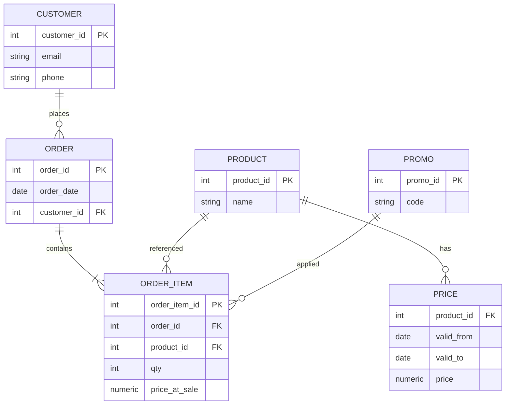
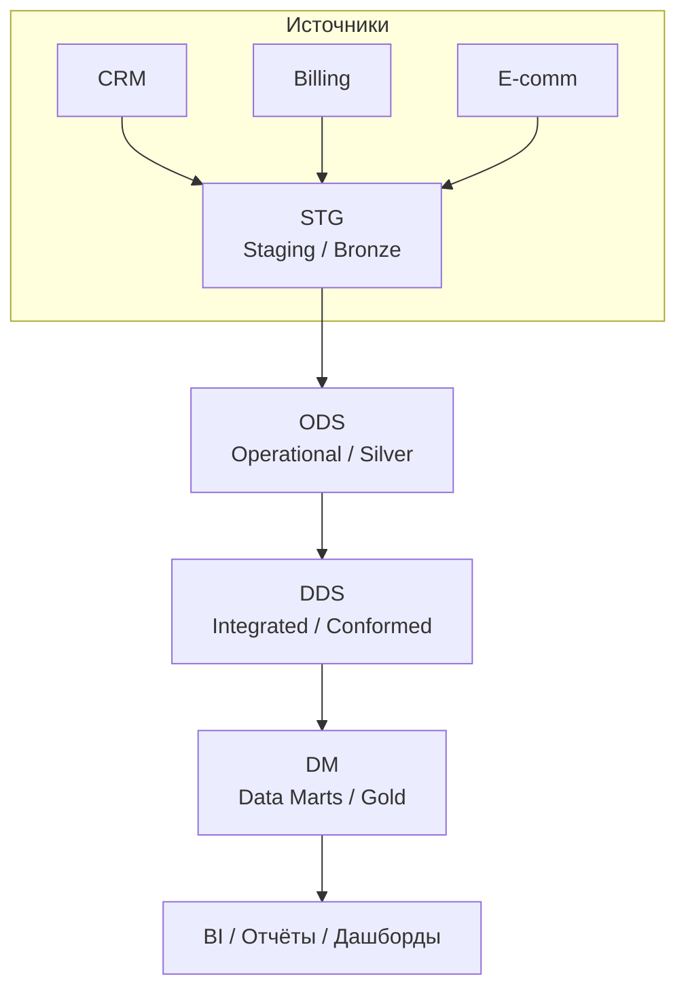
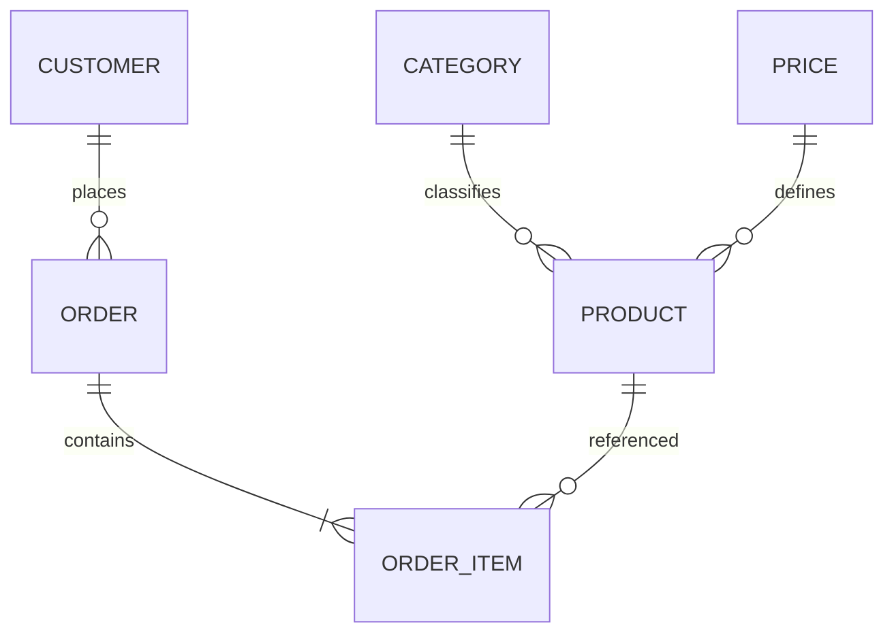
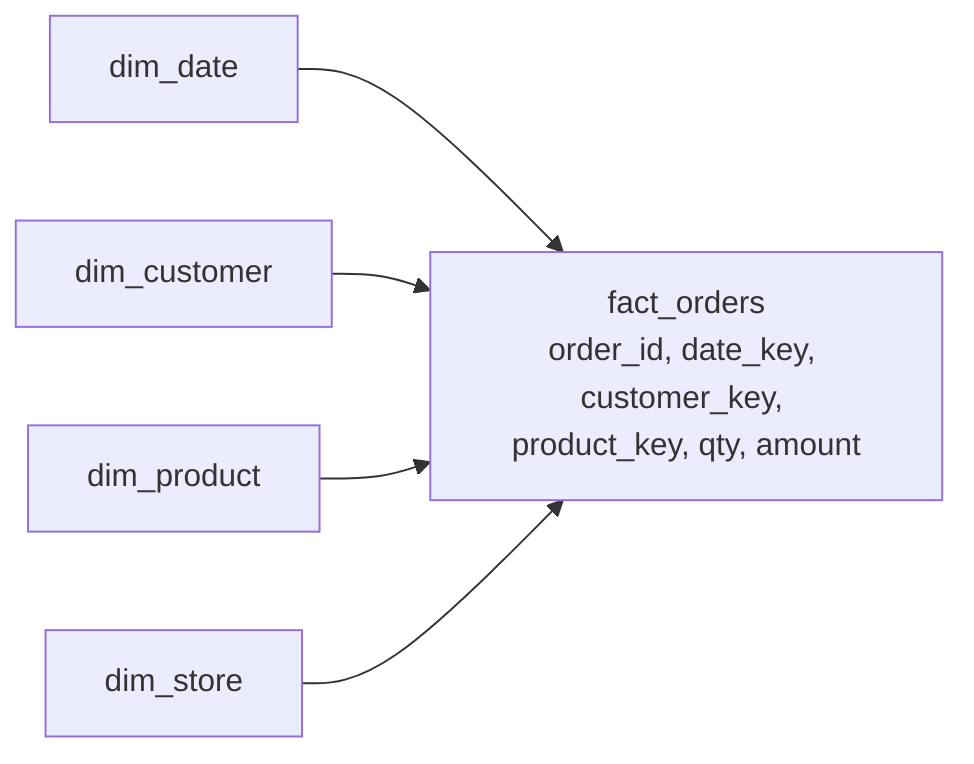
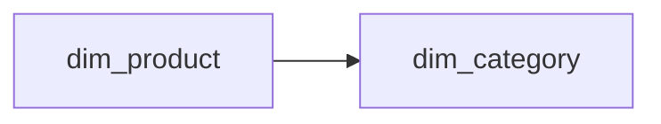
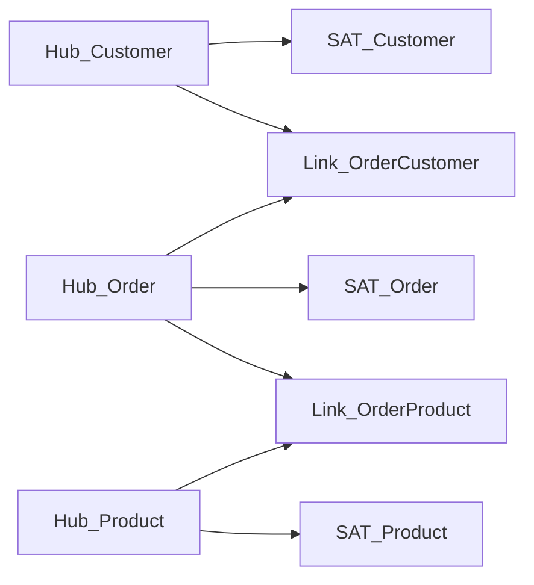
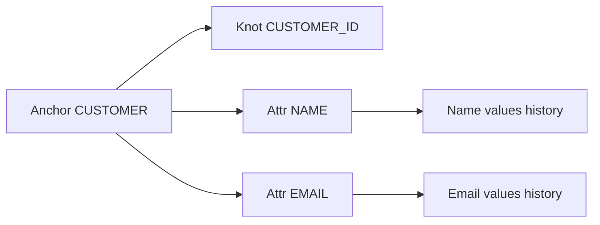
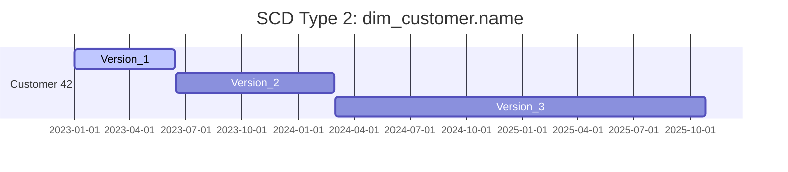
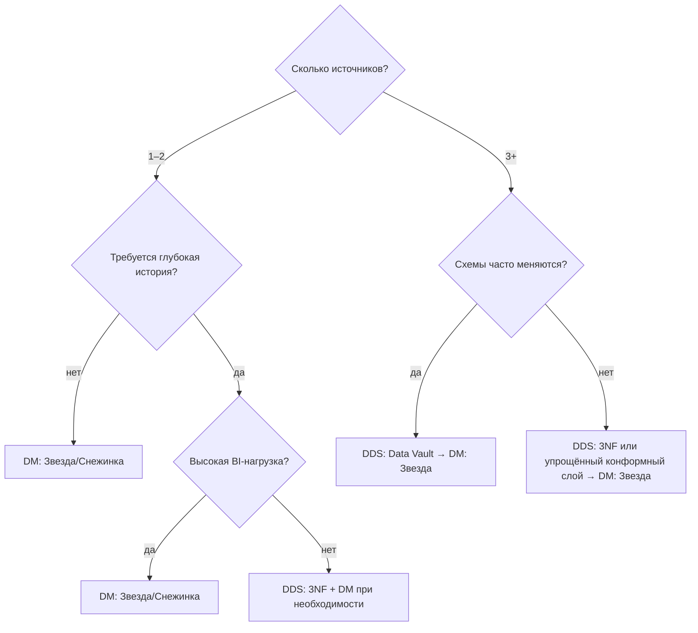
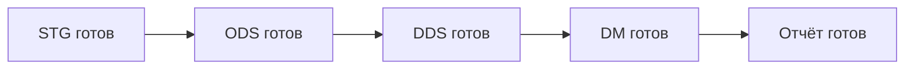

# Структура хранилища данных (для студентов SQL/Postgres)

> **Цель**: объяснить, как раскладывать данные в аналитической БД и почему именно так принято. Рус/Eng термины приводятся вместе (например, «витрина (Data Mart)»).

---

## 0. Навигация по статье

* [1. Введение: зачем слои и почему не «всё в одну таблицу»](#1)
* [2. Учебный домен/пример](#2)
* [3. Типичная структура слоёв (STG → ODS → DDS → DM)](#3)
* [4. Слои по отдельности](#4)
* [5. Модели данных для DDS/DM: 3NF, Звезда/Снежинка, Data Vault, Anchor](#5)
* [6. Ключевые понятия: факт/измерение, зерно, SK vs BK, SCD](#6)
* [7. Выбор подхода: дерево решений](#7)
* [8. Эволюция схемы и эксплуатации](#8)
* [9. MVP учебного проекта](#9)
* [10. Заключение](#10)

---

## 1. Введение: зачем слои и почему не «всё в одну таблицу»

**Коротко**: OLTP vs OLAP, управляемость, прозрачность, стоимость.

**Заглушки для текста**:

* Что такое слои и какую проблему решают.
* Почему «одна большая таблица» ломается на истории и изменениях.
* 3–4 тезиса о выгодах послойной архитектуры.

---

## 2. Учебный домен/пример (интернет-магазин)

**Описание**: используем один домен сквозь статью: клиенты, товары, заказы, позиции заказа, цены, акции.

**Диаграмма ER (эскиз)**:

**Заглушки**: 2–3 абзаца с пояснениями domain-гранулярности и бизнес-ключей (BK).

---

## 3. Типичная структура слоёв (STG → ODS → DDS → DM)

**Картинка-конвейер (эскиз)**:

**Заглушки**:

* Соответствие Bronze/Silver/Gold.
* Что происходит на каждом переходе в 1–2 фразы.

---

## 4. Слои по отдельности

### 4.1 STG (Staging/Bronze)

**Коротко**: «как пришло». Идемпотентность, дедупликация, неизменяемость/переигрузка.

**TODO**: список «что можно» / «что нельзя»; форматы; контроль качества на входе.

### 4.2 ODS (Operational Data Store/Silver)

**Коротко**: чистка и выравнивание типов, базовая унификация кодов, ещё без тяжёлой бизнес-логики.

**TODO**: правила именования, ключи, простая история.

### 4.3 DDS (Integrated/Conformed Layer)

**Коротко**: интеграция источников, общие справочники, SK/BK, SCD. Здесь уже начинаются модели данных. Какие модели испольуют.

**TODO**: где хранить историю, антидубли, конформные измерения.

### 4.4 DM (Data Marts/Gold)

**Коротко**: модели под задачи BI (звезда/снежинка). Агрегаты, материализации.

**TODO**: границы ответственности витрин.

---

## 5. Модели данных для DDS/DM: 3NF, Звезда/Снежинка, Data Vault, Anchor

### 5.1 3NF (по Инмону, 3-я нормальная форма)

**Идея**: целостная интегрированная модель предприятия.

**Мини-эскиз (ER, нормализовано)**:

**TODO**: плюсы/минусы, когда выбирать.

### 5.2 Звезда/Снежинка (по Кимбаллу)

**Идея**: простые и быстрые аналитические запросы. 
Упомянуть, что самая часто испольуемая модель.

**Эскиз звезды: факт + измерения**:

**Эскиз снежинки (нормализация измерения продукта)**:

**TODO**: зерно факта, типы измерений, агрегаты.

### 5.3 Data Vault 2.0 (Hub–Link–Satellite)

**Идея**: масштабируемая интеграция многоисточниковых данных с полной историей.

**Эскиз DV (упорядоченная колонками)**:

**TODO**: Raw Vault vs Business Vault, плюс/минус.
На каких слоях используем, зачем там оно нам.

Схема часто используется. Пишем, почему.

### 5.4 Anchor Modeling (Анкерное моделирование)

**Идея**: эволюционируемость атрибутов с версионированием на уровне «якорей/атрибутов/узлов».

**Эскиз (упрощённый)**:

**TODO**: где уместно, порог входа.

**TODO**: где уместно, порог входа.

Редко используется. Сложна для людей и для машин. Обосновываем.

---

## 6. Ключевые понятия (минимум для практики)

* **Факты (Facts)** и **Измерения (Dimensions)**; **зерно (grain)** факта.
* **Натуральные ключи (BK)** и **суррогатные ключи (SK)**.
* **SCD (Slowly Changing Dimensions)**: типы 1 / 2 / 4 / 6.
* **Bridge/Junk dimensions**, календарь, валюта, часовой пояс.
* **Поздно прибывающие события (late arriving)**.

**Эскиз SCD‑истории (Type 2) как лента времени**:

**TODO**: короткие примеры для Type 1/2/4/6.

---

## 7. Выбор подхода: дерево решений (эскиз)

**TODO**: превратить в 6–8 вопросов с текстовыми пояснениями.

---

## 8. Эволюция схемы и эксплуатационные практики

* Совместимость назад/вперёд, view‑based миграции.
* Идемпотентные пайплайны, дедупликация, инкрементальные загрузки (CDC).
* Data Quality: уникальность, ссылочная целостность, распределения, «contracts».
* Каталог/линейка (Data Catalog / Lineage), словарь данных (Business Glossary), владение.

**TODO**: чек-лист из 8–10 пунктов.

---

## 9. MVP учебного проекта (рецепт)

1. STG: положить сырые данные из 2–3 источников.
2. ODS: очистка и выравнивание типов.
3. DDS: либо упрощённая интеграция (конформные справочники), либо Raw Vault.
4. DM: одна звезда `fact_orders` + 3–4 измерения.
5. Простой отчёт/дашборд и верификация цифр.
6. Мини‑тесты качества данных.

**Эскиз «дорожной карты»**:

---

## 10. Заключение

**Заглушки**: повторить ключевые тезисы, дать ссылки на дополнительные темы: CDC, оркестрация, тестирование данных, наблюдаемость.

---

## Примечания к иллюстрациям

* Диаграммы — **эскизы**: заменить/уточнить, когда будет готов текст.
* При необходимости добавить отдельные рисунки: «что можно/нельзя в слоях», SCD типы на одном полотне, пример late arriving events.
