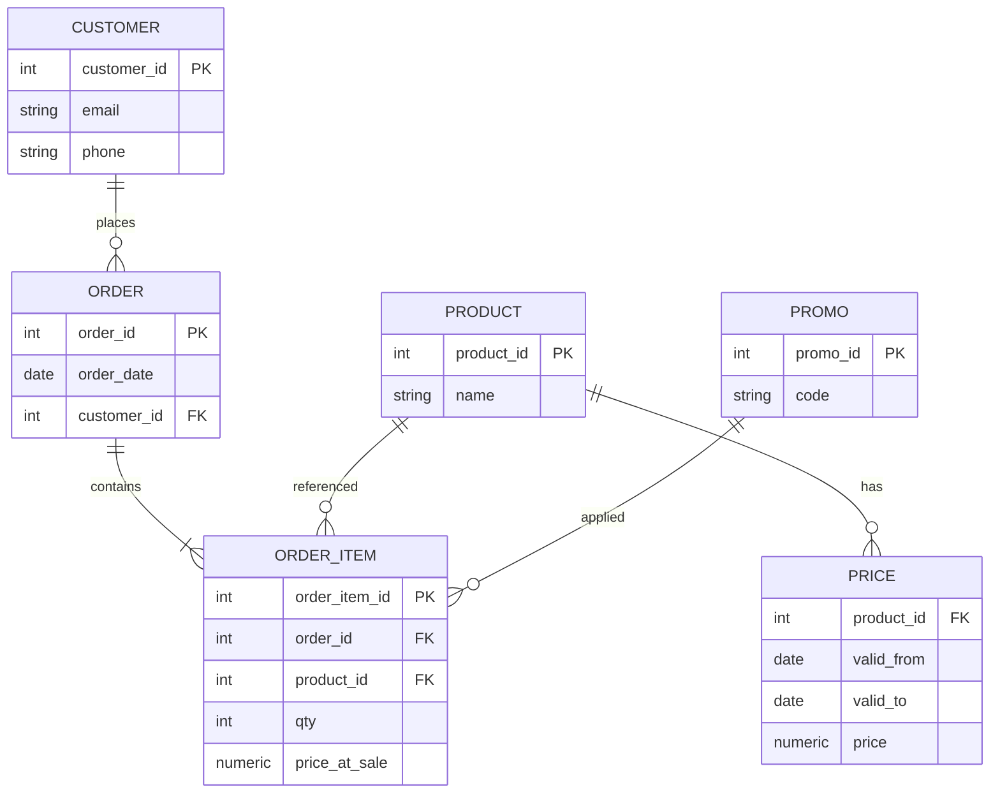
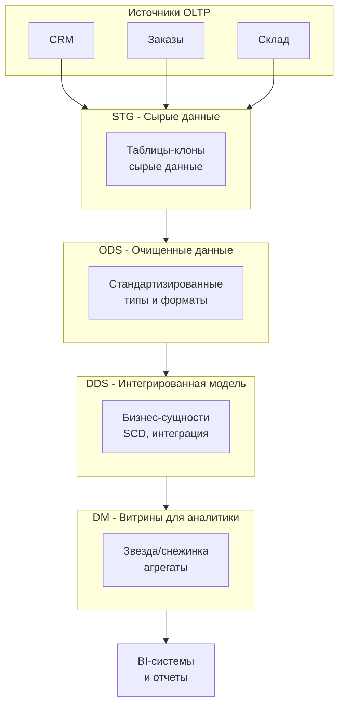
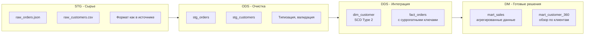
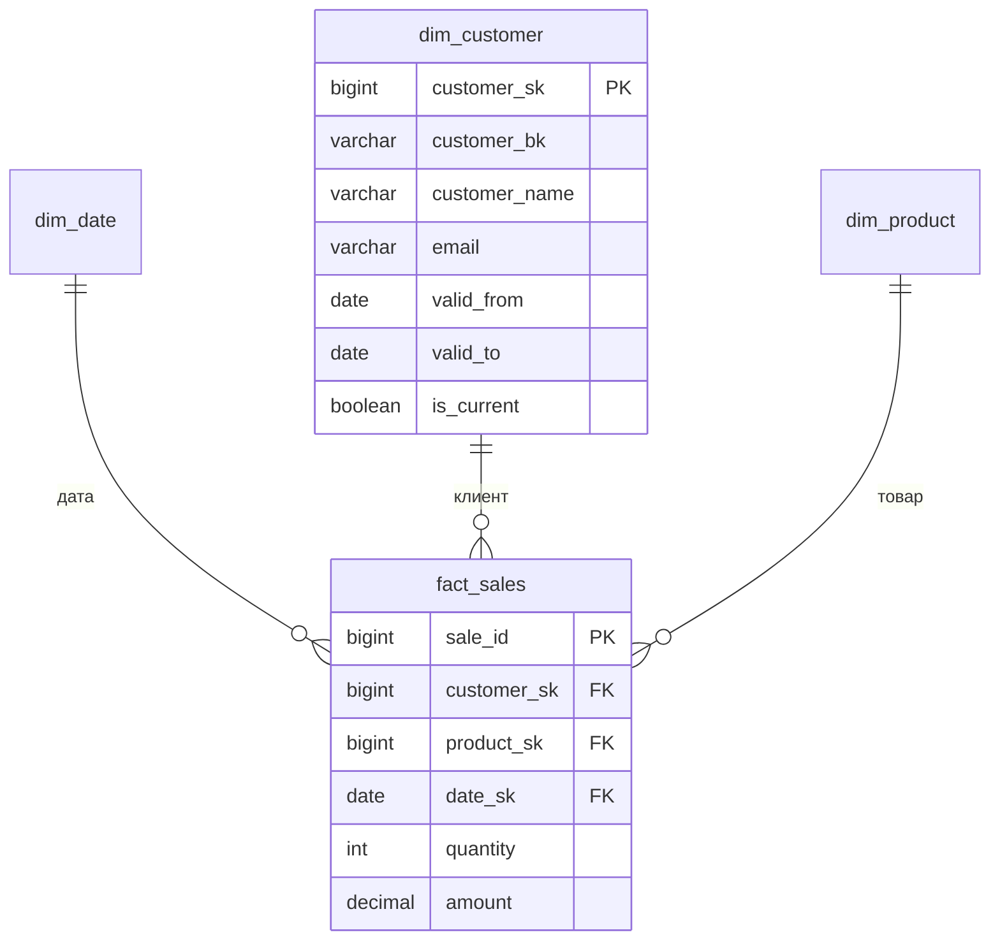
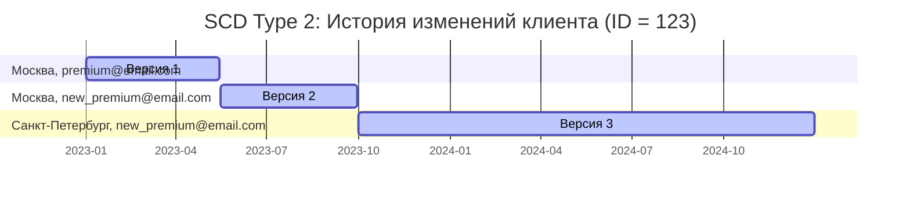
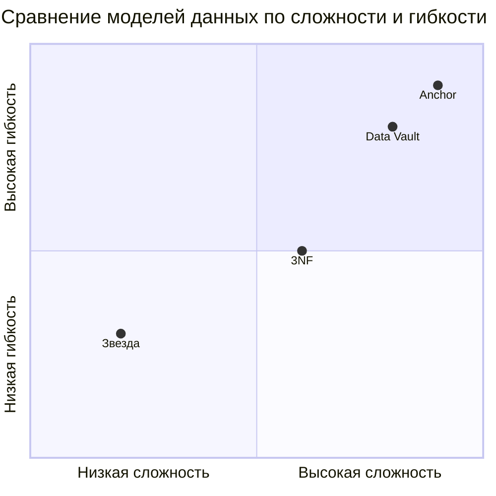
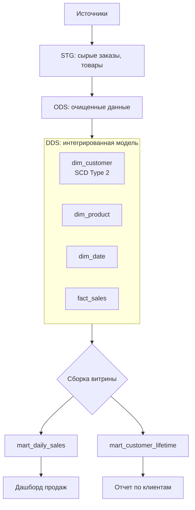
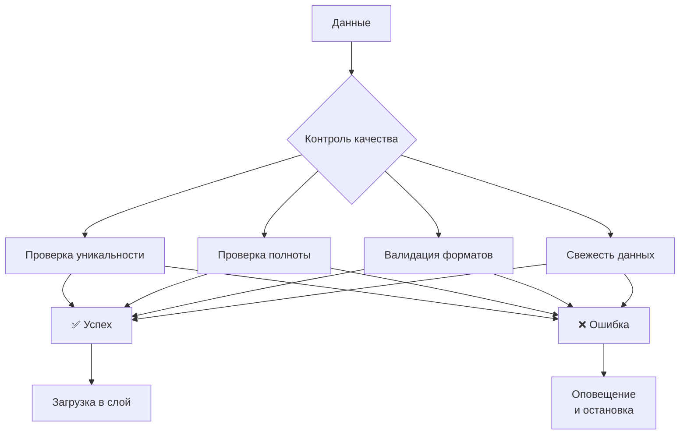
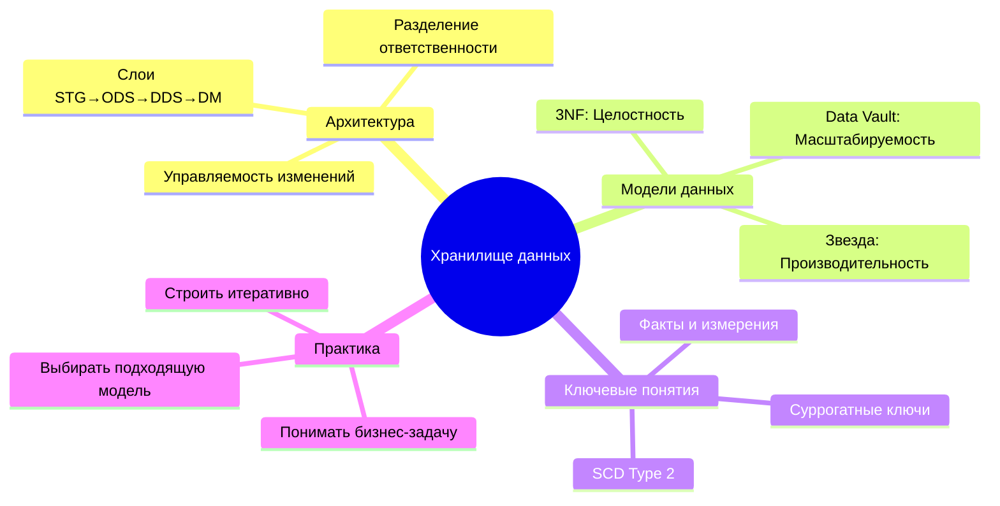

Что нас здесь ждет

* **Уже умеете:** SQL-основы (SELECT/JOIN/GROUP BY), простые агрегаты.
* **Узнаете:** слои (STG/ODS/DDS/DM), модели (3NF/Star/DV/Anchor), SCD и суррогатные ключи.
* **Не рассматриваем здесь:** физический дизайн, производительность, партиционирование, распределённые кластеры — это отдельная тема.

# **Структура статьи про хранилище данных **

1. Введение. Проблема аналитики в OLTP
2. Учебный пример. Интернет-магазин
3. Архитектура. Зачем слои?
4. Путешествие данных. STG→ODS→DDS→DM
5. Базовые понятия. Факты, Измерения, SCD
6. Модели данных. 3NF, DV, Звезда
7. Практикум. Собираем витрину
8. Выбор моделию Дерево решений
9. Эксплуатация. Качество и эволюция
10. Заключение

---

# **1. Введение: Аналитика — это не оперативный учет**

**OLTP (оперативный учёт)**: CRM, заказы, склад.
**DWH (аналитическое хранилище)**: единая модель для анализа.

Проблема: в OLTP для исторической аналитики — сложные JOIN, тяжёлые агрегации, нестабильная производительность.

**Особенности DWH**:

* Слоистая архитектура
* Оптимизированные под аналитику модели

**Ключевые тезисы**:

* OLTP vs OLAP: транзакции против анализа
* Почему «одна большая таблица» не работает на истории
* 3 преимущества слоёв: управляемость, производительность, прозрачность

---

# **2. Учебный пример: интернет-магазин**

ER-диаграмма сущностей источника (упрощённо):



Описание примера текстом

---

# **3. Архитектура хранилища: зачем делить на слои?**



---

## **4. Путешествие данных по слоям**



STG (Staging/Bronze)

Коротко: «как пришло». Идемпотентность, дедупликация, неизменяемость/переигрузка.

ODS (Operational Data Store/Silver)

Коротко: чистка и выравнивание типов, базовая унификация кодов, ещё без тяжёлой бизнес-логики.

DDS (Integrated/Conformed)

Коротко: интеграция источников, общие справочники, SK/BK, SCD. Здесь живут модели данных (3NF/DV/Anchor/Star).

DM (Data Marts/Gold)

Коротко: модели под задачи BI (звезда/снежинка). Агрегаты, материализации.

* **STG (Bronze):** как пришло; неизменяемо/переигрузка; идемпотентность; дедуп по `(BK, load_ts)`; только тех. обогащения (например, `_ingest_id`).
* **ODS (Silver):** типизация; базовая очистка и стандартные коды; **без** тяжёлой бизнес-логики; стабильные схемы/имена.
* **DDS (Conformed/Core):** интеграция источников; единая терминология; SK/BK; SCD; здесь живут модели (3NF/Star/DV/Anchor).
* **DM (Gold):** под конкретные вопросы BI/продукта; агрегаты/материализации; доступные метрики и измерения.

Нейминг-гайд (пример)

* `stg.*` — как в источнике, добавочные тех. поля: `_ingest_id`, `_load_ts`.
* `ods.*` — очищенные «плоские» таблицы, стаб. схемы.
* `dds.dim_*`, `dds.fact_*` — интегрированная модель.
* `dm.mart_*` — витрины/представления.

---

## **5. Базовые понятия: Факты, Измерения, Ключи**



Что из базвой модели данных

**SCD Type 2 - Визуализация истории**:


в fact берём версию dim_customer по дате факта (между valid_from и valid_to)

Краткое описание текстом. Указание, что подробно про scd можно почитать в соседней статье SCD.md

---

## **6. Модели данных для DDS**

### 3NF (третья нормальная форма)

Классическая нормализованная модель, сильная целостность и интеграция, но SQL для аналитики сложнее.

### Снежинка (Snowflake)

Нормализованные измерения поверх звезды — компромисс между читаемостью и дублированием.

### Звезда (Star Schema)

Факт + денормализованные измерения — просто и быстро для BI/SQL.

### **Data Vault 2.0**:

```mermaid
erDiagram
    hub_customer ||--o{ sat_customer_info : "хаб"
    hub_order ||--o{ sat_order_details : "хаб"
    hub_product ||--o{ sat_product_info : "хаб"
    
    hub_customer ||--o{ link_order_customer : "участвует"
    hub_order ||--o{ link_order_customer : "включает"
    
    hub_order ||--o{ link_order_product : "содержит"
    hub_product ||--o{ link_order_product : "входит в"
    
    hub_customer {
        string customer_hash_key PK
        string customer_id BK
        datetime load_dttm
    }
    
    sat_customer_info {
        string customer_hash_key PK,FK
        datetime load_dttm PK
        string customer_name
        string email
        string phone
    }
    
    link_order_customer {
        string order_customer_hash_key PK
        string order_hash_key FK
        string customer_hash_key FK
        datetime load_dttm
    }
```

Коротко: хабы (BK), линки (связи), сателлиты (история атрибутов). Этот раздел обзорный.

Упомянуть про DV 1

### Anchor Modeling (анкерное моделирование)

Атомарная декомпозиция сущностей и атрибутов, гибкая эволюция схемы; высокая гранулярность усложняет чтение.

> **Сравнение (интуитивно):** Звезда — проще/быстрее для BI; 3NF — целостность и интеграция; DV/Anchor — масштабируемая интеграция из многих источников и «история по умолчанию», но сложнее читать и писать.

**Сравнение моделей**:


Рассказать, что выбор модели для данных далеко не всегда однозначен, и является компромисснным.

3NF - преимущества и недостатки
Снежинка - преимущества и недостатки
DV
Anchor Modeling

---

#### **7. Практикум: собираем витрину**

Раздел мне не нравится, надо бы переработать.



**Пример SQL для витрины**:
```sql
-- Витрина ежедневных продаж
CREATE TABLE mart_daily_sales AS
SELECT 
    d.date,
    p.product_name,
    c.customer_segment,
    SUM(f.quantity) as total_quantity,
    SUM(f.amount) as total_amount
FROM fact_sales f
JOIN dim_date d ON f.date_key = d.date_key
JOIN dim_product p ON f.product_key = p.product_key  
JOIN dim_customer c ON f.customer_key = c.customer_key
WHERE c.is_current = true
GROUP BY d.date, p.product_name, c.customer_segment;
```

---

#### **9. Эксплуатация: качество и эволюция**



---

#### **10. Заключение: главное — понимать "почему"**



---

## **10. Заключение: главное — понимать «почему»**

Ключевые идеи: разделение на слои (STG → ODS → DDS → DM), разные модели для разных задач (3NF, Star, DV, Anchor), факты/измерения/SCD, итеративная сборка витрин под конкретные вопросы бизнеса.

# Приложения

### 2) Мини-глоссарий RU/EN (по 1–2 строки)

* **Слой (Layer)** — логический уровень в DWH: STG/ODS/DDS/DM.
* **Витрина (Data Mart)** — предметно-ориентированный набор таблиц/представлений для конкретной аналитики.
* **Факт (Fact)** — таблица событий/измерений величин (кол-во, сумма).
* **Измерение (Dimension)** — справочник контекста фактов (клиенты, товары, даты).
* **Суррогатный ключ (Surrogate Key, SK)** — искусственный технический ключ (int/bigint).
* **Бизнес-ключ (Business Key, BK)** — естественный ключ из источника (например, `customer_id`).
* **SCD (Slowly Changing Dimension)** — подход к хранению истории атрибутов измерения.
* **CDC (Change Data Capture)** — техника инкрементальной загрузки изменений.
* **Conformed Dimension** — «конформное» измерение, общее для нескольких витрин.

### 3) Отображение синонимов слоёв

* **STG (Bronze)** → **ODS (Silver)** → **DDS (Conformed/Core)** → **DM (Gold)**.

### 4) «Правила слоя» — короткие чек-листы


### 5) Антипаттерны (короткий бокс)

* «Одна огромная историческая таблица» → медленные запросы, нет истории атрибутов.
* «Смешали STG и ODS» → потеря трассировки ошибок и инцидентов качества.
* «Факт с текстовыми атрибутами без причин» → раздутая таблица и неявные бизнес-правила.
* «SCD без BK» → история «плывёт», не привязана к бизнес-идентификатору.


### 10) «Зачем разные модели» (без выбора)

* **Star (звезда):** быстро писать отчёты, учим новичков на ней.
* **3NF:** лучшая консистентность/интеграция понятий, тяжелее для BI.
* **Data Vault:** масштабируемая интеграция множества источников + «история по умолчанию».
* **Anchor:** гибкая эволюция схемы, максимальная атомарность, цена — сложность.

### 11) Что почитать дальше

* **Kimball, The Data Warehouse Toolkit** — модели «звезды», SCD.
* **Inmon, Building the Data Warehouse** — корпоративный DWH и нормализация.
* **Linstedt & Olschimke, The Data Vault 2.0** — практический DV.
* **Anchor Modeling** — официальный сайт/документация по Anchor.

---

## ЧАСТЬ C. Мини-датасет (для примеров в статье)

> Опционально приложить к репозиторию/приложению статьи.

**customers.csv**

```
customer_id,email,phone,city
101,a@ex.com,700,Москва
101,b@ex.com,700,Москва
102,c@ex.com,701,СПб
```

**orders.csv**

```
order_id,order_date,customer_id
5001,2024-01-10,101
5002,2024-02-05,102
```

**order_items.csv**

```
order_item_id,order_id,product_id,qty,price_at_sale
1,5001,9001,2,100.00
2,5001,9002,1,50.00
3,5002,9001,1,100.00
```

**products.csv**

```
product_id,name
9001,Phone
9002,Case
```

**prices.csv**

```
product_id,valid_from,valid_to,price
9001,2023-12-01,2024-01-31,100
9001,2024-02-01,2999-12-31,110
```

---

## ЧАСТЬ D. DDL-скелеты (минимально)

```sql
-- DDS: измерение клиента (Type 2)
CREATE TABLE dds.dim_customer (
  customer_sk   BIGINT GENERATED ALWAYS AS IDENTITY PRIMARY KEY,
  customer_bk   VARCHAR NOT NULL,
  email         VARCHAR,
  phone         VARCHAR,
  city          VARCHAR,
  valid_from    DATE    NOT NULL,
  valid_to      DATE,
  is_current    BOOLEAN NOT NULL DEFAULT TRUE
);

-- DDS: факт продаж (гранулярность: строка заказа)
CREATE TABLE dds.fact_sales (
  sale_id      BIGINT GENERATED ALWAYS AS IDENTITY PRIMARY KEY,
  customer_sk  BIGINT NOT NULL,
  product_sk   BIGINT NOT NULL,
  date_sk      INT    NOT NULL,
  quantity     INT    NOT NULL,
  amount       DECIMAL(18,2) NOT NULL
);
```

