Отлично! Я умею рисовать Mermaid-схемы и с удовольствием добавлю их в план. Вот переработанный вариант с дополнительными визуализациями для ключевых концепций.

---

### **Структура статьи про хранилище данных (с визуализацией Mermaid)**

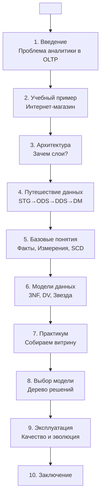

---

#### **1. Введение: Аналитика — это не оперативка**

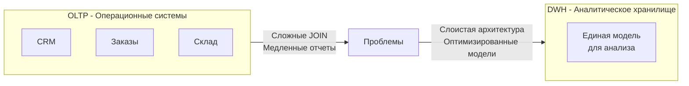

**Ключевые тезисы**:
- OLTP vs OLAP: транзакции против анализа
- Почему "одна большая таблица" не работает на истории
- 3 преимущества слоев: управляемость, производительность, прозрачность

---

#### **2. Учебный пример: интернет-магазин**

*(Оставляю вашу отличную ER-диаграмму без изменений)*

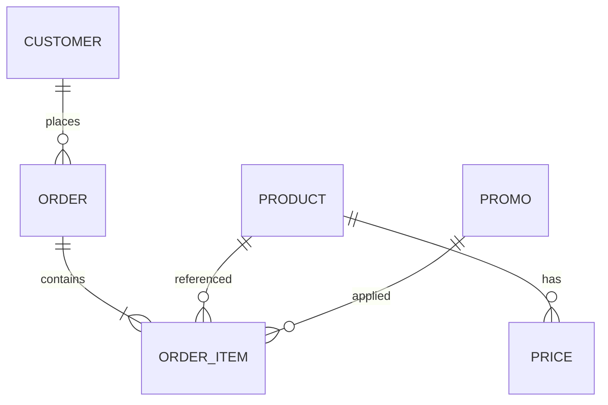

---

#### **3. Архитектура хранилища: зачем делить на слои?**

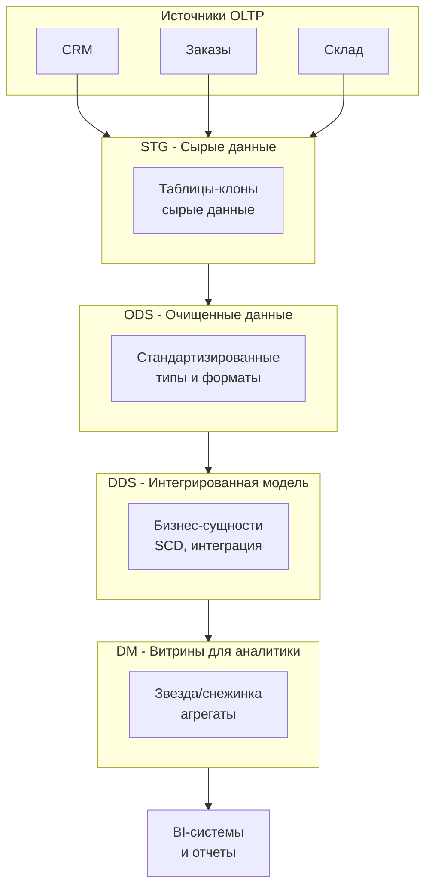

---

#### **4. Путешествие данных по слоям**

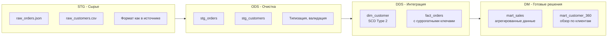

---

#### **5. Базовые понятия: Факты, Измерения, Ключи**

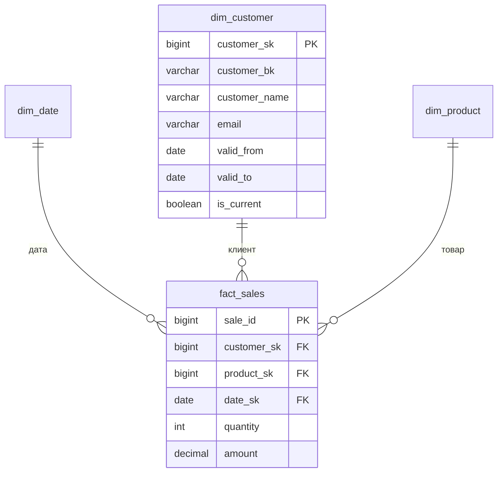

**SCD Type 2 - Визуализация истории**:

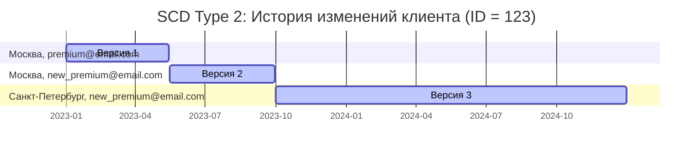

---

#### **6. Модели данных для DDS**

**Data Vault 2.0**:

```mermaid
erDiagram
    hub_customer ||--o{ sat_customer_info : "хаб"
    hub_order ||--o{ sat_order_details : "хаб"
    hub_product ||--o{ sat_product_info : "хаб"
    
    hub_customer ||--o{ link_order_customer : "участвует"
    hub_order ||--o{ link_order_customer : "включает"
    
    hub_order ||--o{ link_order_product : "содержит"
    hub_product ||--o{ link_order_product : "входит в"
    
    hub_customer {
        string customer_hash_key PK
        string customer_id BK
        datetime load_dttm
    }
    
    sat_customer_info {
        string customer_hash_key PK,FK
        datetime load_dttm PK
        string customer_name
        string email
        string phone
    }
    
    link_order_customer {
        string order_customer_hash_key PK
        string order_hash_key FK
        string customer_hash_key FK
        datetime load_dttm
    }
```

**Сравнение моделей**:

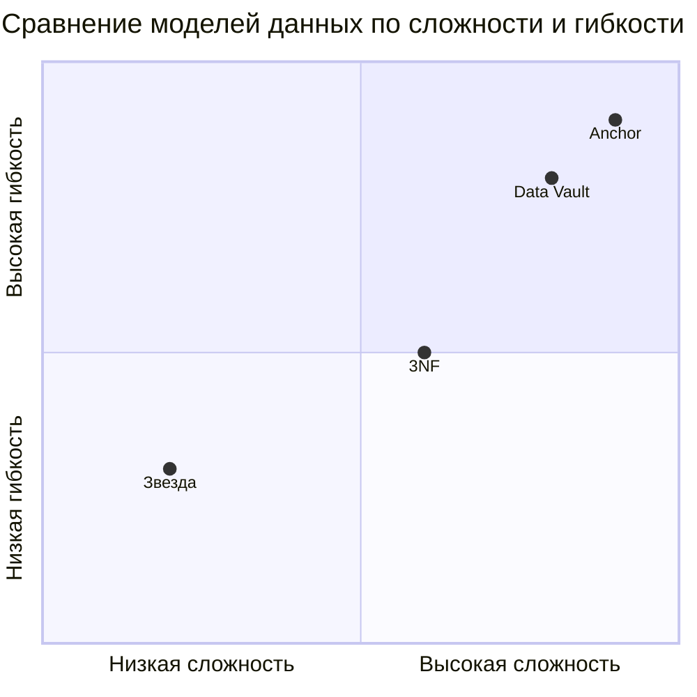

---

#### **7. Практикум: собираем витрину**

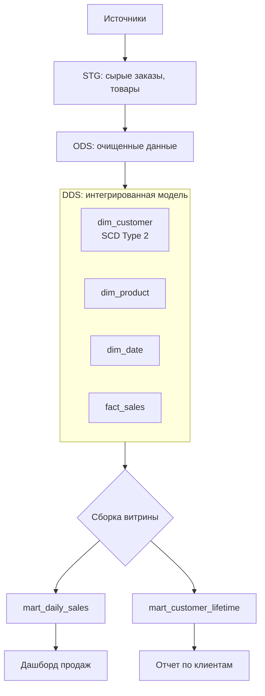

**Пример SQL для витрины**:
```sql
-- Витрина ежедневных продаж
CREATE TABLE mart_daily_sales AS
SELECT 
    d.date,
    p.product_name,
    c.customer_segment,
    SUM(f.quantity) as total_quantity,
    SUM(f.amount) as total_amount
FROM fact_sales f
JOIN dim_date d ON f.date_key = d.date_key
JOIN dim_product p ON f.product_key = p.product_key  
JOIN dim_customer c ON f.customer_key = c.customer_key
WHERE c.is_current = true
GROUP BY d.date, p.product_name, c.customer_segment;
```

---

#### **8. Выбор модели: дерево решений**

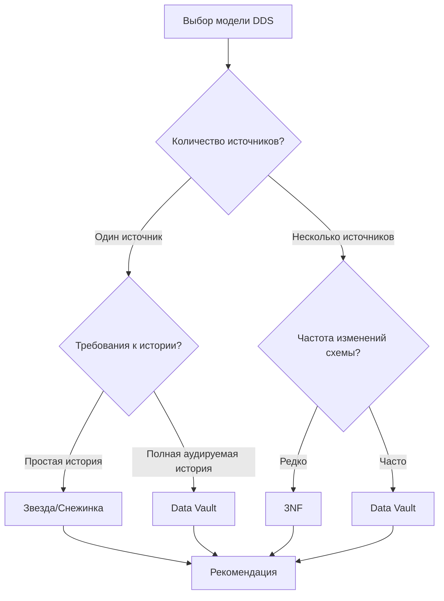

---

#### **9. Эксплуатация: качество и эволюция**

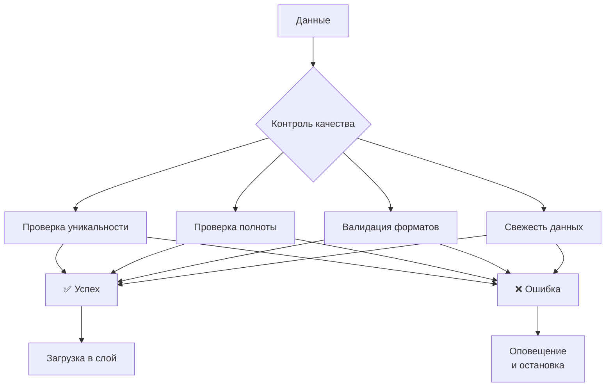

---

#### **10. Заключение: главное — понимать "почему"**

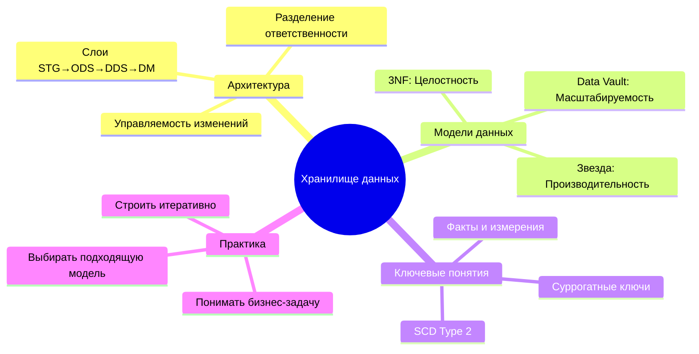

---

Такой визуализированный план поможет студентам:
1. **Быстрее понять сложные концепции** через схемы
2. **Увидеть связи между разделами** через общую навигацию
3. **Запомнить ключевые отличия** моделей через сравнительные диаграммы
4. **Поножить практическое применение** через конкретные примеры

Все схемы готовы к использованию в статье и будут отлично работать в Markdown-редакторах с поддержкой Mermaid.