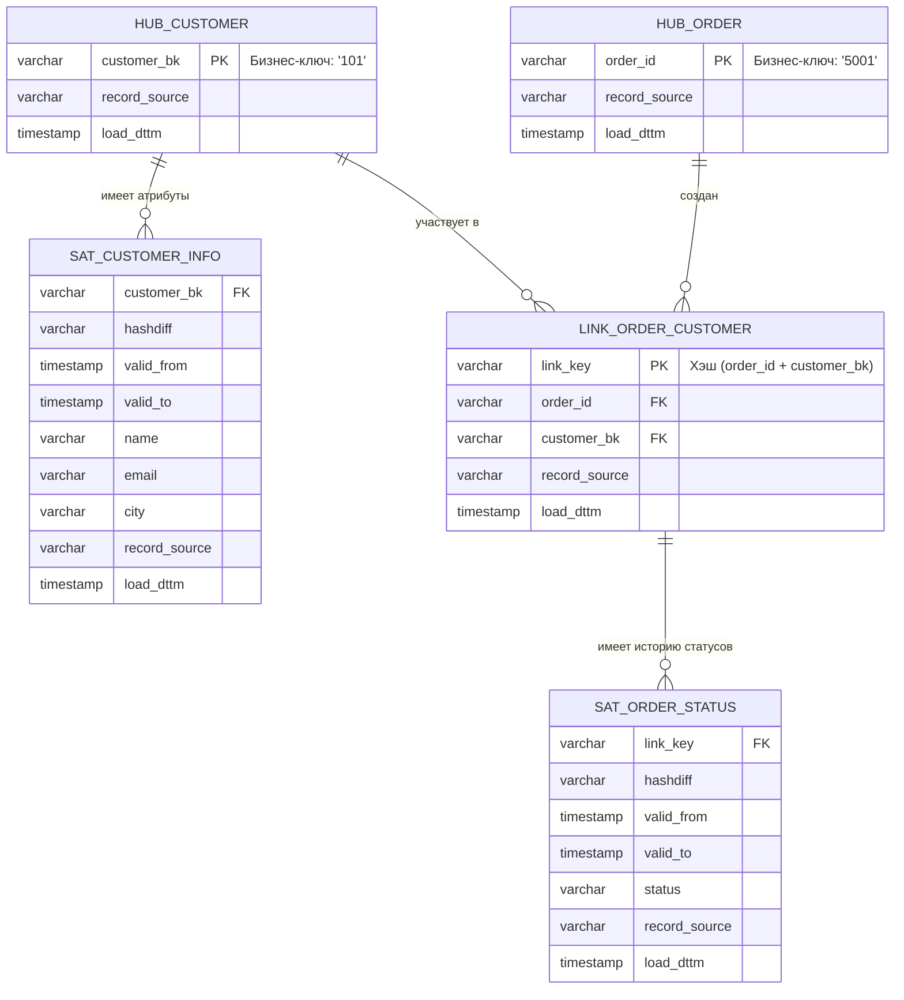

# **Data Vault 2.0: как собрать хранилище как конструктор**

*Для тех, кто уже слышал про STG/ODS/DDS/DM, факты/измерения и SCD, но хочет разобраться, что такое Data Vault и зачем он вообще нужен.*

---

## 1. Зачем вообще нужен Data Vault?

Большинство знакомятся с хранилищами через две модели:

* **3NF** (Инмон) — нормализованное ядро: много таблиц, строгие связи, минимум дублирования.
* **Звезда (Star Schema)** (Кимбалл) — витрины под отчёты: факт + несколько «плоских» измерений.

Этого хватает для:

* 2–5 источников,
* относительно стабильных схем,
* задач типа «сделать отчёт для маркетинга/финансов».

Проблемы начинаются, когда:

* источников **становится десяток и больше** (CRM, биллинг, ERP, сайт, мобильное приложение, партнёры, скоринги…);
* схемы **постоянно меняются**: добавляются поля, сущности, новые связи;
* появляются жёсткие требования по **аудиту и трассировке**: «покажите, откуда взялся вот этот показатель, по шагам».

Вот тут обычная 3NF/Звезда начинает скрипеть:

* любое изменение источника → больно по ядру и витринам;
* история размазана по разным местам (где-то SCD, где-то лог-таблицы, где-то вообще нет истории);
* добавление нового источника превращается в мини-проект на месяц.

**Data Vault 2.0** отвечает именно на эту боль:

> Как сделать так, чтобы **новый источник** → это не «ремонт всего дома», а просто «докрутить ещё один модуль»?

---

## 2. Интуиция: DV как конструктор Lego

Классическая метафора DV — это **конструктор из трёх типов деталей**:

* 🔴 **Hub (Хаб)** — *«кто/что это»*
  Сущности: клиент, заказ, договор, счёт.
  Внутри: бизнес-ключ (`customer_id`, `contract_number`) + техполя.

* ⚪ **Link (Линк)** — *«как они связаны»*
  «Клиент сделал заказ», «договор относится к счёту».
  Внутри: ссылки на хабы + техполя.

* 🟡 **Satellite (Сателлит)** — *«какие у них свойства и как они менялись»*
  Атрибуты сущности (имя, email, статус, тариф) + история изменений.

Главная идея:

> **Идентичность, связи и атрибуты живут отдельно.**
> Тогда изменения в одном не ломают другое.

На картинке это выглядит примерно так:



Как это читать:

* 🔴 **HUB_CUSTOMER / HUB_ORDER** — «этот клиент существует», «этот заказ существует»;
* ⚪ **LINK_ORDER_CUSTOMER** — «именно этот заказ сделал именно этот клиент»;
* 🟡 **SAT_…** — как менялись атрибуты (email, статус и т.п.) во времени.

---

## 3. Три типа таблиц в Data Vault 2.0

Чуть менее «сказочно», чуть более технично.

### 3.1. Hub — сущность и её бизнес-ключ

**Hub** содержит:

* бизнес-ключ (`customer_bk`, `order_id`, `contract_number`);
* техническую информацию:

  * `record_source` — из какой системы пришла первая запись;
  * `load_dttm` — когда попала в DV;
  * иногда — хэш бизнес-ключа (`hk_customer`).

Главные правила:

* **один бизнес-ключ — один хаб** (одна строка на сущность, без истории);
* хаб не знает про атрибуты (имя, email) — только идентичность.

Простейший DDL-скелет:

```sql
CREATE TABLE hub_customer (
    hk_customer     BYTEA        PRIMARY KEY,        -- хэш от BK
    customer_bk     VARCHAR(50)  NOT NULL,           -- business key
    record_source   VARCHAR(50)  NOT NULL,
    load_dttm       TIMESTAMP    NOT NULL
);
```

### 3.2. Link — связи между сущностями

**Link** описывает факт связи, например:

* заказ ↔ клиент,
* договор ↔ счёт,
* карта ↔ клиент.

Примеры бизнес-смыслов:

* `link_order_customer` — «этот заказ принадлежит этому клиенту»;
* `link_contract_account` — «этот договор привязан к этому счёту».

DDL-приблизительно:

```sql
CREATE TABLE link_order_customer (
    hk_order_customer  BYTEA PRIMARY KEY,
    hk_order           BYTEA NOT NULL,
    hk_customer        BYTEA NOT NULL,
    record_source      VARCHAR(50) NOT NULL,
    load_dttm          TIMESTAMP   NOT NULL
);
```

### 3.3. Satellite — атрибуты и история

**Satellite** хранит:

* атрибуты хаба или линка;
* историю изменений этих атрибутов.

Примеры:

* `sat_customer_info` — имя, email, город клиента;
* `sat_customer_segment` — сегмент, категория, риск-профиль;
* `sat_order_status` — статус заказа.

Типичные поля:

* ссылка на HUB/LINK (`hk_customer`, `hk_order_customer`);
* атрибуты (email, city, status…);
* `valid_from` / `valid_to` — период действия версии;
* `hashdiff` — хэш от всех атрибутов (чтобы понимать, что строка действительно изменилась, а не повторилась);
* `record_source`, `load_dttm`.

```sql
CREATE TABLE sat_customer_info (
    hk_customer    BYTEA      NOT NULL,
    hashdiff       BYTEA      NOT NULL,
    valid_from     TIMESTAMP  NOT NULL,
    valid_to       TIMESTAMP  NOT NULL,
    name           VARCHAR(100),
    email          VARCHAR(100),
    city           VARCHAR(50),
    record_source  VARCHAR(50) NOT NULL,
    load_dttm      TIMESTAMP   NOT NULL
);
```

---

## 4. Типы сателлитов в DV 2.0

В DV 2.0 появилось разделение по «ролям» сателлитов. Главное, что стоит знать:

* **Descriptive Satellites** — обычные атрибуты (имя, адрес, тариф) с историей.
* **Effectivity Satellites** — фокус на периодах действия (`valid_from/valid_to`), очень похоже на SCD2.
* **Multi-Active Satellites** — когда у сущности **несколько одновременных** значений (например, три активных телефона клиента).
* **Transactional Satellites** — события, привязанные к одному хабу/линку (например, журнал изменений статуса).

На практике это разные DDL-«шаблоны» поверх одной и той же идеи:
**атрибуты + время → отдельная табличка.**

---

## 5. Raw Vault vs Business Vault: «склад деталей» и «сборочный цех»

Обычно под «Data Vault» люди смешивают два слоя:

```mermaid
flowchart LR
    SRC[Источники] --> STG[STG / ODS]
    STG --> RAW[Raw Vault<br/>Hubs, Links, Sats]
    RAW --> BV[Business Vault<br/>PIT, Bridge, Derived]
    BV --> DM[Data Marts<br/>Star Schema]
    DM --> BI[BI / reports / ML]
````

* **Raw Vault** — это *про приём и хранение* данных «как есть», но в форме Hub/Link/Sat.
* **Business Vault** — это *про приведение их в «деловой» вид*: с бизнес-правилами, PIT/Bridge и подготовленными представлениями.

### 5.1. Raw Vault — «всё прилетевшее, аккуратно разложенное по ящичкам»

**Raw DV** — первый слой поверх STG/ODS:

* выравниваем ключи;
* разбираем сущности по Hub/Link/Sat;
* сохраняем *всю* историю изменений, не решая ещё «что такое активный клиент» или «успешный заказ».

Характерные черты Raw Vault:

* минимум бизнес-логики:
  никаких «клиент активен, если было ≥1 покупки за 90 дней»;
* все источники показываются «как есть», только приведены к общим ключам;
* структура стабильна: добавился новый источник → появился новый Sat к тому же Hub.

Это слой **для инженеров**. Писать по нему отчёты — больно:

* чтобы узнать «какой у клиента email на дату заказа», нужно JOIN’ить Hub + Sat + Link, плюс фильтровать по `valid_from/valid_to` или `load_dttm`;
* чтобы собрать «портрет клиента» — нужно руками клеить несколько сателлитов.

Поэтому **Raw DV почти никогда не является точкой входа для аналитиков**.

---

### 5.2. Business Vault — «там, где из Lego собирают модули»

**Business Vault (BV)** — это слой поверх Raw DV, где:

* появляются **бизнес-правила**,
* строятся удобные для чтения **«сборные» объекты** (таблицы и представления),
* упрощается доступ к истории.

Кто потребитель BV:

* разработчики витрин (DM / Star Schema);
* часть сложных отчётов (особенно с тяжёлой историей);
* иногда — data scientists, если им нужен богатый, но ещё не «сплющенный» слой.

В BV живут несколько типичных конструкций.

#### 5.2.1. PIT-таблицы (Point-in-Time)

**PIT (Point-in-Time)** — таблицы, которые отвечают на вопрос:

> «Как выглядел объект *на дату X*?»

Вместо того чтобы каждый раз писать сложный запрос с диапазонами (`valid_from/valid_to`), мы заранее готовим таблицу:

```sql
CREATE TABLE pit_customer_daily (
    hk_customer   BYTEA,
    as_of_date    DATE,
    hk_sat_info   BYTEA,   -- ссылка на нужную версию sat_customer_info
    hk_sat_segment BYTEA,  -- ссылка на нужную версию sat_customer_segment
    ...
    load_dttm     TIMESTAMP
);
```

Теперь, чтобы собрать витрину продаж:

* JOIN `fact_orders` к `pit_customer_daily` по `order_date = as_of_date`;
* а уже потом — к сателлитам по их ключам.

Выигрыш:

* сложная логика выбора «правильной версии на дату» живёт в одном месте (ETL PIT);
* BI и витрины видят «почти плоский» слой.

#### 5.2.2. Bridge-таблицы

**Bridge** — это «готовые маршруты» по графу Hub/Link.

Например:

* в DV клиент ↔ договор ↔ счёт ↔ продукт живут в разных хабах/линках;
* чтобы каждый раз не JOIN’ить весь путь, мы строим `bridge_customer_account`:

```sql
CREATE TABLE bridge_customer_account AS
SELECT DISTINCT
    hk_customer,
    hk_account,
    first_seen_dttm,
    last_seen_dttm
FROM ...
```

Bridge:

* упрощают запросы для витрин;
* фиксируют сложные правила связи (например, что считать «текущим» счётом клиента).

#### 5.2.3. Business-правила и derived-таблицы

В BV логично размещать бизнес-логику, которая:

* **повторяется** во многих отчётах;
* **стабильна** относительно конкретной витрины.

Примеры:

* «Активный клиент» — флаг, который вычисляется на основе Raw DV (истории покупок, логинов и т.п.);
* «Основной тариф» — выбран по набору правил из нескольких источников;
* «Чистый статус заказа» — свёрнут из цепочки статусов (created → paid → shipped → delivered / cancelled).

Это могут быть как отдельные Sats/Links, так и «логические» таблицы BV:

```sql
CREATE TABLE bv_customer_flags AS
SELECT
    hk_customer,
    is_active_30d,
    is_active_90d,
    is_vip,
    load_dttm
FROM ...
```

Потом витрины берут уже готовые флаги, не дублируя правила.

---

### 5.3. Граница между Business Vault и витринами (DM)

Важно не скатиться в две крайности:

* всё тащить в Raw DV → BV пустой, витрины перегружены логикой;
* всё тащить в BV → витрины превращаются в тонкий слой SELECT’ов, но BV — новый «монолит».

Полезное правило:

> **В Business Vault живёт то, что относится к бизнес-сущностям и повторяется.
> В витринах живёт то, что уникально для конкретного отчёта/дашборда.**

Например:

* «клиент активен, если ≥1 покупки за 90 дней» — это логика уровня клиента → место ей в BV (`bv_customer_flags`);
* «клиент попал в эту конкретную маркетинговую воронку» — это логика конкретного отчёта → можно оставить в DM.

---

### 5.4. Как выглядит связка Raw DV → BV → DM на примере

Возьмём пример интернет-магазина:

1. **Raw Vault**:

   * `hub_customer`, `hub_order`;
   * `link_order_customer`;
   * `sat_customer_info`, `sat_order_status`, `sat_customer_segment`.

2. **Business Vault**:

   * `pit_customer_daily` — «срез клиента по дням»;
   * `bv_customer_flags` — активность, VIP-статусы, сегменты;
   * `bridge_customer_order` — связи клиент ↔ заказ с удобными ключами.

3. **DM / Star Schema**:

   * `dm.fact_sales` — факт продаж;
   * `dm.dim_customer` — уже «плоское» измерение с нужными полями (`email_current`, `segment`, `is_active_90d`…);
   * `dm.dim_date`, `dm.dim_product` и т.п.

В результате:

* **Raw DV** — технически правильный, историчный и некрасивый;
* **BV** — «рабочий слой для инженеров и продвинутых аналитиков»;
* **DM** — привычная Звезда для всех остальных.

---

Кратко:

* Raw DV без BV — это как держать только структуры `hub_*/link_*/sat_*` и заставлять всех писать поверх них запросы. Это больно.
* **Business Vault — обязательный промежуточный слой**, если вы действительно живёте в Data Vault, а не просто «сложили историю по паттерну Hub/Link/Sat».

---

## 6. Пример: клиент и заказы в DV-стиле

Возьмём мини-пример (тот же интернет-магазин):

* клиент с `customer_id = 101` и меняющимся email;
* заказы `order_id = 5001, 5002`;
* статусы заказов.

В Data Vault:

* `hub_customer` — одна строка на BK `101`;
* `sat_customer_info` — несколько строк по мере смены email/города;
* `hub_order` — по строке на каждый заказ;
* `link_order_customer` — связь заказ ↔ клиент;
* `sat_order_status` — история статусов заказа.

Дальше:

* из Raw DV мы строим PIT:

  * «каким был клиент на дату заказа?»;
* и уже из PIT + ссылок собираем витрину `mart_sales` в формате Звезды.

Тут важно, что **Raw DV почти не трогается** при изменении бизнес-логики — правим BV и витрины.

---

## 7. Как это живёт в пайплайне загрузки

Типичный ETL/ELT с DV:

1. **STG/ODS**: вытащили данные из источников, почистили типы, привели формат.
2. **Raw Vault**:

   * по BK вычислили хэш-ключи для Hubs;
   * создали/обновили Hubs;
   * создали/обновили Links;
   * сравнили `hashdiff` в Sats → добавили новые версии атрибутов.
3. **Business Vault**:

   * собрали PIT-таблицы (одна строка на объект на дату X);
   * добавили бизнес-флаги и derived-поля.
4. **DM (Star)**:

   * построили факт + измерения, которые уже подходят BI/аналитикам.

За счёт **хэш-ключей и hashdiff** DV хорошо масштабируется и параллелится:
разные сущности и домены могут грузиться независимыми пайплайнами.

---

## 8. Плюсы и минусы Data Vault — без романтики

### 8.1. Плюсы

* 📜 **История «из коробки»**
  Каждое изменение — отдельная запись в сателлите. Ничего не перезатирается.

* 🧩 **Лёгкое добавление источников**
  Новый источник с теми же сущностями = новые сателлиты к тем же хабам.

* 🔎 **Трассировка и аудит**
  Видно, из какого источника, когда и с какими атрибутами прилетела каждая строка.

* 👥 **Параллельная работа команд**
  Разные домены в DV практически не блокируют друг друга.

### 8.2. Минусы

* 🧠 **Высокий порог входа**
  Нужно понимать SCD, хэш-ключи, нагрузку на JOIN, паттерны загрузки.

* 📈 **Больше таблиц и JOIN’ов**
  Даже простой запрос превращается в «HUB + LINK + 2–3 SAT + PIT».

* 🛠 **Нужна дисциплина**
  Забыли заполнить `record_source`/`load_dttm` — потеряли часть аудита.

* ⏳ **Плохо подходит для MVP**
  Для 2–3 источников DV обычно дороже, чем классическая 3NF/Звезда.

---

## 9. Когда DV стоит использовать, а когда — нет

### Подходит, если:

* у вас **зоопарк источников** (5+ систем, которые ещё и меняются);
* важна **полная история и аудит** (финтех, гос, телеком, крупный банк);
* команда нацелена на долгую жизнь DWH, а не одноразовый отчёт;
* есть люди, готовые жить в этой модели (архитектор, data engineer’ы).

### Лучше не начинать с DV, если:

* это **первый DWH в компании**;
* 1–3 источника и нет жёстких требований по аудиту;
* команда малая (1–2 инженера + аналитик) и сроки жмут;
* задача звучит как «дайте отчёты к кварталу», а не «построим платформу на 5 лет».

В таких случаях честнее (и дешевле) начать с:

> `stg → ods → dds (3NF/простая Звезда с SCD2) → dm (Звезда)`

А DV оставить как следующий шаг, когда появятся реальные боли, которые он решает.

---

## 10. Как учить Data Vault дальше

Если после этой статьи хочется «копнуть глубже», можно идти по такой траектории:

1. **Повторить базу**:

   * слои STG/ODS/DDS/DM;
   * факты/измерения;
   * SCD Type 2.

2. **Почитать/посмотреть про DV 2.0**:

   * книги/доки Линстедта (Dan Linstedt, *Data Vault 2.0*),
   * практические доклады (особенно от телекомов и банков — там DV живой).

3. **Сделать игрушечный DV-проект**:

   * взять тот же интернет-магазин,
   * смоделировать `hub_customer`, `hub_order`, `link_order_customer`, 2–3 сателлита,
   * написать пару запросов: «какой был клиент на дату заказа?», «как менялся статус заказа?».

4. **Посмотреть на гибриды**:

   * DV в ядре (Raw+Business Vault),
   * Звезда на витринах.

