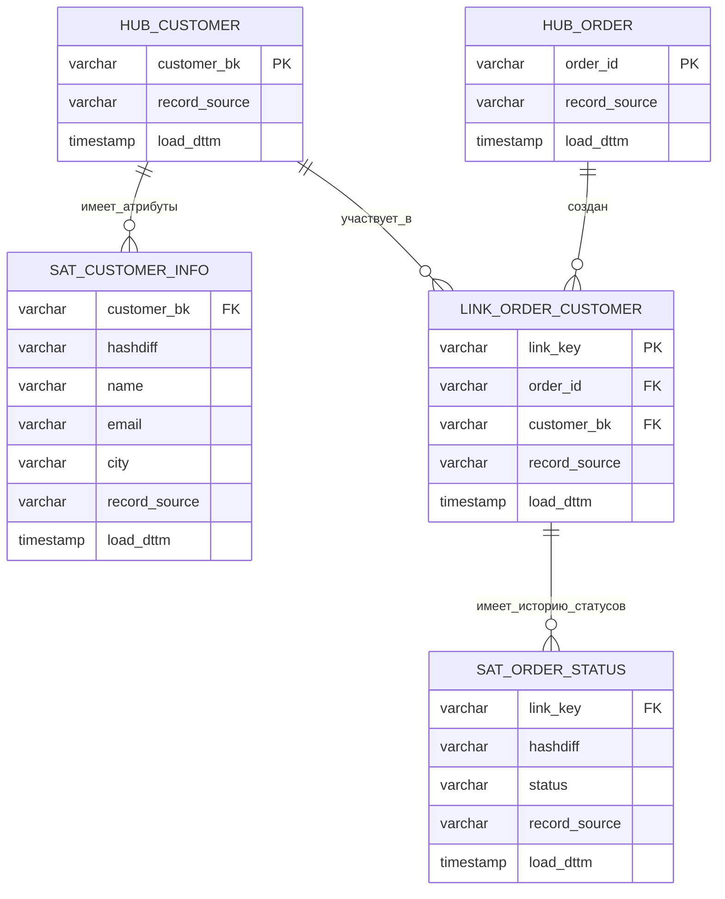

# **Data Vault 2.0: как собрать хранилище как конструктор**

## 📚 Оглавление

1. [Зачем вообще нужен Data Vault?](#1-зачем-вообще-нужен-data-vault)
2. [Интуиция: DV как конструктор Lego](#2-интуиция-dv-как-конструктор-lego)
3. [Три типа таблиц в Data Vault 2.0](#3-три-типа-таблиц-в-data-vault-20)
4. [Типы сателлитов в DV 2.0](#4-типы-сателлитов-в-dv-20)
5. [Raw Vault и Business Vault](#5-raw-vault-и-business-vault)
6. [Пример: клиент и заказы в DV-стиле](#6-пример-клиент-и-заказы-в-dv-стиле)
7. [Как это живёт в пайплайне загрузки](#7-как-это-живёт-в-пайплайне-загрузки)
8. [Плюсы и минусы Data Vault](#8-плюсы-и-минусы-data-vault)
9. [Когда DV стоит использовать, а когда нет](#9-когда-dv-стоит-использовать-а-когда-нет)

---

## 1. Зачем вообще нужен Data Vault?

Большинство знакомятся с хранилищами через две модели:

* **3NF** (Инмон) — нормализованное ядро: много таблиц, строгие связи, минимум дублирования.
* **Звезда (Star Schema)** (Кимбалл) — витрины под отчёты: факт + несколько «плоских» измерений.

Этого хватает для:

* 2–5 источников,
* относительно стабильных схем,
* задач типа «сделать отчёт для маркетинга/финансов».

Проблемы начинаются, когда:

* источников **становится десяток и больше** (CRM, биллинг, ERP, сайт, мобильное приложение, партнёры, скоринги…);
* схемы **постоянно меняются**: добавляются поля, сущности, новые связи;
* появляются жёсткие требования по **аудиту и трассировке**: «покажите, откуда взялся вот этот показатель, по шагам».

Вот тут обычная 3NF/Звезда начинает скрипеть:

* любое изменение источника → больно по ядру и витринам;
* история размазана по разным местам (где-то SCD, где-то лог-таблицы, где-то вообще нет истории);
* добавление нового источника превращается в мини-проект на месяц.

**Data Vault 2.0** отвечает именно на эту боль:

> Как сделать так, чтобы **новый источник** → это не «ремонт всего дома», а просто «докрутить ещё один модуль»?

---

## 2. Интуиция: DV как конструктор Lego

Классическая метафора DV — это **конструктор из трёх типов деталей**:

* 🔴 **Hub (Хаб)** — *«кто/что это»*
  Сущности: клиент, заказ, договор, счёт.
  Внутри: бизнес‑ключ (например, customer_id или contract_number) и техполя.

* ⚪ **Link (Линк)** — *«как они связаны»*
  «Клиент сделал заказ», «договор относится к счёту».
  Внутри: ссылки на хабы и техполя.

* 🟡 **Satellite (Сателлит)** — *«какие у них свойства и как они менялись»*
  Атрибуты сущности (имя, email, статус, тариф) плюс история изменений.

Главная идея:

> **Идентичность, связи и атрибуты живут отдельно.**
> Тогда изменения в одном не ломают другое.

На картинке это можно показать так:



Как это читать:

* 🔴 HUB_CUSTOMER / HUB_ORDER — «этот клиент существует», «этот заказ существует»;
* ⚪ LINK_ORDER_CUSTOMER — «именно этот заказ сделал именно этот клиент»;
* 🟡 SAT_… — как менялись атрибуты (email, статус и т.п.) во времени.

## 3. Три типа таблиц в Data Vault 2.0

Чуть менее «сказочно», чуть более технично.

### 3.1. Hub — сущность и её бизнес-ключ

**Hub** содержит:

* бизнес‑ключ (customer_bk, order_id, contract_number);
* техническую информацию:
  * record_source — из какой системы пришла первая запись;
  * load_dttm — когда запись попала в DV;
  * иногда — хэш бизнес‑ключа (hk_customer).

Главные правила:
* один бизнес‑ключ — один хаб (одна строка на сущность, без истории);
* хаб не знает про атрибуты (имя, email) — только идентичность.

Простейший DDL‑скелет:

```sql
CREATE TABLE hub_customer (
    hk_customer     BYTEA        PRIMARY KEY,  -- хэш от BK
    customer_bk     VARCHAR(50)  NOT NULL,     -- business key
    record_source   VARCHAR(50)  NOT NULL,
    load_dttm       TIMESTAMP    NOT NULL
);
```

### 3.2. Link — связи между сущностями

**Link** описывает факт связи, например:

* заказ ↔ клиент;
* договор ↔ счёт;
* карта ↔ клиент.

Примеры бизнес‑смыслов:

* link_order_customer — «этот заказ принадлежит этому клиенту»;
* link_contract_account — «этот договор привязан к этому счёту».

DDL‑эскиз:

```sql
CREATE TABLE link_order_customer (
    hk_order_customer  BYTEA PRIMARY KEY,
    hk_order           BYTEA NOT NULL,
    hk_customer        BYTEA NOT NULL,
    record_source      VARCHAR(50) NOT NULL,
    load_dttm          TIMESTAMP   NOT NULL
);
```

### 3.3. Satellite — атрибуты и история

**Satellite** хранит:

* атрибуты хаба или линка;
* историю изменений этих атрибутов.

Примеры:

* sat_customer_info — имя, email, город клиента;
* sat_customer_segment — сегмент, категория, риск‑профиль;
* sat_order_status — статус заказа.

Типичные поля:

* ссылка на HUB или LINK (hk_customer, hk_order_customer);
* атрибуты (email, city, status и т.п.);
* hashdiff — хэш от всех атрибутов, чтобы понять, изменилась ли строка;
* record_source, load_dttm — источник и момент загрузки версии.

```sql
CREATE TABLE sat_customer_info (
    hk_customer    BYTEA      NOT NULL,
    hashdiff       BYTEA      NOT NULL,
    name           VARCHAR(100),
    email          VARCHAR(100),
    city           VARCHAR(50),
    record_source  VARCHAR(50) NOT NULL,
    load_dttm      TIMESTAMP   NOT NULL
);
```

Главная мысль: DV заставляет явно разделять идентичность, связи и атрибуты с историей. Это делает модель сложнее на вид, но гораздо устойчивее к изменениям источников.

Когда нужны именно бизнес-периоды действия («с/по»), их удобнее моделировать не в базовом сателлите, а отдельными effectivity-сателлитами или через PIT-таблицы в Business Vault.

## 4. Типы сателлитов в DV 2.0

В DV 2.0 появилось разделение по «ролям» сателлитов. Главное, что стоит знать:

* **Descriptive Satellites** — обычные атрибуты (имя, адрес, тариф) с историей.
* **Effectivity Satellites** — фокус на периодах действия (`valid_from` / `valid_to`), очень похоже на SCD2.
* **Multi-Active Satellites** — когда у сущности несколько одновременных значений (например, три активных телефона клиента).
* **Transactional Satellites** — события, привязанные к одному хабу/линку (например, журнал изменений статуса).

На практике это разные DDL-«шаблоны» поверх одной и той же идеи:
**атрибуты + время → отдельная табличка.**

---

## 5. Raw Vault и Business Vault

Обычно под «Data Vault» люди смешивают два слоя:


* **Raw Vault** — это про приём и хранение данных «как есть», но уже в форме Hub / Link / Satellite.
* **Business Vault** — это про приведение этих данных в более «деловой» вид: с бизнес-правилами, PIT/Bridge и подготовленными представлениями.

### 5.1. Raw Vault — «всё прилетевшее, аккуратно разложенное по ящичкам»

Raw DV — первый слой поверх STG / ODS:

* выравниваем ключи;
* разбираем сущности по Hub / Link / Sat;
* сохраняем всю историю изменений, не решая ещё, что такое «активный клиент» или «успешный заказ».

Характерные черты Raw Vault:

* минимум бизнес-логики:

  * никаких правил вроде «клиент активен, если была хотя бы одна покупка за 90 дней»;
* все источники показываются «как есть», только приведены к общим ключам;
* структура стабильна: добавился новый источник → появился новый Satellite к тому же Hub.

### 5.2. Business Vault — «там, где из Lego собирают модули»

Business Vault (BV) — следующий слой над Raw DV:

* здесь применяются бизнес-правила (что считать активным клиентом, как трактовать статусы);
* здесь строятся вспомогательные структуры:

  * PIT-таблицы,
  * Bridge-таблицы,
  * агрегаты и derived-таблицы.

Именно из BV чаще всего строятся витрины в формате Звезды, к которым подключаются BI и отчётность.

Если сильно упростить:

* Raw DV → «мы всё собрали»;
* Business DV → «мы это привели в вид, с которым удобно жить»;
* DM → «мы вынесли это на витрину в понятной форме».

#### 5.2.1. PIT-таблицы (Point-in-Time)

PIT (Point-in-Time) решает очень конкретную боль:

> «Покажи, как объект выглядел **на дату X**, но так, чтобы запрос был простым».

Если у нас есть несколько сателлитов с историей (например, `sat_customer_info`, `sat_customer_segment`, `sat_customer_risk`), то без PIT любой запрос превращается в пачку условий
`BETWEEN valid_from AND valid_to` или оконных функций.

**Идея PIT:**

Мы заранее считаем «словарь» вида:

> для каждой пары (объект, дата) — какие версии сателлитов на эту дату актуальны.

Упрощённый пример структуры:

```sql
CREATE TABLE pit_customer_daily (
    hk_customer     BYTEA,
    as_of_date      DATE,
    hk_sat_info     BYTEA,  -- sat_customer_info на эту дату
    hk_sat_segment  BYTEA,  -- sat_customer_segment на эту дату
    load_dttm       TIMESTAMP
);
```

Внутри логически это выглядит так:

| hk_customer | as_of_date | hk_sat_info  | hk_sat_segment |
| ----------- | ---------- | ------------ | -------------- |
| 101         | 2023-06-10 | hash_info_v1 | hash_seg_v1    |
| 101         | 2023-06-11 | hash_info_v2 | hash_seg_v1    |
| 101         | 2023-06-12 | hash_info_v2 | hash_seg_v2    |

Дальше витрина продаж вместо сложных `BETWEEN` делает простой JOIN:

```sql
SELECT
    s.sale_date,
    s.amount,
    seg.segment,
    info.city
FROM fact_sales s
JOIN pit_customer_daily pit
  ON pit.hk_customer = s.hk_customer
 AND pit.as_of_date  = s.sale_date
JOIN sat_customer_segment seg
  ON seg.hk_customer = pit.hk_customer
 AND seg.hashdiff    = pit.hk_sat_segment
JOIN sat_customer_info info
  ON info.hk_customer = pit.hk_customer
 AND info.hashdiff    = pit.hk_sat_info;
```

Мы **один раз** дорого посчитали PIT (по расписанию),
и дальше все витрины просто используют эту «справочную таблицу».

Коротко: **PIT — это таблица, где заранее записано, какая версия данных была актуальна на дату X.**

#### 5.2.2. Bridge-таблицы

Bridge-таблицы отвечают на другой вопрос:

> «Какие объекты **в итоге** связаны между собой через длинную цепочку Links?»

В Data Vault связь между двумя сущностями редко бывает «одним JOIN’ом». Чаще это цепочка:

* клиент → договор → счёт → карта → транзакция;
* подразделение → филиал → торговая точка → чек;
* компания → дочерняя компания → проект → контракт → платёж.

Если каждый раз в витринах писать все эти JOIN’ы, запросы становятся:

* длинными и хрупкими;
* плохо читаемыми;
* дублируются во множестве отчётов.

**Идея Bridge:**

Сделать отдельную таблицу, где заранее развернуть «финальные» пары:

```sql
CREATE TABLE bridge_customer_trx (
    hk_customer  BYTEA,
    hk_trx       BYTEA
    -- опционально: даты действия связи, тип связи и т.п.
);
```

Такую таблицу мы считаем **в ETL**, один раз по расписанию, а не в каждом запросе.
Условный псевдокод построения:

```sql
INSERT INTO bridge_customer_trx (hk_customer, hk_trx)
SELECT DISTINCT
    c.hk_customer,
    t.hk_trx
FROM hub_customer c
JOIN link_customer_contract lcc    ON lcc.hk_customer = c.hk_customer
JOIN hub_contract ct               ON ct.hk_contract = lcc.hk_contract
JOIN link_contract_account lca     ON lca.hk_contract = ct.hk_contract
JOIN hub_account acc               ON acc.hk_account = lca.hk_account
JOIN link_account_card lac         ON lac.hk_account = acc.hk_account
JOIN hub_card card                 ON card.hk_card = lac.hk_card
JOIN link_card_trx lct             ON lct.hk_card = card.hk_card
JOIN hub_trx t                     ON t.hk_trx = lct.hk_trx;
```

После этого витрина может использовать уже готовый Bridge:

```sql
SELECT
    c.customer_bk,
    SUM(t.amount) AS total_amount
FROM hub_customer c
JOIN bridge_customer_trx bct
  ON bct.hk_customer = c.hk_customer
JOIN hub_trx t
  ON t.hk_trx = bct.hk_trx
WHERE t.trx_date >= CURRENT_DATE - INTERVAL '30 day'
GROUP BY c.customer_bk;
```

Сложный путь по Links мы спрятали внутрь bridge‑таблицы,
а витрины работают с простой связкой «клиент ↔ транзакция».

Коротко:

* **PIT** — про «какая версия атрибутов была на дату X»;
* **Bridge** — про «какие объекты в итоге связаны друг с другом по длинному маршруту».

Bridge — это **не обязательный элемент DV**, а инструмент оптимизации.
Он нужен тогда, когда цепочки Links становятся длинными и повторяются во многих отчётах.

#### 5.2.3. Business-правила и derived-таблицы Business-правила и derived-таблицы

В BV логично размещать бизнес-логику, которая:

* повторяется во многих отчётах;
* достаточно стабильна.

Примеры:

* флаг «активный клиент», который вычисляется на основе истории покупок и логинов;
* «основной тариф», выбранный по набору правил из нескольких источников;
* «чистый статус заказа», свёрнутый из цепочки статусов (created → paid → shipped → delivered / cancelled).

Это могут быть как отдельные Satellites / Links, так и логические таблицы BV с уже посчитанными флагами и агрегатами.

### 5.3. Граница между Business Vault и витринами (DM)

Важно проговорить границу:

* Business Vault — ещё про данные и историю;
* DM (Data Marts) — уже про конкретные бизнес-сценарии и удобство BI.

Витрины можно переделывать, не трогая BV, пока вы не меняете фундаментальные бизнес-правила.

### 5.4. Как выглядит связка Raw DV → BV → DM на примере

Мини-пример интернет-магазина:

1. Raw Vault:

   * `hub_customer`, `hub_order`;
   * `link_order_customer`;
   * `sat_customer_info`, `sat_order_status`, `sat_customer_segment`.

2. Business Vault:

   * `pit_customer_daily` — срез клиента по дням;
   * `bv_customer_flags` — активность, VIP-статусы, сегменты;
   * `bridge_customer_order` — связи клиент ↔ заказ с удобными ключами.

3. DM / Star Schema:

   * `dm.fact_sales` — факт продаж;
   * `dm.dim_customer` — уже плоское измерение с нужными полями (email_current, segment, is_active_90d и т.п.);
   * `dm.dim_date`, `dm.dim_product` и другие измерения.

В результате:

* Raw DV — технически корректный, историчный и некрасивый слой;
* BV — рабочий слой для инженеров и продвинутых аналитиков;
* DM — привычная Звезда для всех остальных.

## 6. Пример: клиент и заказы в DV-стиле

Возьмём мини‑пример всё того же интернет‑магазина.

У нас есть:

* клиент с `customer_id = 101`, у которого иногда меняется email и город;
* два заказа: `order_id = 5001` и `order_id = 5002`;
* статусы заказов: `created → paid → shipped → delivered`.

### Что появляется в Raw Vault

В Data Vault это раскладывается на несколько таблиц:

* `hub_customer` — по одной строке на каждого клиента (BK = `customer_id`).
* `hub_order` — по одной строке на каждый заказ (BK = `order_id`).
* `link_order_customer` — связь «какой заказ сделал какой клиент».
* `sat_customer_info` — история атрибутов клиента (имя, email, город).
* `sat_order_status` — история статусов заказа.

Примерно так это выглядит логически:

```text
HUB_CUSTOMER
--------------------------------------
customer_bk | record_source | load_dttm
--------------------------------------
101         | CRM           | 2023-01-10 10:00

SAT_CUSTOMER_INFO
customer_bk | load_dttm           | email              | city
---------------------------------------------------------------------
101         | 2023-01-10 10:00    | a@example.com      | Moscow
101         | 2023-06-01 09:00    | alice@newmail.com  | Moscow

HUB_ORDER
--------------------------------------
order_id    | record_source | load_dttm
--------------------------------------
5001        | SHOP          | 2023-06-10 12:00
5002        | SHOP          | 2023-06-11 09:30

SAT_ORDER_STATUS
order_id | load_dttm           | status
-------------------------------------------------------
5001     | 2023-06-10 12:00    | created
5001     | 2023-06-10 12:05    | paid
5001     | 2023-06-11 09:00    | shipped
...      | ...                 | ...
```

Ключевая идея: **любое изменение** (email, статус) — это **новая строка** в соответствующем Satellite.

### Как из этого получить витрину продаж

Дальше нам нужно привычное измерение `dim_customer` и факт `fact_sales` в формате Звезды.

Обычно цепочка выглядит так:

1. В Business Vault строим `PIT`‑таблицу по клиентам:

   * для каждой даты (или дня, или часа) знаем, какая строка из `sat_customer_info` была актуальна.
2. Строим витрину `dm.dim_customer`:

   * на выбранную дату берём нужную версию из `sat_customer_info`;
   * добавляем флаги/сегменты из других Satellites/BV‑таблиц.
3. Строим факт `dm.fact_sales`, где каждая строка — заказ или позиция заказа.

Итог: на витрине мы видим «плоского» клиента (одна строка → текущее имя/город/email на момент заказа),
хотя внутри DV лежит полная, аккуратно разложенная история.

## 7. Как это живёт в пайплайне загрузки

Посмотрим теперь, как DV вписывается в обычный ETL/ELT‑пайплайн.

Типичный поток выглядит так:

1. **STG / ODS — приём и первичная обработка**

   * Подключаемся к источникам (CRM, биллинг, сайт, партнёрские выгрузки).
   * Забираем инкременты (CDC, выгрузки по расписанию, API).
   * Приводим типы данных, чистим очевидный мусор, нормализуем форматы дат и т.п.

2. **Raw Vault — приземление в Hub / Link / Satellite**

   * Из STG/ODS считаем хэш‑ключи для бизнес‑ключей (HK для Hubs).
   * Создаём/обновляем **Hubs** — если бизнес‑ключ новый, заводим запись.
   * Создаём/обновляем **Links** — фиксируем связи между сущностями.
   * Для **Satellites** считаем `hashdiff` по атрибутам и добавляем новые строки
     только если что‑то реально изменилось.

3. **Business Vault — бизнес‑правила и ускорители**

   * Строим PIT‑таблицы, чтобы быстро получать срез «на дату X».
   * Строим Bridge‑таблицы для сложных цепочек связей.
   * Вычисляем стабильные бизнес‑флаги и derived‑атрибуты (активность, сегменты, статусы).

4. **DM / Star Schema — витрины для отчётов и аналитики**

   * На основе BV собираем факты и измерения в формате Звезды.
   * Под это уже настраиваются BI‑инструменты, отчётность, дашборды.

Чем это отличается от классического «STG → ODS → DDS → DM»:

* слой DDS в DV‑подходе часто фактически превращается в **Raw+Business Vault**;
* вместо одной «большой» нормализованной схемы ядра у нас набор Lego‑модулей (Hubs/Links/Sats);
* за счёт хэш‑ключей и независимой загрузки доменов пайплайны проще масштабировать
  и параллелить по командам.

DV не отменяет STG/ODS/DM — он скорее **раскладывает слой DDS на более мелкие и управляемые детали**.

## 8. Плюсы и минусы Data Vault

### 8.1. Плюсы

* 📜 **История «из коробки»**
  Каждое изменение — отдельная запись в сателлите. Ничего не перезатирается.

* 🧩 **Лёгкое добавление источников**
  Новый источник с теми же сущностями = новые сателлиты к тем же хабам.

* 🔎 **Трассировка и аудит**
  Видно, из какого источника, когда и с какими атрибутами прилетела каждая строка.

* 👥 **Параллельная работа команд**
  Разные домены в DV практически не блокируют друг друга.

### 8.2. Минусы

* 🧠 **Высокий порог входа**
  Нужно понимать SCD, хэш‑ключи, нагрузку на JOIN, паттерны загрузки.

* 📈 **Больше таблиц и JOIN’ов**
  Даже простой запрос превращается в «HUB + LINK + 2–3 SAT + PIT».

* 🛠 **Нужна дисциплина**
  Забыли заполнить `record_source`/`load_dttm` — потеряли часть аудита.

* ⏳ **Плохо подходит для MVP**
  Для 2–3 источников DV обычно дороже, чем классическая 3NF/Звезда.

## 9. Когда DV стоит использовать, а когда нет

### Подходит, если:

* у вас **зоопарк источников** (5+ систем, которые ещё и меняются);
* важна **полная история и аудит** (финтех, гос, телеком, крупный банк);
* команда нацелена на долгую жизнь DWH, а не одноразовый отчёт;
* есть люди, готовые жить в этой модели (архитектор, data engineer’ы).

### Лучше не начинать с DV, если:

* это **первый DWH в компании**;
* 1–3 источника и нет жёстких требований по аудиту;
* команда малая (1–2 инженера + аналитик) и сроки жмут;
* задача звучит как «дайте отчёты к кварталу», а не «построим платформу на 5 лет».

В таких случаях честнее (и дешевле) начать с:

> `stg → ods → dds (3NF/простая Звезда с SCD2) → dm (Звезда)`

А DV оставить как следующий шаг, когда появятся реальные боли, которые он решает.
