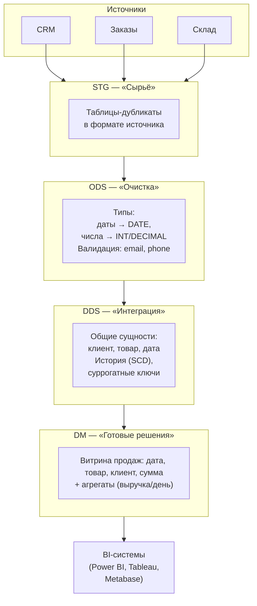
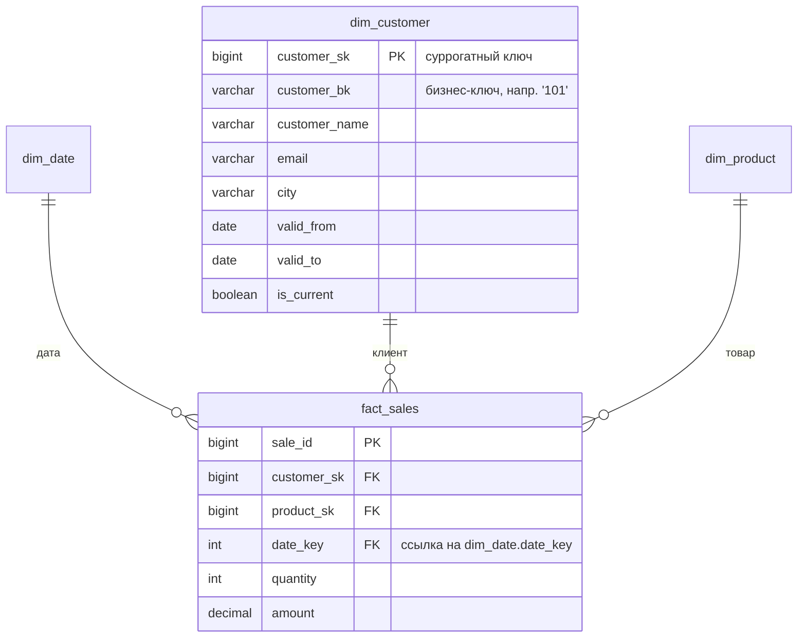
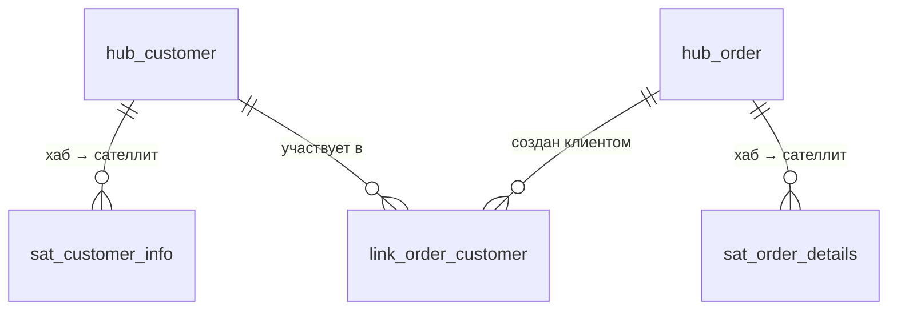
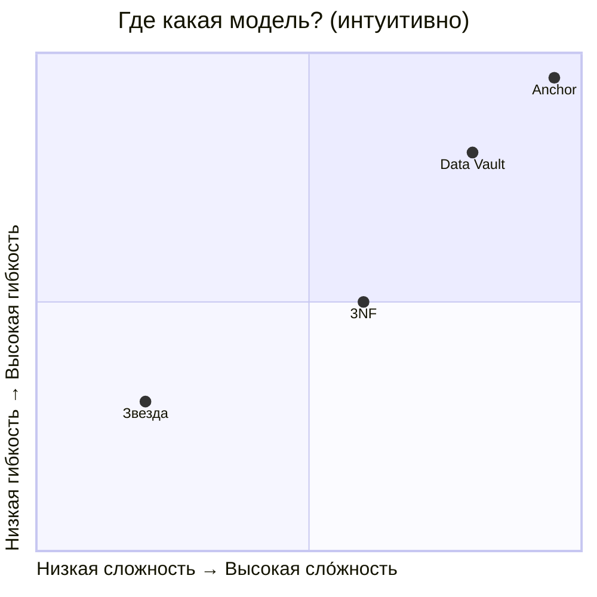
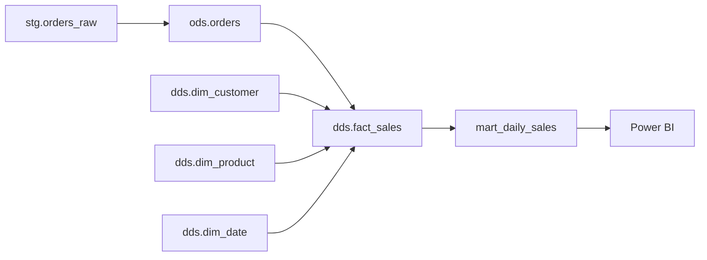
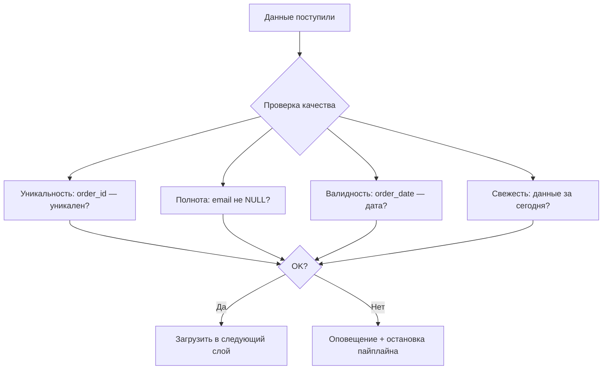

Отлично! Вот **связный, литературный и педагогически выстроенный** вариант статьи, адаптированный под новичков (студентов с базовым SQL), но без упрощения сути. Я убрал «рыхлые» места, усилил плавность повествования, добавил пояснения «на пальцах» — и сохранил все важные детали: архитектурные слои, модели данных, SCD, ключи, антипаттерны.  

Статья оформлена как **обучающий материал** — с логикой «от боли к решению», с живым примером (интернет-магазин), с акцентом на *почему*, а не только *как*.  
Готова к публикации на Habr, с приложенным GitHub-репозиторием.

---

# **Хранилище данных: как устроена аналитика «под капотом»**  
*Для тех, кто знает SQL, но хочет понять, как хранить данные не в Excel, а по-взрослому*

---

## **Что вы уже умеете — и что узнаете здесь**

✅ Уже знаете:  
- `SELECT`, `JOIN`, `GROUP BY`;  
- как посчитать сумму/среднее/количество по таблице.

🆕 Узнаете в этой статье:  
- **слои хранилища** (STG → ODS → DDS → DM) и *зачем они нужны*;  
- **факты и измерения** — основные кирпичики аналитики;  
- **SCD Type 2** — как хранить историю изменений клиента (например, смену email или города);  
- **суррогатные ключи (SK)** и чем они отличаются от обычных `id`;  
- **четыре модели данных**: 3NF, Звезда (Star), Data Vault, Anchor Modeling — и когда какую использовать.

⛔ **Не будем говорить** здесь о:  
- физическом хранении (партиции, индексы, ClickHouse-движки);  
- распределённых кластерах (Kafka, Spark, Airflow — это отдельный курс);  
- настройке производительности (`EXPLAIN`, кэши и т.п.).  
Это — про *логику*, структуру и здравый смысл.

---

## **1. Введение: почему нельзя просто SELECT из базы заказов?**

Представьте: вы — аналитик в интернет-магазине. Вам нужно ответить на вопрос:  
> **«Сколько заказов сделал клиент с email `a@ex.com` за 2023 год, и сколько он потратил?»**

Вы идёте в базу заказов — и… не находите email. Он в CRM. Идёте в CRM — там нет сумм заказов. Возвращаетесь в заказы — сумма есть, но *только текущая цена товара*. А в 2023 году цена была другой!

Знакомо? Это — **проблема OLTP-систем** (оперативного учёта):  
- **CRM**, **склад**, **платёжка** — это разные базы;  
- каждая оптимизирована под *быструю запись операций* («добавить заказ», «списать товар»);  
- историю там не хранят — email меняется «в лоб»: старое значение перезаписывается.

Такие системы называют **OLTP** (*Online Transaction Processing* — обработка транзакций в реальном времени).  
А для аналитики нужна **OLAP** (*Online Analytical Processing* — обработка запросов на анализ).

➡️ **Хранилище данных (Data Warehouse, DWH)** — это как «единая карта сокровищ», куда собирают данные из всех источников, *сохраняя историю*, *выравнивая термины* и *готовя их к анализу*.

И вот главный секрет его успеха: **слоистая архитектура**.

---

## **2. Учебный пример: интернет-магазин**

Чтобы всё было на пальцах — разберём простой, но живой пример.

У нас есть 6 таблиц из трёх источников:

| Таблица | Источник | Что содержит |
|---------|----------|--------------|
| `customers` | CRM | Клиенты: `customer_id`, `email`, `phone`, `city` |
| `orders`, `order_items` | Заказы | Заказы и позиции в них |
| `products` | Склад | Товары: `product_id`, `name` |
| `prices` | Склад | История цен: `product_id`, `valid_from`, `valid_to`, `price` |
| `promos` | Маркетинг | Акции: `promo_id`, `code` |

⚠️ Обратите внимание:  
- `customer_id = 101` в одном месяце — `a@ex.com`, в другом — `b@ex.com`;  
- цена на товар `9001` (Phone) в январе — 100 ₽, в феврале — 110 ₽;  
- `order_items` содержит `price_at_sale` — *цену в момент покупки*, а не текущую.

Это уже **намёк**: чтобы посчитать выручку 2023 года, нам нужна не текущая цена, а *та, что была в день заказа*.

(ER-диаграмма и DDL-примеры — в конце статьи, в разделе «Для практики».)

---

## **3. Зачем делить DWH на слои?**

Представьте, что вы строите дом. Вы же не будете сразу вбивать гвозди в стены — сначала:  
1. Привезли стройматериалы (песок, доски, кирпич) — **сырьё**;  
2. Очистили, просеяли, нарезали — **обработка**;  
3. Собрали каркас, провели коммуникации — **интеграция**;  
4. Сделали отделку под конкретную квартиру — **готовое решение**.

В DWH — то же самое. Каждый слой отвечает за *одну задачу*:



👉 **Почему так лучше, чем «одна большая таблица»?**  
1. **Управляемость**: если в `customers` пришёл битый `email` — ошибка локализована в STG/ODS, DDS не пострадает.  
2. **Прозрачность**: можно посмотреть: «а как выглядел исходник?», «а как мы его почистили?».  
3. **Производительность**: в DDS и DM — только то, что нужно для анализа. Никаких `JSON`-полей, `TEXT` без причины.

---

## **4. Путешествие данных: от STG до DM**

Давайте проследим, как превращается строка заказа.

### **STG (Staging / «Бронза»)** — «как пришло»

- Таблицы: `stg.orders_raw`, `stg.customers_raw`;  
- Структура — *точно как в источнике* (может быть `VARCHAR` даже у дат);  
- Добавлены технические поля:  
  - `_ingest_id` — идентификатор загрузки;  
  - `_load_ts` — время получения данных;  
- Главное правило: **неизменяемость**. Если пришла новая порция — либо добавляем новые строки, либо *полностью перезагружаем* слой (идемпотентность).  
- Дедупликация: если два раза пришёл один и тот же заказ — оставляем один (по `order_id + _load_ts`).

> 💡 *Пример:* `stg.orders_raw` содержит `"2024-01-10"` как строку — это нормально. Главное — не потерять оригинал.

---

### **ODS (Operational Data Store / «Серебро»)** — «почистили, но не трогали смысл»

- Таблицы: `ods.orders`, `ods.customers`;  
- Здесь:  
  - привели `order_date` к типу `DATE`;  
  - убрали заказы без клиента (`customer_id IS NULL` → ошибка или флаг);  
  - привели телефоны к формату `79991112233`;  
  - проверили email на валидность (регуляркой или простой проверкой).  
- **Но!** Не объединяем клиента из CRM и клиента из заказов — это будет позже.  
- Пока — никакой бизнес-логики. Только *техническая* очистка.

> 🎯 Цель ODS — дать «надёжную платформу» для следующего слоя. Как сухое, чистое бревно перед сборкой дома.

---

### **DDS (Data Delivery Store / «Ядро», «Золото»)** — «интеграция + история»

Здесь рождается *единая бизнес-модель*.  
Появляются понятия: **измерения**, **факты**, **суррогатные ключи**, **SCD**.

Например:

| Таблица | Назначение |
|---------|------------|
| `dds.dim_customer` | Измерение «Клиент» с историей (SCD Type 2) |
| `dds.dim_product` | Измерение «Товар» |
| `dds.dim_date` | Готовый календарь на 10 лет вперёд (день/неделя/месяц/квартал) |
| `dds.fact_sales` | Факт «Продажа» — строка заказа с суммой и количеством |

💡 **Суррогатный ключ (Surrogate Key, SK)** — это `BIGINT`, который мы генерируем сами (например, `customer_sk = 1001`).  
**Бизнес-ключ (Business Key, BK)** — это `customer_id = 101` из источника.  
Мы храним и то, и другое — чтобы можно было и джойнить, и понимать, откуда строка.

> ✅ Почему не использовать `customer_id` напрямую?  
> — Потому что в одном источнике `customer_id` — целое число, в другом — строка `CUST-101`.  
> — Потому что ID могут повторяться (например, в тестовой и продовой базах).  
> — Потому что нам нужна *связь* с историей: у клиента с BK = `101` может быть 3 версии в `dim_customer`.

---

### **DM (Data Mart / «Витрины»)** — «готово к употреблению»

Здесь — таблицы и представления для конкретных задач:  
- `dm.mart_daily_sales` — ежедневные продажи по товарам и сегментам;  
- `dm.mart_customer_360` — полный портрет клиента: сколько потратил, когда заходил, какие товары любит.

Они построены по модели **Звезда (Star Schema)** — потому что BI-инструментам так удобнее всего.

---

## **5. Базовые понятия: факты, измерения, SCD**

Представьте отчёт:  
> *«10 января 2024 года клиент из Москвы (сегмент Premium) купил Phone за 100 ₽»*.

В DWH это разложится на:  
- **Факт (Fact)** — событие, которое можно измерить: *покупка*.  
  Хранится в `fact_sales`: `quantity = 1`, `amount = 100`.  
- **Измерения (Dimensions)** — *контекст* факта:  
  - `dim_date` → 10 января 2024;  
  - `dim_customer` → Москва, Premium;  
  - `dim_product` → Phone.



### **SCD Type 2 — как хранить историю**

Клиент №101:  
- с 1 янв по 15 мая — `email = a@ex.com`, `city = Москва`;  
- с 16 мая — `email = b@ex.com`, `city = Москва`;  
- с 1 окт — `email = b@ex.com`, `city = Санкт-Петербург`.

В `dim_customer` это будет **три строки**:

| customer_sk | customer_bk | email | city | valid_from | valid_to | is_current |
|-------------|-------------|-------|------|------------|----------|------------|
| 1001 | 101 | a@ex.com | Москва | 2023-01-01 | 2023-05-15 | false |
| 1002 | 101 | b@ex.com | Москва | 2023-05-16 | 2023-09-30 | false |
| 1003 | 101 | b@ex.com | СПб | 2023-10-01 | 9999-12-31 | true |

Когда мы считаем продажи за **12 января** — джойним `fact_sales` к той строке `dim_customer`, где:  
```sql
fact_sales.order_date BETWEEN dim_customer.valid_from AND dim_customer.valid_to
```
и получаем актуальный на тот день email и город.

> 🔍 Подробнее про SCD — в отдельной статье [SQC](SCD.md) (сравнение Type 1/2/3, паттерны обновления).

---

## **6. Модели данных для слоя DDS: 4 подхода — и когда какой выбрать**

В DDS мы можем хранить данные по-разному. Это не «правильно/неправильно», а **выбор под задачу**.

### **1. 3NF (третья нормальная форма)**  
*Источник: Билл Инмон (Bill Inmon)*

✅ **Плюсы**:  
- Максимальная **целостность** — дубликатов нет (все атрибуты — там, где должны быть);  
- Легко **расширять** — добавили новый источник? Расширили связанный справочник.

❌ **Минусы**:  
- Запросы сложные: много JOIN’ов даже для простого отчёта;  
- Тяжело новичкам: «а где город клиента?» → нужно пройти `customer → address → city`.

📌 **Когда выбирать**:  
→ Корпоративные DWH, где важна *единая терминология* и *долгосрочная поддержка*.  
→ Когда источников — десятки, и нужно гарантировать консистентность.

---

### **2. Звезда (Star Schema)**  
*Источник: Ральф Кимболл (Ralph Kimball)*

✅ **Плюсы**:  
- **Простота**: факт + несколько «плоских» измерений;  
- **Скорость**: BI-системы любят звезду — запросы пишутся за 5 минут;  
- **Понятно бизнесу**: «продажи по товарам и клиентам» — это ровно то, что в таблицах.

❌ **Минусы**:  
- Дублирование: город будет повторяться в каждой строке клиента;  
- Изменение структуры измерения — дорого (перестроить всю витрину).

📌 **Когда выбирать**:  
→ Витрины (DM), а не ядро (DDS);  
→ Начинающим командам и MVP;  
→ Когда отчёты — главная цель.

---

### **3. Data Vault 2.0**  
*Источник: Дэн Линстедт (Dan Linstedt)*

Модель основана на трёх типах таблиц:

| Тип | Назначение | Пример |
|-----|------------|--------|
| **Hub (Хаб)** | Хранит бизнес-ключи (BK) | `hub_customer`: `customer_id`, `load_dttm` |
| **Link (Связь)** | Фиксирует отношения | `link_order_customer`: `order_id + customer_id` |
| **Satellite (Сателлит)** | Хранит атрибуты + историю | `sat_customer_info`: имя, email, дата начала/окончания |



✅ **Плюсы**:  
- **История «из коробки»** — каждое изменение — новая строка в сателлите;  
- **Масштабируемость**: легко подключить новый источник — добавили хаб/линк/сателлит;  
- **Аудит**: откуда пришёл каждый факт — видно по `_load_dttm`.

❌ **Минусы**:  
- Сложно читать (20 таблиц вместо 3);  
- Нужно писать сложные запросы (или использовать автоматическую генерацию витрин).

📌 **Когда выбирать**:  
→ Большие проекты с 10+ источниками;  
→ Когда критична **трассировка** и **соответствие регуляторным требованиям** (например, финтех).

> 📌 *DV 1.0* не поддерживал SCD Type 2 «из коробки» — в DV 2.0 это решено.

---

### **4. Anchor Modeling (анкерное моделирование)**  
*Источник: Ларс Рёне (Lars Rönnbäck)*

Ещё более атомарный подход:  
- **Anchor** — сущность (клиент, товар);  
- **Attribute** — атрибут (email, имя);  
- **Tie** — связь (как Link в DV);  
- Все таблицы — 2–3 столбца.

✅ **Плюсы**:  
- **Максимальная гибкость**: поменяли модель — не трогали старые таблицы;  
- **Бесконечная эволюция**: можно добавлять атрибуты «задним числом».

❌ **Минусы**:  
- Очень сложные запросы (JOIN’ов — десятки);  
- Почти не используется «в чистом виде» — чаще как концепция.

📌 **Когда выбирать**:  
→ Экспериментальные проекты;  
→ Когда схема данных *каждый месяц* радикально меняется.

---

### **Сравнение моделей — наглядно**



> 🎯 **Вывод**: нет «лучшей» модели. Есть **подходящая под контекст**.  
> — Для обучения — **Звезда** (просто, наглядно).  
> — Для корпоративного DWH — **3NF + Звезда на выходе**.  
> — Для масштабируемой интеграции — **Data Vault**.

---

## **7. Практикум: как собрать первую витрину**

Покажем на примере `mart_daily_sales` — таблицу, которую можно сразу подключить к Power BI.

### **Этапы сборки**

1. Из STG → ODS:  
   - `stg.orders_raw` → `ods.orders` (привели `order_date` к `DATE`);
2. Из ODS → DDS:  
   - `ods.customers` → `dds.dim_customer` (SCD Type 2);  
   - `ods.products` → `dds.dim_product`;  
   - `ods.orders` + `ods.order_items` → `dds.fact_sales`;
3. Из DDS → DM:  
   - `fact_sales` + `dim_*` → `mart_daily_sales`.



### **Пример SQL-запроса для витрины**

```sql
-- mart_daily_sales: ежедневные продажи с сегментацией
CREATE MATERIALIZED VIEW dm.mart_daily_sales AS
SELECT
    d.date_actual AS order_date,
    p.product_name,
    c.customer_segment,        -- например: 'Premium', 'Basic'
    SUM(f.quantity) AS total_qty,
    SUM(f.amount) AS total_revenue
FROM dds.fact_sales f
JOIN dds.dim_date d 
  ON f.date_key = d.date_key
JOIN dds.dim_product p 
  ON f.product_sk = p.product_sk
JOIN dds.dim_customer c 
  ON f.customer_sk = c.customer_sk
  AND f.order_date BETWEEN c.valid_from AND c.valid_to  -- SCD!
WHERE c.is_current = true  -- или не фильтровать — тогда будет история
GROUP BY d.date_actual, p.product_name, c.customer_segment;
```

> 💡 **Материализованное представление (MATERIALIZED VIEW)** — это «кэш» результата. Обновляется по расписанию (например, ночью).

---

## **8. Как выбрать модель? Дерево решений**

Вот простой алгоритм:

```
Нужна ли история изменений? ── Нет → Звезда (просто и быстро)
                             │
                             Да
                             │
Много ли источников (>5)? ── Нет → 3NF (надёжно, понятно)
                             │
                             Да
                             │
Нужна ли аудиторская трассировка? ── Нет → 3NF + SCD
                                      │
                                      Да → Data Vault
```

> 🛑 Не делайте «гибрид» без причины:  
> — Звезда в DDS — плохо (потеряете гибкость);  
> — DV в DM — плохо (BI не потянет 50 JOIN’ов).

---

## **9. Эксплуатация: качество данных — это не «опция»**

Самая красивая архитектура бессмысленна, если в `mart_daily_sales` — нули.  
Поэтому в каждом слое — **контроль качества (DQ, Data Quality)**.



Примеры проверок (на SQL):

```sql
-- Проверка уникальности order_id в ODS
SELECT order_id, COUNT(*)
FROM ods.orders
GROUP BY order_id
HAVING COUNT(*) > 1;

-- Проверка свежести: есть ли данные за вчера?
SELECT 'OK' WHERE EXISTS (
  SELECT 1 FROM ods.orders
  WHERE order_date = CURRENT_DATE - INTERVAL '1 day'
);
```

> 🔔 **Совет**: делайте DQ-тесты частью CI/CD — как unit-тесты в коде.

---

## **10. Заключение: главное — понимать «почему»**

Хранилище данных — это не про «крутые технологии», а про **мышление**:

- **Слои (STG→ODS→DDS→DM)** — это про *разделение ответственности*.  
  Не смешивайте сырые данные и аналитические — иначе не найдёте, где ошибка.

- **Факты и измерения** — это про *структуру мышления*.  
  События (факты) и контекст (измерения) — две стороны одного процесса.

- **SCD Type 2** — это про *уважение к истории*.  
  Бизнес меняется — и данные должны это отражать.

- **Модели (Star/3NF/DV)** — это про *выбор под задачу*.  
  Нет «серебряной пули» — есть компромиссы.

> 🎁 **Финальный подарок**:  
> Запомните **5 золотых правил DWH**:  
> 1. Всегда храните BK (бизнес-ключ) — иначе потеряете связь с источником.  
> 2. В DDS — только интегрированные, «чистые» сущности.  
> 3. В DM — только то, что нужно для отчёта.  
> 4. Проверяйте качество *на каждом слое*.  
> 5. Собирайте витрины *итеративно*: MVP → доработка → новые метрики.

---

## **Приложения**

### 📚 Мини-глоссарий (RU / EN)

| Термин | Пояснение |
|-------|-----------|
| **Слой (Layer)** | Логический уровень в DWH: STG/ODS/DDS/DM |
| **Витрина (Data Mart)** | Готовый набор таблиц для конкретной аналитики (например, финансы или маркетинг) |
| **Факт (Fact)** | Таблица событий или измерений: продажи, клики, звонки |
| **Измерение (Dimension)** | Справочник контекста: клиенты, товары, дата |
| **Суррогатный ключ (SK)** | Искусственный `BIGINT`, генерируемый в DWH |
| **Бизнес-ключ (BK)** | Естественный идентификатор из источника (`customer_id`, `order_number`) |
| **SCD (Slowly Changing Dimension)** | Подход к хранению истории атрибутов измерения |
| **CDC (Change Data Capture)** | Техника инкрементальной загрузки «только изменений» |
| **Conformed Dimension** | Измерение, единое для нескольких витрин (например, `dim_date`) |

---

### 🧱 Синонимы слоёв в индустрии

| Название | Синонимы |
|----------|----------|
| **STG** | Staging, Raw, Bronze, Landing Zone |
| **ODS** | Cleaned, Integrated, Silver |
| **DDS** | Core, Conformed, Golden Layer, Enterprise Data Model |
| **DM** | Data Mart, Semantic Layer, Gold, Analytics Layer |

> ⚠️ Названия могут отличаться — смотрите на *содержание*, а не на ярлыки.

---

### 🚫 Антипаттерны (чего избегать)

| Антипаттерн | Почему плохо |
|-------------|--------------|
| **«Одна огромная история заказов»** | Запросы тормозят, нет истории атрибутов (клиент сменил email — и всё прошлое «перекрасилось») |
| **STG и ODS в одной таблице** | Невозможно понять: ошибка в источнике или при очистке? |
| **Факт с текстовыми атрибутами** (`customer_name` в `fact_sales`) | Дублирование, нарушение нормализации, «спрятанная» бизнес-логика |
| **SCD без BK** | История «отвязана» от бизнеса: удалили клиента — и вся его история исчезла |

---

### 📖 Что почитать дальше?

| Книга / Ресурс | Для кого |
|----------------|----------|
| **Кимболл, «Техника создания хранилищ данных»** | Начинающим: звезда, SCD, витрины |
| **Инмон, «Построение хранилищ данных»** | Для понимания 3NF и корпоративного подхода |
| **Linstedt & Olschimke, «Data Vault 2.0»** | Практическое руководство по DV |
| **[anchor-modeling.com](https://www.anchormodeling.com/)** | Официальный сайт Anchor Modeling |
| **Курс «Аналитика в Postgres» (Stepik / Postgres Pro)** | Практика SQL + DWH на реальных данных |

---

## **ЧАСТЬ C. Мини-датасет (для практики)**

Положите эти файлы в папку `data/` — и тренируйтесь:

**`customers.csv`**
```csv
customer_id,email,phone,city
101,a@ex.com,700,Москва
101,b@ex.com,700,Москва
102,c@ex.com,701,СПб
```

**`orders.csv`**
```csv
order_id,order_date,customer_id
5001,2024-01-10,101
5002,2024-02-05,102
```

**`order_items.csv`**
```csv
order_item_id,order_id,product_id,qty,price_at_sale
1,5001,9001,2,100.00
2,5001,9002,1,50.00
3,5002,9001,1,100.00
```

**`products.csv`**
```csv
product_id,name
9001,Phone
9002,Case
```

**`prices.csv`**
```csv
product_id,valid_from,valid_to,price
9001,2023-12-01,2024-01-31,100
9001,2024-02-01,2999-12-31,110
```

> 📂 Примеры DDL, SQL-загрузки, SCD-скрипты — в [GitHub-репозитории к статье](https://github.com/yourname/dwh-basics) (реальный репо — по вашему усмотрению).

---

## **ЧАСТЬ D. DDL-скелеты (PostgreSQL)**

```sql
-- DDS: измерение клиента (SCD Type 2)
CREATE TABLE dds.dim_customer (
    customer_sk   BIGINT GENERATED ALWAYS AS IDENTITY PRIMARY KEY,
    customer_bk   VARCHAR(50) NOT NULL,   -- напр. '101'
    email         VARCHAR(100),
    phone         VARCHAR(20),
    city          VARCHAR(50),
    valid_from    DATE NOT NULL,
    valid_to      DATE DEFAULT '9999-12-31',
    is_current    BOOLEAN NOT NULL DEFAULT TRUE
);

-- DDS: факт продаж (гранулярность: строка заказа)
CREATE TABLE dds.fact_sales (
    sale_id      BIGINT GENERATED ALWAYS AS IDENTITY PRIMARY KEY,
    customer_sk  BIGINT NOT NULL REFERENCES dds.dim_customer(customer_sk),
    product_sk   BIGINT NOT NULL,
    date_key     INT NOT NULL,  -- YYYYMMDD, ссылка на dim_date.date_key
    quantity     INT NOT NULL CHECK (quantity > 0),
    amount       DECIMAL(18,2) NOT NULL CHECK (amount >= 0)
);
```

> 💡 `date_key` — это `20240110`, а не `DATE`, чтобы не делать JOIN по диапазону в `fact → dim_date`.

---

Если нужно — могу:  
- добавить **интерактивные схемы** (например, кликабельные Mermaid → SVG);  
- подготовить **полный SQL-скрипт загрузки** (STG→ODS→DDS);  
- сделать **вариант статьи в формате Jupyter Notebook** (с исполняемыми ячейками).

Готов дорабатывать под ваш стиль и аудиторию.