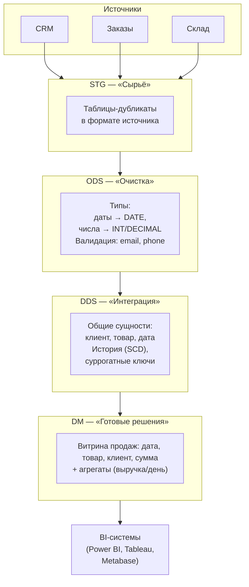
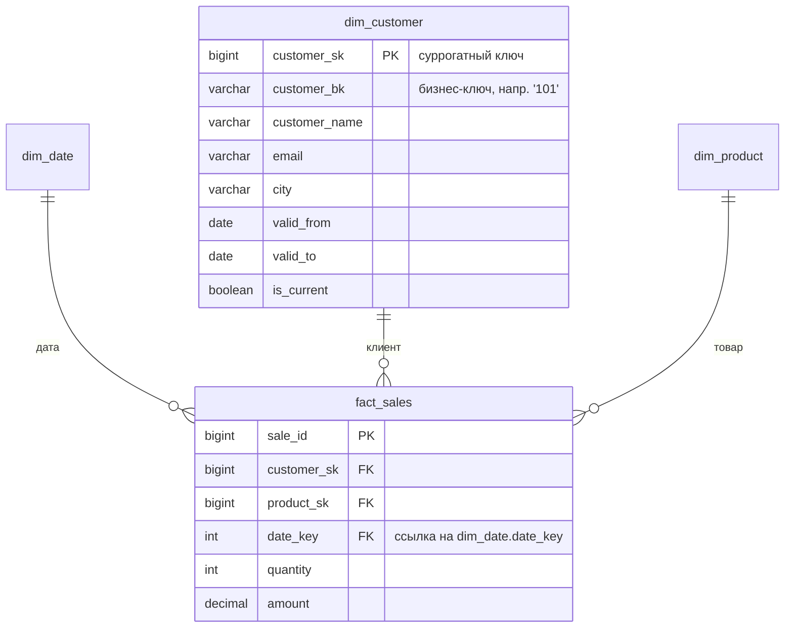
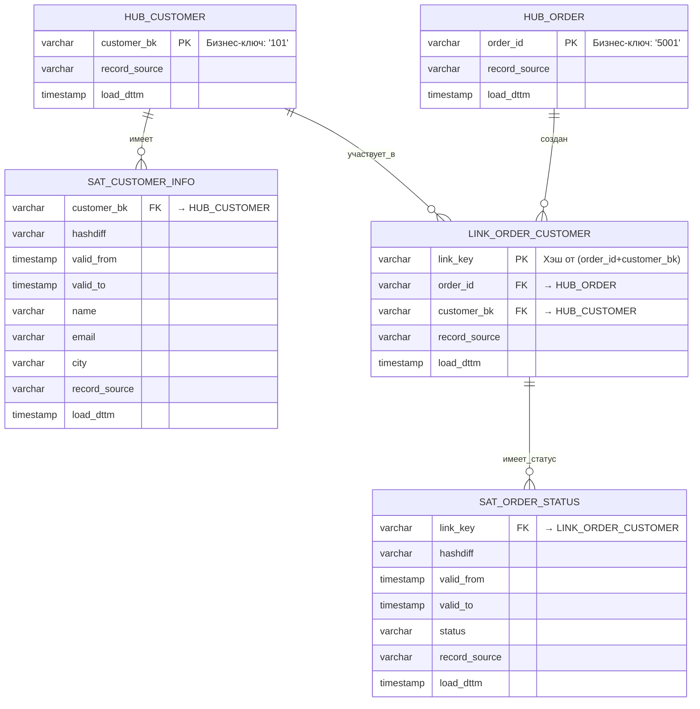
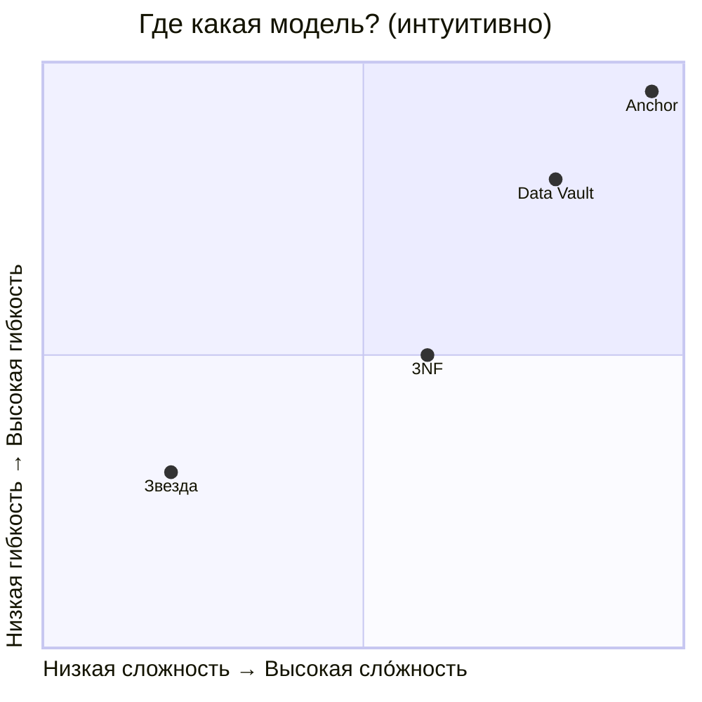
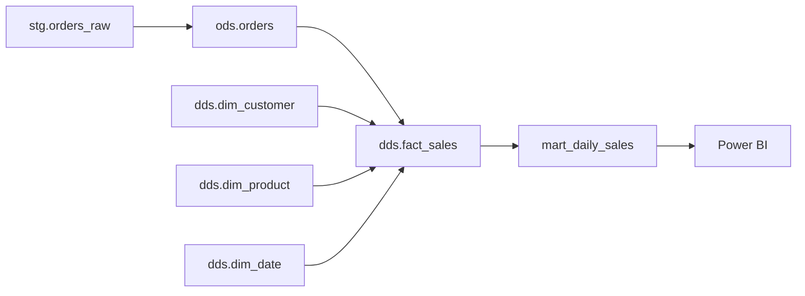
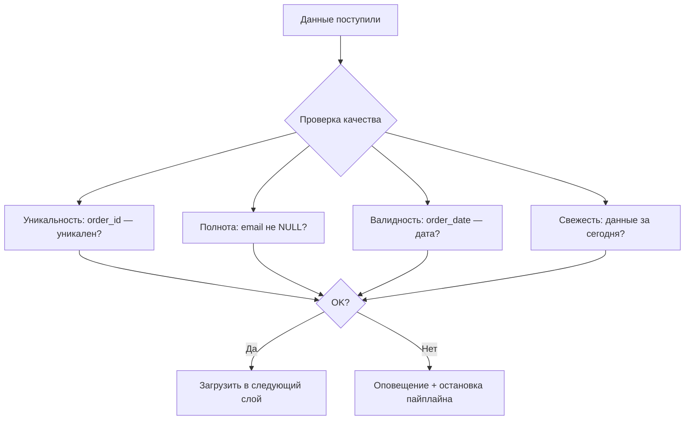

# **Хранилище данных: как устроена аналитика «под капотом»**  
*Для тех, кто знает SQL, но хочет понять, как хранить данные не в Excel, а по-взрослому*

---

## **Что вы уже умеете — и что узнаете здесь**

✅ Уже знаете:  
- `SELECT`, `JOIN`, `GROUP BY`;  
- как посчитать сумму/среднее/количество по таблице.

🆕 Узнаете в этой статье:  
- **слои хранилища** (STG → ODS → DDS → DM) и *зачем они нужны*;  
- **факты и измерения** — основные кирпичики аналитики;  
- **SCD Type 2** — как хранить историю изменений клиента (например, смену email или города);  
- **суррогатные ключи (SK)** и чем они отличаются от обычных `id`;  
- **четыре модели данных**: 3NF, Звезда (Star), Data Vault, Anchor Modeling — и когда какую использовать.

⛔ **Не будем говорить** здесь о:  
- физическом хранении (партиции, индексы, ClickHouse-движки);  
- распределённых кластерах (Kafka, Spark, Airflow — это отдельный курс);  
- настройке производительности (`EXPLAIN`, кэши и т.п.).  
Это — про *логику*, структуру и здравый смысл.

---

## **1. Введение: почему нельзя просто SELECT из базы заказов?**

Представьте: вы — аналитик в интернет-магазине. Вам нужно ответить на вопрос:  
> **«Сколько заказов сделал клиент с email `a@ex.com` за 2023 год, и сколько он потратил?»**

Вы идёте в базу заказов — и… не находите email. Он в CRM. Идёте в CRM — там нет сумм заказов. Возвращаетесь в заказы — сумма есть, но *только текущая цена товара*. А в 2023 году цена была другой!

Знакомо? Это — **проблема OLTP-систем** (оперативного учёта):  
- **CRM**, **склад**, **платёжка** — это разные базы;  
- каждая оптимизирована под *быструю запись операций* («добавить заказ», «списать товар»);  
- историю там не хранят — email меняется «в лоб»: старое значение перезаписывается.

Такие системы называют **OLTP** (*Online Transaction Processing* — обработка транзакций в реальном времени).  
А для аналитики нужна **OLAP** (*Online Analytical Processing* — обработка запросов на анализ).

➡️ **Хранилище данных (Data Warehouse, DWH)** — это как «единая карта сокровищ», куда собирают данные из всех источников, *сохраняя историю*, *выравнивая термины* и *готовя их к анализу*.

И вот главный секрет его успеха: **слоистая архитектура**.

---

## **2. Учебный пример: интернет-магазин**

Чтобы всё было на пальцах — разберём простой, но живой пример.

У нас есть 6 таблиц из трёх источников:

| Таблица | Источник | Что содержит |
|---------|----------|--------------|
| `customers` | CRM | Клиенты: `customer_id`, `email`, `phone`, `city` |
| `orders`, `order_items` | Заказы | Заказы и позиции в них |
| `products` | Склад | Товары: `product_id`, `name` |
| `prices` | Склад | История цен: `product_id`, `valid_from`, `valid_to`, `price` |
| `promos` | Маркетинг | Акции: `promo_id`, `code` |

⚠️ Обратите внимание:  
- `customer_id = 101` в одном месяце — `a@ex.com`, в другом — `b@ex.com`;  
- цена на товар `9001` (Phone) в январе — 100 ₽, в феврале — 110 ₽;  
- `order_items` содержит `price_at_sale` — *цену в момент покупки*, а не текущую.

Это уже **намёк**: чтобы посчитать выручку 2023 года, нам нужна не текущая цена, а *та, что была в день заказа*.

(ER-диаграмма и DDL-примеры — в конце статьи, в разделе «Для практики».)

---

## **3. Зачем делить DWH на слои?**

Представьте, что вы строите дом. Вы же не будете сразу вбивать гвозди в стены — сначала:  
1. Привезли стройматериалы (песок, доски, кирпич) — **сырьё**;  
2. Очистили, просеяли, нарезали — **обработка**;  
3. Собрали каркас, провели коммуникации — **интеграция**;  
4. Сделали отделку под конкретную квартиру — **готовое решение**.

В DWH — то же самое. Каждый слой отвечает за *одну задачу*:



👉 **Почему так лучше, чем «одна большая таблица»?**  
1. **Управляемость**: если в `customers` пришёл битый `email` — ошибка локализована в STG/ODS, DDS не пострадает.  
2. **Прозрачность**: можно посмотреть: «а как выглядел исходник?», «а как мы его почистили?».  
3. **Производительность**: в DDS и DM — только то, что нужно для анализа. Никаких `JSON`-полей, `TEXT` без причины.

---

## **4. Путешествие данных: от STG до DM**

Давайте проследим, как превращается строка заказа.

### **STG (Staging / Bronze)** — «как пришло»

- Таблицы: `stg.orders_raw`, `stg.customers_raw`;  
- Структура — *точно как в источнике* (может быть `VARCHAR` даже у дат);  
- Добавлены технические поля:  
  - `_load_id` — идентификатор загрузки;  
  - `_load_ts` — время получения данных;  
- Главное правило: **неизменяемость**. Если пришла новая порция — либо добавляем новые строки, либо *полностью перезагружаем* слой (идемпотентность).  
- Дедупликация: если два раза пришёл один и тот же заказ — оставляем один (по `order_id + _load_ts`).

> 💡 *Пример:* `stg.orders_raw` содержит `"2024-01-10"` как строку — это нормально. Главное — не потерять оригинал.

---

### **ODS (Operational Data Store / Silver)** — «почистили, но не трогали смысл»

- Таблицы: `ods.orders`, `ods.customers`;  
- Здесь:  
  - привели `order_date` к типу `DATE`;  
  - убрали заказы без клиента (`customer_id IS NULL` → ошибка или флаг);  
  - привели телефоны к формату `79991112233`;  
  - проверили email на валидность (регуляркой или простой проверкой).  
- **Но!** Не объединяем клиента из CRM и клиента из заказов — это будет позже.  
- Пока — никакой бизнес-логики. Только *техническая* очистка.

> 🎯 Цель ODS — дать «надёжную платформу» для следующего слоя. Как сухое, чистое бревно перед сборкой дома.

---

### **DDS (Data Delivery Store / Core / Gold)** — «интеграция + история»

Здесь рождается *единая бизнес-модель*.  
Появляются понятия: **измерения**, **факты**, **суррогатные ключи**, **SCD**.

Например:

| Таблица | Назначение |
|---------|------------|
| `dds.dim_customer` | Измерение «Клиент» с историей (SCD Type 2) |
| `dds.dim_product` | Измерение «Товар» |
| `dds.dim_date` | Готовый календарь на 10 лет вперёд (день/неделя/месяц/квартал) |
| `dds.fact_sales` | Факт «Продажа» — строка заказа с суммой и количеством |

💡 **Суррогатный ключ (Surrogate Key, SK)** — это `BIGINT`, который мы генерируем сами (например, `customer_sk = 1001`).  
**Бизнес-ключ (Business Key, BK)** — это `customer_id = 101` из источника.  
Мы храним и то, и другое — чтобы можно было и джойнить, и понимать, откуда строка.

> ✅ Почему не использовать `customer_id` напрямую?  
> — Потому что в одном источнике `customer_id` — целое число, в другом — строка `CUST-101`.  
> — Потому что ID могут повторяться (например, в тестовой и продовой базах).  
> — Потому что нам нужна *связь* с историей: у клиента с BK = `101` может быть 3 версии в `dim_customer`.

---

### **DM (Data Mart / «Витрины»)** — «готово к употреблению»

Здесь — таблицы и представления для конкретных задач:  
- `dm.mart_daily_sales` — ежедневные продажи по товарам и сегментам;  
- `dm.mart_customer_360` — полный портрет клиента: сколько потратил, когда заходил, какие товары любит.

Они часто построены по модели **Звезда (Star Schema)** — потому что BI-инструментам так удобнее всего.

---

## **5. Базовые понятия: факты, измерения, SCD**

Представьте отчёт:  
> *«10 января 2024 года клиент из Москвы (сегмент Premium) купил Phone за 100 ₽»*.

В DWH это разложится на:  
- **Факт (Fact)** — событие, которое можно измерить: *покупка*.  
  Хранится в `fact_sales`: `quantity = 1`, `amount = 100`.  
- **Измерения (Dimensions)** — *контекст* факта:  
  - `dim_date` → 10 января 2024;  
  - `dim_customer` → Москва, Premium;  
  - `dim_product` → Phone.



### **SCD Type 2 — как хранить историю**

Клиент №101:  
- с 1 янв по 15 мая — `email = a@ex.com`, `city = Москва`;  
- с 16 мая — `email = b@ex.com`, `city = Москва`;  
- с 1 окт — `email = b@ex.com`, `city = Санкт-Петербург`.

В `dim_customer` это будет **три строки**:

| customer_sk | customer_bk | email | city | valid_from | valid_to | is_current |
|-------------|-------------|-------|------|------------|----------|------------|
| 1001 | 101 | a@ex.com | Москва | 2023-01-01 | 2023-05-15 | false |
| 1002 | 101 | b@ex.com | Москва | 2023-05-16 | 2023-09-30 | false |
| 1003 | 101 | b@ex.com | СПб | 2023-10-01 | 9999-12-31 | true |

Когда мы считаем продажи за **12 января** — джойним `fact_sales` к той строке `dim_customer`, где:  
```sql
fact_sales.order_date BETWEEN dim_customer.valid_from AND dim_customer.valid_to
```
и получаем актуальный на тот день email и город.

> 🔍 Подробнее про SCD — в отдельной статье [Slow Changing Dimensions](SCD.md) (сравнение Type 1/2/3, паттерны обновления).

---

## **6. Модели данных для слоя DDS: 4 подхода — и когда какой выбрать**

В DDS мы можем хранить данные по-разному. Это не «правильно/неправильно», а **выбор под задачу**.

### **1. 3NF (третья нормальная форма)**  
*Источник: Билл Инмон (Bill Inmon)*

✅ **Плюсы**:  
- Минимум избыточности при строгих ключах и правилах дедупликации.
- Проще поддерживать единую терминологию и НСИ (reference data).
- Атрибуты и справочники легко расширять.

❌ **Минусы**:  
- Много JOIN даже для простых отчётов.
- Историчность (SCD2) усложняет таблицы.
- Новые источники дороже гармонизировать (привести к канону).

📌 **Когда выбирать**:  
→ Корпоративные DWH, где важна *единая терминология* и *долгосрочная поддержка*.  
→ Стабильные домены (финансы, НСИ, договоры) и умеренная динамика изменений.

---

### **2. Звезда (Star Schema)**  
*Источник: Ральф Кимболл (Ralph Kimball)*

✅ **Плюсы**:  
- **Простота**: факт + несколько «плоских» измерений;  
- **Скорость**: BI-системы любят звезду — запросы пишутся за 5 минут;  
- **Понятно бизнесу**: «продажи по товарам и клиентам» — это ровно то, что в таблицах.

❌ **Минусы**:  
- Дублирование: город будет повторяться в каждой строке клиента;  
- Изменение структуры измерения — дорого (перестроить всю витрину).

📌 **Когда выбирать**:  
→ Витрины (DM), а не ядро (DDS);  
→ Начинающим командам и MVP;  
→ Когда отчёты — главная цель.

---

### **3. Data Vault 2.0 — «конструктор Lego» для больших DWH**

*Идея: Дэн Линстедт (Dan Linstedt). Цель — собирать DWH из повторно используемых блоков, не боясь, что новый источник «сломает» всё, что было до него.*

#### С чего начать? Представьте конструктор

У вас есть коробка Lego. В ней:
- **Красные кирпичи (Хабы)** — это *«что или кто»*: клиент, заказ, товар.  
  У них нет цвета, надписей — только форма (бизнес-ключ). Главное — *узнать*, что это «один и тот же клиент №101», даже если его email менялся трижды.
- **Серые соединители (Линки)** — это *«как связаны»*: «заказ №5001 создан клиентом №101».  
  Не сами объекты, а *связь между ними*. И даже эту связь можно «отвязать» и привязать по-другому — без пересборки кирпичей.
- **Жёлтые наклейки (Сателлиты)** — это *«какие у них свойства»*: имя клиента, статус заказа, цена товара.  
  И самое важное: **каждый раз, когда что-то изменилось — наклеиваем новую жёлтую наклейку**, не стирая старую. Так у нас остаётся *полная история*.

💡 **Главный принцип DV**:  
> *«Идентичность — навсегда. Свойства — меняются. Связи — тоже могут меняться. И всё это — отдельно.»*



> **Как читать схему:**  
> 🔴 **Красные блоки (Хабы)** = «Кто/что это?» — только идентичность, никаких атрибутов.  
> ⚪ **Серые блоки (Линки)** = «Как связаны?» — соединяют хабы, фиксируют отношения.  
> 🟡 **Жёлтые блоки (Сателлиты)** = «Какие свойства?» — хранят атрибуты + историю изменений.  
>   
> 💡 **Правило конструктора:** Чтобы добавить новый источник (например, мобильное приложение), мы просто «приклеиваем» новый сателлит к существующему хабу — не перестраивая всю модель.

---

#### Почему это не просто SCD Type 2 «по-другому»?

В SCD Type 2 (в `dim_customer`) мы *смешиваем*:
- идентичность (`customer_bk = 101`),  
- и атрибуты (`email`, `city`),  
- и связь с бизнес-событиями (`valid_from`, `is_current`).

В Data Vault эти три вещи **разнесены по разным таблицам**:
- `hub_customer` — только `customer_bk` и технические поля (откуда пришёл, когда загрузили);  
- `sat_customer_info` — только атрибуты + их история (как в SCD, но отдельно!);  
- `link_order_customer` — только «кто сделал заказ» (и даже тут — отдельный сателлит может хранить *статус связи*: «активный», «отменённый» и т.д.).

➡️ Это даёт **огромный бонус**:  
Если завтра пришёл новый источник — например, мобильное приложение — и там у клиента есть `device_id`,  
вы **не перестраиваете `dim_customer`** (как в Kimball/3NF),  
а просто добавляете **новый сателлит** — `sat_customer_device`.  
Старые отчёты продолжают работать. Новые — используют новую наклейку.

---

#### Как устроен «сырой» Data Vault (упрощённо)

| Таблица | Внутри | Пример |
|---------|--------|--------|
| **`hub_customer`** | `customer_bk` (например, `'101'`) + `load_dttm` + `source` | Клиент «101» появился в CRM 10 января |
| **`sat_customer_info`** | `customer_bk`, `email`, `city`, `valid_from`, `valid_to`, `load_dttm` | 10 янв–15 мая: `a@ex.com`, Москва; 16 мая–…: `b@ex.com`, Москва |
| **`hub_order`** | `order_id` + `load_dttm` + `source` | Заказ «5001» из системы заказов |
| **`link_order_customer`** | `order_id`, `customer_bk` + `load_dttm` + `source` | Заказ 5001 → клиент 101 |
| **`sat_order_status`** *(опционально)* | `order_id`, `status`, `valid_from`, `valid_to` | 10 янв: «оплачен», 12 янв: «доставлен» |

> ⚠️ *На практике вместо `customer_bk` часто используют **хэш-ключ** (`hk_customer`) — чтобы сравнивать быстрее и избежать проблем с типами (число vs строка).

---

#### А как же отчёты? Где витрины?

Хороший вопрос. **Сырой DV — не для BI.** Это «склад запчастей».  
Чтобы собрать «машину», нужен второй шаг: **Business Vault** (в DV 2.0 это — обязательная часть!).

Там уже:
- **PIT-таблицы (Point-in-Time)** — «какой клиент был 12 января 2024?» за 1 JOIN, а не за 5 оконных функций;  
- **Bridge-таблицы** — готовые пути: «заказ → клиент → последняя версия профиля»;  
- **Derived-таблицы** — после бизнес-логики (скидки, сегментация, флаги).

А *уже из них* строят **витрины в формате Звезды** — те самые `mart_daily_sales`, которые вы подключаете в Power BI.

🔁 То есть цепочка:  
**Источник → Hub/Link/Sat (Raw DV) → PIT/Bridge (Business Vault) → Star Schema (DM)**
Можно строить и напрямую, без PIT/Bridge таблиц. Но это значительно "тяжелее" с точки зрения затрат вычислительных ресурсов.

---

#### Плюсы и минусы — честно и без прикрас

| ✅ Плюсы | ❌ Минусы |
|---------|----------|
| **История «из коробки»** — каждое изменение видно, ничего не перезаписывается | Сырой слой тяжел для чтения — нужен Business Vault (доп. работа) |
| **Добавить источник — легко** (новый сателлит, не ломая старое) | **Новых таблиц много** (Hub/Link/Sat — уже 3 на простую сущность) |
| **Полная трассировка**: кто, откуда, когда привёз каждую строчку | **Требует дисциплины**: если `record_source` забыли — аудит сломан |
| **Параллельная работа**: одна команда — клиенты, другая — заказы | **Не для MVP**: окупается на 10+ источниках, не на двух CSV |

---

#### Когда Data Vault — ваш выбор?

| Выберите DV 2.0, если… | Не начинайте с DV, если… |
|------------------------|---------------------------|
| У вас 5+ разнородных систем (CRM, ERP, мобильные приложения, внешние API) | У вас 1–2 источника и нужно быстро дать отчёт |
| Схемы часто меняются (новые атрибуты, новые связи) | Схема стабильна (например, учёт договоров в банке) |
| Важен аудит: «кто и когда изменил email?» (финтех, госсектор) | Отчёты — главная цель, а не соответствие регуляторам |
| В будущем — масштабирование: новые домены, новые команды | Вы один или вдвоём, и хотите простоты |

> 🎯 **Совет для новичка**:  
> Пока учитесь — *не пытайтесь собрать DV вручную*. Но **понимать его логику — обязательно**.  
> Почему? Потому что многие современные enterprise-DWH сегодня — либо DV, либо гибриды (DV + Star).  
> Даже если вы будете работать с витринами — вы будете *понимать*, откуда берутся данные и почему история «не обновляется».

---

#### Важно: DV 1.0 vs DV 2.0 — в чём разница?

- **DV 1.0** — только Hub/Link/Sat + историзация через `load_dttm`.  
  *Проблема:* нет стандартного способа хранить *периоды действия* (как в SCD Type 2) — `valid_from/valid_to` приходилось изобретать самим.

- **DV 2.0** — стандартизирует:  
  - **Effectivity Satellites** (с `valid_from/valid_to`) — для явной историчности,  
  - **Multi-Active Satellites** — когда у объекта *несколько одновременных значений* (например, три активных телефона),  
  - **Business Vault** — как обязательный слой перед витринами.

➡️ Сегодня, когда говорят «Data Vault», почти всегда имеют в виду **DV 2.0**.

---

### **4. Anchor Modeling (анкерное моделирование)**  
*Источник: Ларс Рёне (Lars Rönnbäck)*

Ещё более атомарный подход:  
- **Anchor** — сущность (клиент, товар);  
- **Attribute** — атрибут (email, имя);  
- **Tie** — связь (как Link в DV);  
- Все таблицы — 2–3 столбца.

✅ **Плюсы**:  
- **Максимальная гибкость**: поменяли модель — не трогали старые таблицы;  
- **Бесконечная эволюция**: можно добавлять атрибуты «задним числом».

❌ **Минусы**:  
- Очень сложные запросы (JOIN’ов — десятки);  
- Почти не используется «в чистом виде» — чаще как концепция.

📌 **Когда выбирать**:  
→ Экспериментальные проекты;  
→ Когда схема данных *каждый месяц* радикально меняется.

---

### **Сравнение моделей — наглядно**



> 🎯 **Вывод**: нет «лучшей» модели. Есть **подходящая под контекст**.  
> — Для обучения — **Звезда** (просто, наглядно).  
> — Для корпоративного DWH — **3NF + Звезда на выходе**.  
> — Для масштабируемой интеграции — **Data Vault**.

---

## **7. Практикум: как собрать первую витрину**

Покажем на примере `mart_daily_sales` — таблицу, которую можно сразу подключить к BI.

### **Этапы сборки**

1. Из STG → ODS:
   - `stg.orders_raw` → `ods.orders` (привели `order_date` к `DATE`);
2. Из ODS → DDS:
   - `ods.customers` → `dds.dim_customer` (SCD Type 2);
   - `ods.products` → `dds.dim_product`;
   - `ods.orders` + `ods.order_items` → `dds.fact_sales`;
3. Из DDS → DM:
   - `fact_sales` + `dim_*` → `mart_daily_sales`.



### **Готовые SQL-скрипты**

Все необходимые скрипты для построения хранилища находятся в папке [`sql/`](dwh-modeling/sql/)):

- [`01_ddl_stg-dds.sql`](dwh-modeling/sql/01_ddl_stg-dds.sql) — создание схем и таблиц (STG, ODS, DDS)
- [`02_dml_stg-dds.sql`](dwh-modeling/sql/02_dml_stg-dds.sql) — загрузка данных и трансформация
- [`03_demo_increment.sql`](dwh-modeling/sql/03_demo_increment.sql) — инкрементальная загрузка и SCD2
- [`04_validation.sql`](dwh-modeling/sql/04_validation.sql) — проверки качества данных
- [`05_ddl_dm.sql`](dwh-modeling/sql/05_ddl_dm.sql) — создание витрин (Data Marts)
- [`06_dml_dm.sql`](dwh-modeling/sql/06_dml_dm.sql) — наполнение витрин данными

### **Пример SQL-запроса для витрины**

```sql
-- mart_daily_sales: ежедневные продажи с сегментацией
CREATE MATERIALIZED VIEW dm.mart_daily_sales AS
SELECT
    d.date_actual AS order_date,
    p.product_name,
    c.customer_segment,        -- например: 'Premium', 'Basic'
    SUM(f.quantity) AS total_qty,
    SUM(f.amount) AS total_revenue
FROM dds.fact_sales f
JOIN dds.dim_date d
  ON f.date_key = d.date_key
JOIN dds.dim_product p
  ON f.product_sk = p.product_sk
JOIN dds.dim_customer c
  ON f.customer_sk = c.customer_sk
  AND f.order_date BETWEEN c.valid_from AND c.valid_to  -- SCD!
WHERE c.is_current = true  -- или не фильтровать — тогда будет история
GROUP BY d.date_actual, p.product_name, c.customer_segment;
```

> 💡 **Материализованное представление (MATERIALIZED VIEW)** — это «кэш» результата. Обновляется по расписанию (например, ночью).

---

## **8. Как выбрать модель данных? Советы от практиков**

Выбор модели — **не техническая задача, а стратегическая**.  
Это как решать: строить дом из кирпича, дерева или SIP-панелей. У каждой технологии — свои плюсы, но **главное — подходит ли она *вам* сегодня**.

### 🔹 Главное, что нужно понять новичку:

> **Не существует «самой правильной» модели.**  
> Есть **самая подходящая под ваш контекст** — и он у всех разный.

---

### 🛑 Что делать **не стоит** (если опыта < 2 лет в DWH):

| Что делать не стоит | Почему |
|---------------------|--------|
| **Брать Data Vault «потому что модно»** | DV требует глубокого понимания интеграции, CDC, идемпотентности. Без этого — получите «историю», где невозможно найти актуальные данные. |
| **Строить сложную 3NF «как в книжках» под 10 таблиц** | Если у вас 2 источника — вы потратите 2 недели на нормализацию, чтобы потом делать 5 JOIN’ов ради простого отчёта. |
| **Пытаться «сделать сразу гибко на 5 лет вперёд»** | Гибкость = сложность. А сложность = баги, задержки, выгорание команды. |

---

### ✅ **Базовые советы — с чего начать, если вы учитесь или делаете первый DWH**

1. **Начните с витрины в формате Звезды (Star Schema).**  
   — Это просто: одна таблица фактов + несколько «плоских» справочников.  
   — Это быстро: отчёт в BI — за 10 минут.  
   — Это понятно: даже менеджер поймёт структуру.

2. **Стройте DDS только когда это *действительно нужно*.**  
   — Если источников ≤ 3 и они стабильны — можно `ods → dm` напрямую.  
   — Если появятся расхождения («email в CRM и в заказах — разные»), *тогда* заводите `dds.dim_customer`.

3. **Историю (SCD) включайте *постепенно*.**  
   — Сначала — без истории (Type 1: просто обновляете строку).  
   — Потом — только для ключевых сущностей (клиент, товар).  
   — Только потом — думайте про DV или полную историзацию.

4. **Если сомневаетесь — спросите: «А кто будет этим пользоваться?»**  
   — Аналитик в Metabase → Звезда.  
   — BI-разработчик в Power BI → Звезда.  
   — Инженер, который строит ML-фичи → 3NF или даже сырые ODS-таблицы.  
   — Аудитор или регулятор → DV (но только если вы *готовы* к его сложности).

---

### 💡 И ещё один совет от практиков:

> **Лучше сделать простую модель — и вовремя переделать,**  
> чем сделать «идеальную» — и застрять на этапе проектирования.

Переделать Звезду → Звезда с SCD Type 2 — легко.  
Переделать «недоделанный DV» → что-то рабочее — в 10 раз сложнее.

---

### 📌 Кратко — что выбрать *сегодня*, если вы только учитесь:

| У вас… | Делайте… |
|--------|----------|
| Учебный проект, 1–2 CSV | `ods → dm` по модели **Звезда** (без DDS, без истории) |
| Первый рабочий DWH, 3–5 источников | `stg → ods → dds (3NF/простая Звезда) → dm (Звезда)` |
| Команда из 1 инженера + 1 аналитика | **Не трогайте DV и Anchor** — они «съедят» ваше время без отдачи |

А когда наберётесь опыта — приходите в DV. Он того стоит. Но *не раньше времени*.

---

## **9. Эксплуатация: качество данных — это не «опция»**

Самая красивая архитектура бессмысленна, если в `mart_daily_sales` — нули.  
Поэтому в каждом слое — **контроль качества (DQ, Data Quality)**.



Примеры проверок (на SQL):

```sql
-- Проверка уникальности order_id в ODS
SELECT order_id, COUNT(*)
FROM ods.orders
GROUP BY order_id
HAVING COUNT(*) > 1;

-- Проверка свежести: есть ли данные за вчера?
SELECT 'OK' WHERE EXISTS (
  SELECT 1 FROM ods.orders
  WHERE order_date = CURRENT_DATE - INTERVAL '1 day'
);
```

> 🔔 **Совет**: делайте DQ-тесты частью CI/CD — как unit-тесты в коде.

---

## **10. Заключение: главное — понимать «почему»**

Хранилище данных — это не про «крутые технологии», а про **мышление**:

- **Слои (STG→ODS→DDS→DM)** — это про *разделение ответственности*.  
  Не смешивайте сырые данные и аналитические — иначе не найдёте, где ошибка.

- **Факты и измерения** — это про *структуру мышления*.  
  События (факты) и контекст (измерения) — две стороны одного процесса.

- **SCD Type 2** — это про *уважение к истории*.  
  Бизнес меняется — и данные должны это отражать.

- **Модели (Star/3NF/DV)** — это про *выбор под задачу*.  
  Нет «серебряной пули» — есть компромиссы.

> 🎁 **Финальный подарок**:  
> Запомните **5 золотых правил DWH**:  
> 1. Всегда храните BK (бизнес-ключ) — иначе потеряете связь с источником.  
> 2. В DDS — только интегрированные, «чистые» сущности.  
> 3. В DM — только то, что нужно для отчёта.  
> 4. Проверяйте качество *на каждом слое*.  
> 5. Собирайте витрины *итеративно*: MVP → доработка → новые метрики.

---

## **Приложения**

### 📚 Мини-глоссарий (RU / EN)

| Термин | Пояснение |
|-------|-----------|
| **Слой (Layer)** | Логический уровень в DWH: STG/ODS/DDS/DM |
| **Витрина (Data Mart)** | Готовый набор таблиц для конкретной аналитики (например, финансы или маркетинг) |
| **Факт (Fact)** | Таблица событий или измерений: продажи, клики, звонки |
| **Измерение (Dimension)** | Справочник контекста: клиенты, товары, дата |
| **Суррогатный ключ (SK)** | Искусственный `BIGINT`, генерируемый в DWH |
| **Бизнес-ключ (BK)** | Естественный идентификатор из источника (`customer_id`, `order_number`) |
| **SCD (Slowly Changing Dimension)** | Подход к хранению истории атрибутов измерения |
| **CDC (Change Data Capture)** | Техника инкрементальной загрузки «только изменений» |
| **Conformed Dimension** | Измерение, единое для нескольких витрин (например, `dim_date`) |

---

### 🧱 Синонимы слоёв в индустрии

| Название | Синонимы |
|----------|----------|
| **STG** | Staging, Raw, Bronze, Landing Zone |
| **ODS** | Cleaned, Integrated, Silver |
| **DDS** | Core, Conformed, Golden Layer, Enterprise Data Model |
| **DM** | Data Mart, Semantic Layer, Gold, Analytics Layer |

> ⚠️ Названия могут отличаться — смотрите на *содержание*, а не на ярлыки.

---

### 🚫 Антипаттерны (чего избегать)

| Антипаттерн | Почему плохо |
|-------------|--------------|
| **«Одна огромная история заказов»** | Запросы тормозят, нет истории атрибутов (клиент сменил email — и всё прошлое «перекрасилось») |
| **STG и ODS в одной таблице** | Невозможно понять: ошибка в источнике или при очистке? |
| **Факт с текстовыми атрибутами** (`customer_name` в `fact_sales`) | Дублирование, нарушение нормализации, «спрятанная» бизнес-логика |
| **SCD без BK** | История «отвязана» от бизнеса: удалили клиента — и вся его история исчезла |

---

## **ЧАСТЬ C. Мини-датасет (для практики)**

Все данные для практики находятся в папке [`data/`](dwh-modeling/data/)) — тренируйтесь:

[**`customers.csv`**](dwh-modeling/data/customers.csv)):
```csv
customer_id,email,phone,city
101,a@ex.com,700,Москва
101,b@ex.com,700,Москва
102,c@ex.com,701,СПб
```

[**`orders.csv`**](dwh-modeling/data/orders.csv)):
```csv
order_id,order_date,customer_id
5001,2024-01-10,101
5002,2024-02-05,102
```

[**`order_items.csv`**](dwh-modeling/data/order_items.csv)):
```csv
order_item_id,order_id,product_id,qty,price_at_sale
1,5001,9001,2,100.00
2,5001,9002,1,50.00
3,5002,9001,1,100.00
```

[**`products.csv`**](dwh-modeling/data/products.csv)):
```csv
product_id,name
9001,Phone
9002,Case
```

[**`prices.csv`**](dwh-modeling/data/prices.csv)):
```csv
product_id,valid_from,valid_to,price
9001,2023-12-01,2024-01-31,100
9001,2024-02-01,2999-12-31,110
```

>  📂 Все SQL-скрипты для построения хранилища находятся в папке [`sql/`](dwh-modeling/sql/)).

---

## **ЧАСТЬ D. DDL-скелеты (PostgreSQL)**

Полные DDL-скрипты для всех слоёв хранилища находятся в файле [`01_ddl_stg-dds.sql`](dwh-modeling/sql/01_ddl_stg-dds.sql).

Пример структуры основных таблиц DDS:

```sql
-- DDS: измерение клиента (SCD Type 2)
CREATE TABLE dds.dim_customer (
    customer_sk   BIGINT GENERATED ALWAYS AS IDENTITY PRIMARY KEY,
    customer_bk   VARCHAR(50) NOT NULL,   -- напр. '101'
    email         VARCHAR(100),
    phone         VARCHAR(20),
    city          VARCHAR(50),
    valid_from    DATE NOT NULL,
    valid_to      DATE DEFAULT '9999-12-31',
    is_current    BOOLEAN NOT NULL DEFAULT TRUE
);

-- DDS: факт продаж (гранулярность: строка заказа)
CREATE TABLE dds.fact_sales (
    sale_id      BIGINT GENERATED ALWAYS AS IDENTITY PRIMARY KEY,
    customer_sk  BIGINT NOT NULL REFERENCES dds.dim_customer(customer_sk),
    product_sk   BIGINT NOT NULL,
    date_key     INT NOT NULL,  -- YYYYMMDD, ссылка на dim_date.date_key
    quantity     INT NOT NULL CHECK (quantity > 0),
    amount       DECIMAL(18,2) NOT NULL CHECK (amount >= 0)
);
```

> 💡 `date_key` — это `20240110`, а не `DATE`, чтобы не делать JOIN по диапазону в `fact → dim_date`.

