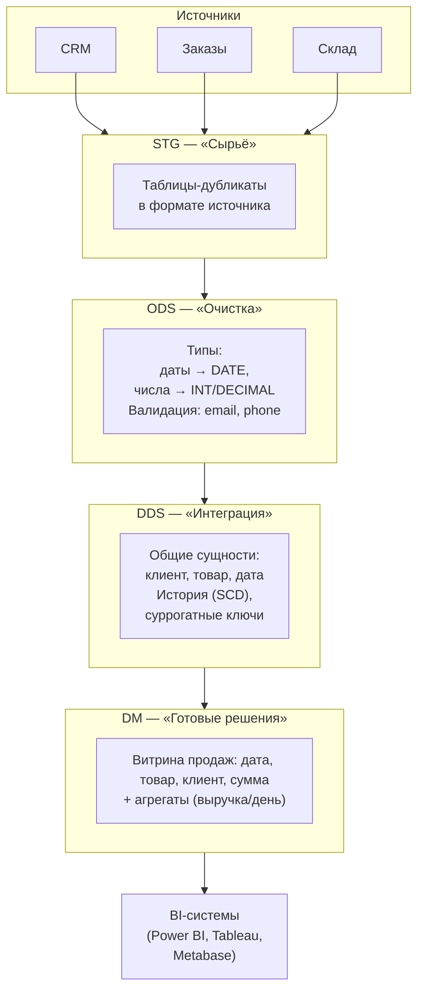
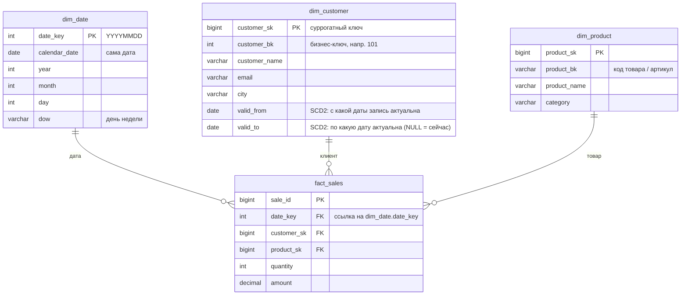
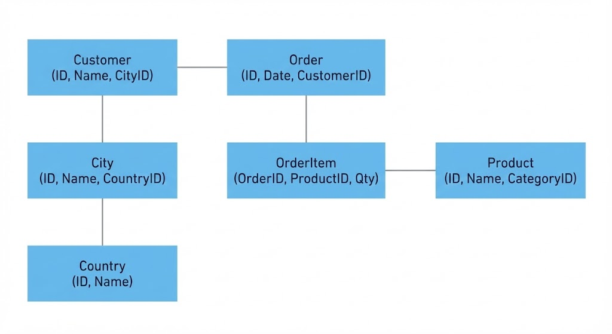
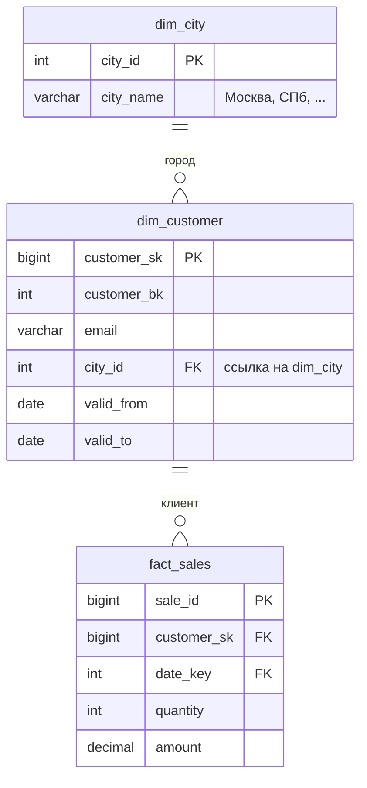
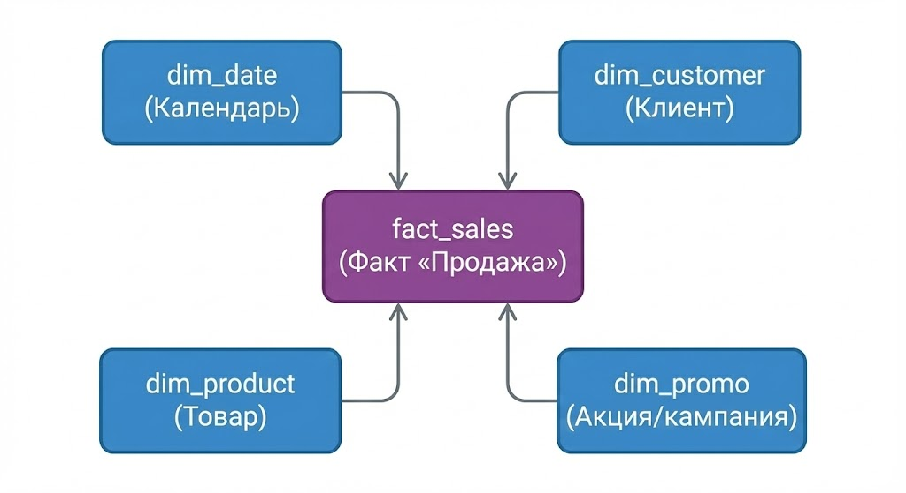
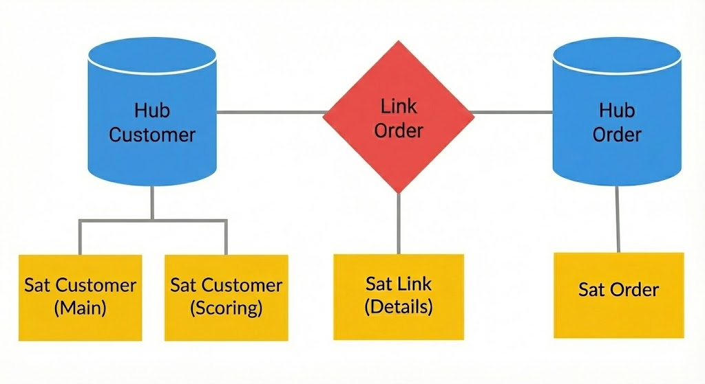
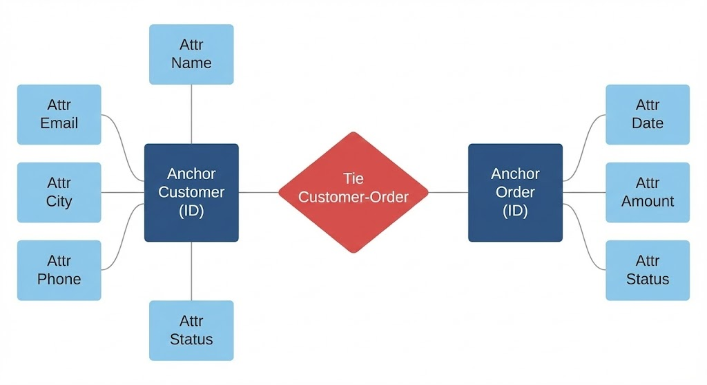
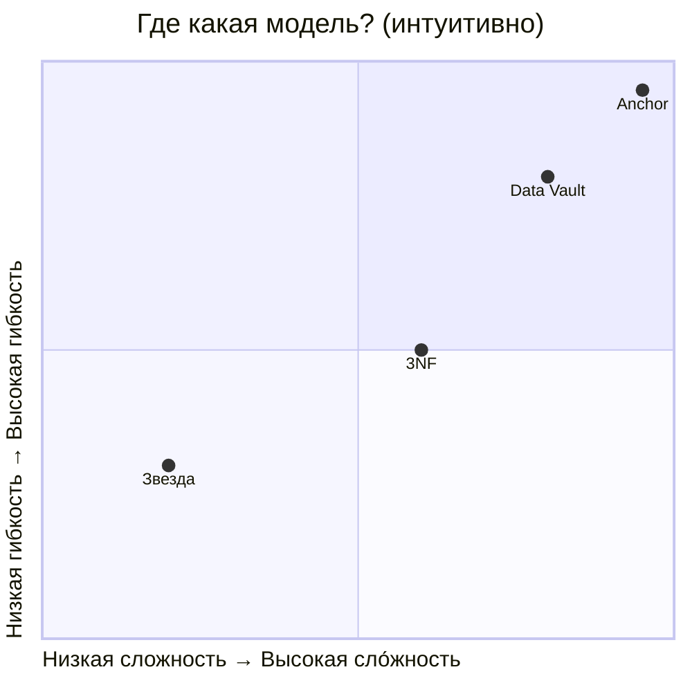
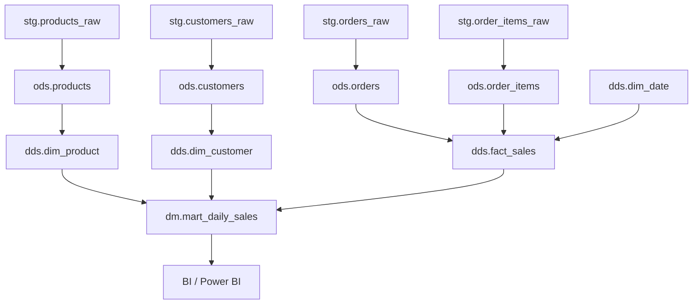
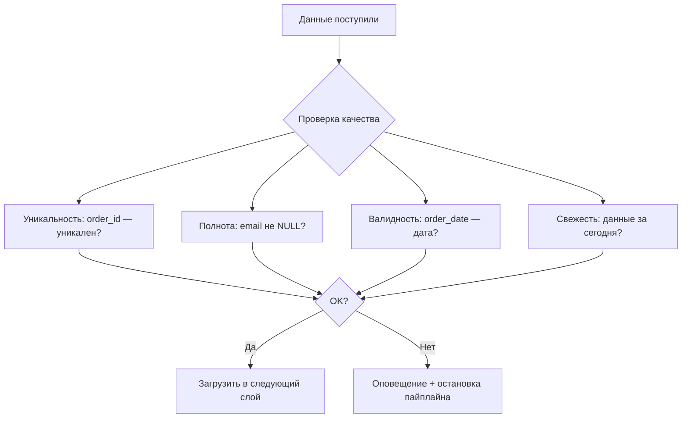

# Хранилище данных: как устроена аналитика «под капотом»
*Для тех, кто знает SQL, но хочет понять, как хранить данные не в Excel, а по-взрослому*

## Оглавление

- [Что вы уже умеете — и что узнаете здесь](#что-вы-уже-умеете-и-что-узнаете-здесь)
- [1. Введение: почему нельзя просто SELECT из базы заказов?](#1-введение-почему-нельзя-просто-select-из-базы-заказов)
- [2. Учебный пример: интернет-магазин](#2-учебный-пример-интернет-магазин)
- [3. Зачем делить DWH на слои?](#3-зачем-делить-dwh-на-слои)
- [4. Путешествие данных: от STG до DM](#4-путешествие-данных-от-stg-до-dm)
- [5. Базовые понятия: факты, измерения, SCD](#5-базовые-понятия-факты-измерения-scd)
- [6. Модели данных для слоя DDS: 4 подхода — и когда какой выбрать](#6-модели-данных-для-слоя-dds-4-подхода-и-когда-какой-выбрать)
- [7. Практикум: как собрать первую витрину](#7-практикум-как-собрать-первую-витрину)
- [8. Как выбрать модель данных? Советы от практиков](#8-как-выбрать-модель-данных-советы-от-практиков)
- [9. Эксплуатация: качество данных — это не «опция»](#9-эксплуатация-качество-данных-это-не-опция)
- [10. Заключение: главное — понимать «почему»](#10-заключение-главное-понимать-почему)
- [Приложения](#приложения)

---

## Что вы уже умеете — и что узнаете здесь

✅ Уже знаете:  
- `SELECT`, `JOIN`, `GROUP BY`;  
- как посчитать сумму/среднее/количество по таблице.

🆕 Узнаете в этой статье:  
- **слои хранилища** (STG → ODS → DDS → DM) и *зачем они нужны*;  
- **факты и измерения** — основные кирпичики аналитики;  
- **SCD Type 2** — как хранить историю изменений клиента (например, смену email или города);  
- **суррогатные ключи (SK)** и чем они отличаются от обычных `id`;  
- **четыре модели данных**: 3NF, Звезда (Star), Data Vault, Anchor Modeling — и когда какую использовать.

⛔ **Не будем говорить** здесь о:  
- физическом хранении (партиции, индексы, ClickHouse-движки);  
- распределённых кластерах (Kafka, Spark, Airflow — это отдельный курс);  
- настройке производительности (`EXPLAIN`, кэши и т.п.).  
Это — про *логику*, структуру и здравый смысл.

---

## 1. Введение: почему нельзя просто SELECT из базы заказов?

Представьте: вы — аналитик в интернет-магазине. Вам нужно ответить на вопрос:  
> **«Сколько заказов сделал клиент с email `a@ex.com` за 2023 год, и сколько он потратил?»**

Вы идёте в базу заказов — и… не находите email. Он в CRM. Идёте в CRM — там нет сумм заказов. Возвращаетесь в заказы — сумма есть, но *только текущая цена товара*. А в 2023 году цена была другой!

Знакомо? Это — **проблема OLTP-систем** (оперативного учёта):  
- **CRM**, **склад**, **платёжка** — это разные базы;  
- каждая оптимизирована под *быструю запись операций* («добавить заказ», «списать товар»);  
- историю там не хранят — email меняется «в лоб»: старое значение перезаписывается.

Такие системы называют **OLTP** (*Online Transaction Processing* — обработка транзакций в реальном времени).  
А для аналитики нужна **OLAP** (*Online Analytical Processing* — обработка запросов на анализ).

➡️ **Хранилище данных (Data Warehouse, DWH)** — это как «единая карта сокровищ», куда собирают данные из всех источников, *сохраняя историю*, *выравнивая термины* и *готовя их к анализу*.

И вот главный секрет его успеха: **слоистая архитектура**.

---

## 2. Учебный пример: интернет-магазин

Чтобы всё было на пальцах — разберём простой, но живой пример.

У нас есть 6 таблиц из трёх источников:

| Таблица | Источник | Что содержит |
|---------|----------|--------------|
| `customers` | CRM | Клиенты: `customer_id`, `email`, `phone`, `city` |
| `orders`, `order_items` | Заказы | Заказы и позиции в них |
| `products` | Склад | Товары: `product_id`, `name` |
| `prices` | Склад | История цен: `product_id`, `valid_from`, `valid_to`, `price` |
| `promos` | Маркетинг | Акции: `promo_id`, `code` |

⚠️ Обратите внимание:  
- `customer_id = 101` в одном месяце — `a@ex.com`, в другом — `b@ex.com`;  
- цена на товар `9001` (Phone) в январе — 100 ₽, в феврале — 110 ₽;  
- `order_items` содержит `price_at_sale` — *цену в момент покупки*, а не текущую.

Это уже **намёк**: чтобы посчитать выручку 2023 года, нам нужна не текущая цена, а *та, что была в день заказа*.

(ER-диаграмма и DDL-примеры — в конце статьи, в разделе «Для практики».)

---

## 3. Зачем делить DWH на слои?

Представьте, что вы строите дом. Вы же не будете сразу вбивать гвозди в стены — сначала:  
1. Привезли стройматериалы (песок, доски, кирпич) — **сырьё**;  
2. Очистили, просеяли, нарезали — **обработка**;  
3. Собрали каркас, провели коммуникации — **интеграция**;  
4. Сделали отделку под конкретную квартиру — **готовое решение**.

В DWH — то же самое. Каждый слой отвечает за *одну задачу*:


```mermaid
flowchart TD
    subgraph Sources["Источники"]
        A["CRM"]
        B["Заказы"]
        C["Склад"]
    end

    subgraph STG["STG — «Сырьё»"]
        D["Таблицы-дубликаты</br>в формате источника"]
    end

    subgraph ODS["ODS — «Очистка»"]
        E["Типы:</br>даты → DATE,</br>числа → INT/DECIMAL</br>Валидация: email, phone"]
    end

    subgraph DDS["DDS — «Интеграция»"]
        F["Общие сущности:</br>клиент, товар, дата</br>История (SCD),</br>суррогатные ключи"]
    end

    subgraph DM["DM — «Готовые решения»"]
        G["Витрина продаж: дата, товар, клиент, сумма</br>+ агрегаты (выручка/день)"]
    end

    A --> STG
    B --> STG
    C --> STG

    STG --> ODS
    ODS --> DDS
    DDS --> DM
    DM --> BI["BI-системы</br>(Power BI, Tableau,</br>Metabase)"]
```

👉 **Почему так лучше, чем «одна большая таблица»?**  
1. **Управляемость**: если в `customers` пришёл битый `email` — ошибка локализована в STG/ODS, DDS не пострадает.  
2. **Прозрачность**: можно посмотреть: «а как выглядел исходник?», «а как мы его почистили?».  
3. **Производительность**: в DDS и DM — только то, что нужно для анализа. Никаких `JSON`-полей, `TEXT` без причины.

---

## 4. Путешествие данных: от STG до DM

Давайте проследим, как превращается строка заказа.

### **STG (Staging / Bronze)** — «как пришло»

- Таблицы: `stg.orders_raw`, `stg.customers_raw`;  
- Структура — *точно как в источнике* (может быть `VARCHAR` даже у дат);  
- Добавлены технические поля:  
  - `_load_id` — идентификатор загрузки;  
  - `_load_ts` — время получения данных;  
- Главное правило: **неизменяемость**. Если пришла новая порция — либо добавляем новые строки, либо *полностью перезагружаем* слой (идемпотентность).  

> 💡 *Пример:* `stg.orders_raw` содержит `"2024-01-10"` как строку — это нормально. Главное — не потерять оригинал.

---

### **ODS (Operational Data Store / Silver)** — «почистили, но не трогали смысл»

- Таблицы: `ods.orders`, `ods.customers`;  
- Здесь:  
  - привели `order_date` к типу `DATE`;  
  - убрали заказы без клиента (`customer_id IS NULL` → ошибка или флаг);  
  - привели телефоны к формату `79991112233`;  
  - проверили email на валидность (регуляркой или простой проверкой).  
- **Но!** Не объединяем клиента из CRM и клиента из заказов — это будет позже.  
- Пока — никакой бизнес-логики. Только *техническая* очистка.
- Дедупликация: если два раза пришёл один и тот же заказ — оставляем один (по `order_id + _load_ts`).

> 🎯 Цель ODS — дать «надёжную платформу» для следующего слоя. Как сухое, чистое бревно перед сборкой дома.

---

### **DDS (Data Delivery Store / Core / Conformed)** — «интеграция + история»

Здесь рождается *единая бизнес-модель*.  
Появляются понятия: **измерения**, **факты**, **суррогатные ключи**, **SCD**.

Например:

| Таблица | Назначение |
|---------|------------|
| `dds.dim_customer` | Измерение «Клиент» с историей (SCD Type 2) |
| `dds.dim_product` | Измерение «Товар» |
| `dds.dim_date` | Готовый календарь на 10 лет вперёд (день/неделя/месяц/квартал) |
| `dds.fact_sales` | Факт «Продажа» — строка заказа с суммой и количеством |

💡 **Суррогатный ключ (Surrogate Key, SK)** — это `BIGINT`, который мы генерируем сами (например, `customer_sk = 1001`).  
**Бизнес-ключ (Business Key, BK)** — это `customer_id = 101` из источника.  
Мы храним и то, и другое — чтобы можно было и джойнить, и понимать, откуда строка.

> ✅ Почему не использовать `customer_id` напрямую?  
> — Потому что в одном источнике `customer_id` — целое число, в другом — строка `CUST-101`.  
> — Потому что ID могут повторяться (например, в тестовой и продовой базах).  
> — Потому что нам нужна *связь* с историей: у клиента с BK = `101` может быть 3 версии в `dim_customer`.

---

### **DM (Data Mart / Gold/ «Витрины»)** — «готово к употреблению»

Здесь — таблицы и представления для конкретных задач:  
- `dm.mart_daily_sales` — ежедневные продажи по товарам и сегментам;  
- `dm.mart_customer_360` — полный портрет клиента: сколько потратил, когда заходил, какие товары любит.

Они часто построены по модели **Звезда (Star Schema)** — потому что BI-инструментам так удобнее всего.

---

## 5. Базовые понятия: факты, измерения, SCD

Представьте отчёт:  
> *«10 января 2024 года клиент из Москвы (сегмент Premium) купил Phone за 100 ₽»*.

В DWH это разложится на:  
- **Факт (Fact)** — событие, которое можно измерить: *покупка*.  
  Хранится в `fact_sales`: `quantity = 1`, `amount = 100`.  
- **Измерения (Dimensions)** — *контекст* факта:  
  - `dim_date` → 10 января 2024;  
  - `dim_customer` → Москва, Premium;  
  - `dim_product` → Phone.


```mermaid
erDiagram
    dim_date ||--o{ fact_sales : "дата"
    dim_customer ||--o{ fact_sales : "клиент" 
    dim_product ||--o{ fact_sales : "товар"
    
    dim_date {
        int    date_key PK        "YYYYMMDD"
        date   calendar_date      "сама дата"
        int    year
        int    month
        int    day
        varchar dow               "день недели"
    }
    
    dim_customer {
        bigint  customer_sk PK    "суррогатный ключ"
        int     customer_bk       "бизнес-ключ, напр. 101"
        varchar customer_name
        varchar email
        varchar city
        date    valid_from        "SCD2: с какой даты запись актуальна"
        date    valid_to          "SCD2: по какую дату актуальна (NULL = сейчас)"
    }
    
    dim_product {
        bigint  product_sk PK
        varchar product_bk        "код товара / артикул"
        varchar product_name
        varchar category
    }
    
    fact_sales {
        bigint  sale_id PK
        int     date_key FK       "ссылка на dim_date.date_key"
        bigint  customer_sk FK
        bigint  product_sk FK
        int     quantity
        decimal amount
    }
```

### SCD Type 2 — как хранить историю

Клиент №101:  
- с 1 янв по 15 мая — `email = a@ex.com`, `city = Москва`;  
- с 16 мая — `email = b@ex.com`, `city = Москва`;  
- с 1 окт — `email = b@ex.com`, `city = Санкт-Петербург`.

В `dim_customer` это будет **три строки**:

| customer_sk | customer_bk | email | city | valid_from | valid_to |
|-------------|-------------|-------|------|------------|----------|
| 1001 | 101 | a@ex.com | Москва | 2023-01-01 | 2023-05-16 |
| 1002 | 101 | b@ex.com | Москва | 2023-05-16 | 2023-10-01 |
| 1003 | 101 | b@ex.com | СПб | 2023-10-01 | NULL |

Когда мы считаем продажи за **12 января** — джойним `fact_sales` к той строке `dim_customer`, где:  
```sql
fact_sales.order_date >= dim_customer.valid_from
AND (dim_customer.valid_to IS NULL OR fact_sales.order_date < dim_customer.valid_to)
```
и получаем актуальный на тот день email и город.

> 🔍 Подробнее про SCD — в отдельной статье [Slowly Changing Dimensions](SCD.md) (сравнение Type 1/2/3, паттерны обновления).

Теперь, когда мы разобрались, что такое факты, измерения и SCD, давайте посмотрим, как именно можно устроить слой DDS внутри — есть несколько вариантов.

---

## 6. Модели данных для слоя DDS: 4 подхода — и когда какой выбрать

В DDS мы можем хранить данные по-разному. Это не «правильно/неправильно», а **выбор под задачу**.

### 1. 3NF (третья нормальная форма)
*Источник: Билл Инмон (Bill Inmon)*

Если упростить, 3NF - это когда данные о разных бизнес-сущностях хранятся в отдельных таблицах и связываются ключами: клиент, заказ, город, регион, страна и т.д. Вместо одной большой таблицы с большим числом дублирующихся данных мы получаем цепочку таблиц, связанных ключами: `Заказ → Клиент → Город → Регион → Страна`. JOIN-ов становится больше, зато одно и то же свойство (например, название города) хранится в одном месте, а не дублируется в каждой строке заказа.

Исторически подход с ядром в 3NF чаще связывают с Биллом Инмоном (Bill Inmon): сначала проектируют корпоративную модель данных ядра в 3NF (сущности, атрибуты, связи), а уже поверх неё строят витрины.



* Данные о сущностях разнесены по отдельным таблицам: клиент, заказ, продукт.
* Минимум дублирования: общие атрибуты хранятся в одном месте, таблицы связаны ключами.

#### Как выглядел бы наш магазин в 3NF

В нашем примере `city` лежит прямо в `dim_customer`. В 3NF город стал бы отдельной таблицей, чтобы название хранилось в одном месте:


```mermaid
erDiagram
    dim_city ||--o{ dim_customer : "город"
    dim_customer ||--o{ fact_sales : "клиент"

    dim_city {
        int city_id PK
        varchar city_name "Москва, СПб, ..."
    }

    dim_customer {
        bigint customer_sk PK
        int    customer_bk
        varchar email
        int    city_id FK "ссылка на dim_city"
        date   valid_from
        date   valid_to
    }

    fact_sales {
        bigint sale_id PK
        bigint customer_sk FK
        int    date_key FK
        int    quantity
        decimal amount
    }
```

Теперь, чтобы узнать **«сколько потратил клиент из Москвы за январь 2024?»**, нужно пройти по цепочке:

```sql
-- 3NF: три JOIN, чтобы добраться до города
SELECT SUM(f.amount)
FROM dds.fact_sales f
JOIN dds.dim_customer c ON f.customer_sk = c.customer_sk
JOIN dds.dim_city ct    ON c.city_id = ct.city_id
JOIN dds.dim_date d     ON f.date_key = d.date_key
WHERE ct.city_name = 'Москва'
  AND d.year = 2024 AND d.month = 1;
```

Запрос читаемый, но JOIN-ов уже три - и это для простого вопроса. В реальном ядре цепочка может быть длиннее: `Клиент → Город → Регион → Страна`.

**Плюсы:**

* Удобно поддерживать **единую «карту бизнеса»**: где живут «клиент», «заказ», «договор» и как они связаны;
* Меньше дублирования: одно и то же свойство хранится в одном месте, проще исправлять ошибки и контролировать качество;
* Проще собирать разные витрины поверх ядра: внизу держим детальные данные и связи, наверху показываем «как удобно».

**Минусы:**

* Если строить отчёты прямо по ядру, запросы часто получаются тяжёлыми: много `JOIN`-ов и условий;
* История (SCD Type 2) увеличивает объём данных и добавляет временной контекст в соединения - запросы становятся сложнее и менее удобными для чтения;
* Изменения в бизнес-процессах приходится аккуратно встраивать в существующую модель: чем старше ядро, тем дороже большие переделки.

Частый паттерн: **ядро в 3NF** (подход ближе к Инмону), витрины - в Звезде.

---

### 2. Звезда (Star Schema)
*Источник: Ральф Кимболл (Ralph Kimball)*

Самый распространённый способ построения таблиц для слоя витрин. Именно эту модель мы использовали в [разделе 5](#5-базовые-понятия-факты-измерения-scd): схема `fact_sales` + `dim_date` / `dim_customer` / `dim_product` - это и есть Звезда.

Структура:

* в центре - таблица фактов (события и метрики);
* вокруг - измерения, обычно денормализованные («плоские») - широкие таблицы со всеми атрибутами сущности. Мы сознательно избегаем цепочек справочников ради простоты запросов.



Методология Ральфа Кимбалла (Ralph Kimball) как раз делает упор на такие звёздные схемы: витрины, которые максимально просты для чтения и понятны аналитикам и BI-инструментам.

#### Тот же вопрос - в Звезде

В Звезде `city` лежит прямо в `dim_customer` (денормализовано). Тот же отчёт выглядит проще:

```sql
-- Звезда: два JOIN, город - прямо в измерении
SELECT SUM(f.amount)
FROM dds.fact_sales f
JOIN dds.dim_customer c ON f.customer_sk = c.customer_sk
JOIN dds.dim_date d     ON f.date_key = d.date_key
WHERE c.city = 'Москва'
  AND d.year = 2024 AND d.month = 1;
```

На один JOIN меньше, и не нужно знать, где именно хранится город: он лежит прямо в карточке клиента. Для аналитика или BI-инструмента это большая разница.

**Плюсы:**

* проста для понимания: аналитикам и BI-инструментам удобно работать с такой моделью;
* меньше `JOIN`-ов - запросы обычно проще и быстрее;
* хорошо подходит для витрин под конкретные задачи.

**Минусы:**

* измерения денормализованы, поэтому атрибуты дублируются (например, название города повторяется у всех клиентов из этого города);
* изменения атрибутов могут требовать обновлять много строк в измерении.


---

### 3. Data Vault 2.0 — «конструктор Lego» для больших DWH

*Идея: Дэн Линстедт (Dan Linstedt). Цель — так организовать хранилище, чтобы можно было спокойно добавлять новые источники и хранить историю, не ломая старую модель.*

#### В чём идея, по-человечески

В Data Vault (DV) все сущности разлетаются по трём типам таблиц:

- **Hub (Хаб)** — *«кто/что это»*.  
  Только бизнес-ключ и технические поля: клиент, заказ, договор.

- **Link (Линк)** — *«как они связаны»*.  
  «Клиент сделал заказ», «договор относится к счёту».

- **Satellite (Сателлит)** — *«какие у них свойства и как они менялись»*.  
  Имя клиента, email, статус заказа, цены — всё с историей изменений.



💡 **Главная мысль:**  
идентичность, связи и атрибуты живут **в разных таблицах**, поэтому:
- историю проще хранить;
- новые источники проще прикручивать;
- меньше шансов «сломать» старые отчёты.

Data Vault хорошо подходит там, где много разнородных источников, нужна полная история изменений и прозрачный аудит. За гибкость приходится платить сложностью модели и количеством таблиц — поэтому для небольших проектов (2–5 источников, маленькая команда) DV почти наверняка избыточен.

> 🔍 Подробнее про Data Vault — сравнение с 3NF/Звездой, Raw и Business Vault, когда внедрять — в отдельной статье [DataVault: как пережить бурную жизнь источников](DataVault.md).

---

### 4. Anchor Modeling (анкерное моделирование)

*Источник: Ларс Рёне (Lars Rönnbäck)*

Anchor Modeling - ещё более атомарный подход к моделированию ядра, чем Data Vault. Если упростить, он «режет» модель на очень мелкие части, чтобы изменения в атрибутах и связях можно было добавлять почти без переделок схемы.

Основные типы таблиц:

* **Anchor** - сущности (например, «клиент» или «заказ»).
* **Attribute** - отдельный атрибут сущности, обычно с историей (например, email, город, статус - каждый в своей таблице).
* **Tie** - связь между сущностями (например, «клиент ↔ заказ»).



Плюс подхода - высокая гибкость: проще добавлять новые атрибуты и варианты связей. Минус - цена этой гибкости: получается очень много таблиц, и запросы (и поддержка модели) обычно заметно сложнее, огромное кол-во `JOIN`. Для обычного DWH-проекта это точно не первый выбор - скорее вариант для очень динамичных предметных областей, где структура данных часто меняется.

---

### Сравнение моделей — наглядно


```mermaid
quadrantChart
    title Где какая модель? (интуитивно)
    x-axis "Низкая сложность → Высокая сло́жность"
    y-axis "Низкая гибкость → Высокая гибкость"
    "Звезда": [0.2, 0.3]
    "3NF": [0.6, 0.5]
    "Data Vault": [0.8, 0.8]
    "Anchor": [0.95, 0.95]
```

> 🎯 **Вывод**: нет «лучшей» модели. Есть **подходящая под контекст**.  
> — Для обучения — **Звезда** (просто, наглядно).  
> — Для корпоративного DWH — **3NF + Звезда на выходе**.  
> — Для масштабируемой интеграции — **Data Vault**.

---

## 7. Практикум: как собрать первую витрину

Покажем на примере `mart_daily_sales` — таблицу, которую можно сразу подключить к BI.

### Этапы сборки

1. Из STG → ODS:
   - `stg.orders_raw` → `ods.orders` (привели `order_date` к `DATE`);
2. Из ODS → DDS:
   - `ods.customers` → `dds.dim_customer` (SCD Type 2);
   - `ods.products` → `dds.dim_product`;
   - `ods.orders` + `ods.order_items` → `dds.fact_sales`;
3. Из DDS → DM:
   - `fact_sales` + `dim_*` → `mart_daily_sales`.


```mermaid
flowchart TD
    %% STG
    STG_PROD[stg.products_raw]
    STG_CUST[stg.customers_raw]
    STG_ORD[stg.orders_raw]
    STG_ITEMS[stg.order_items_raw]

    %% ODS
    ODS_PROD[ods.products]
    ODS_CUST[ods.customers]
    ODS_ORD[ods.orders]
    ODS_ITEMS[ods.order_items]

    %% DDS
    DIM_PROD[dds.dim_product]
    DIM_CUST[dds.dim_customer]
    DIM_DATE[dds.dim_date]
    FACT_SALES[dds.fact_sales]

    %% DM / BI
    DM_SALES[dm.mart_daily_sales]
    BI[BI / Power BI]

    %% Потоки данных
    STG_PROD --> ODS_PROD --> DIM_PROD --> DM_SALES
    STG_CUST --> ODS_CUST --> DIM_CUST --> DM_SALES

    STG_ORD --> ODS_ORD --> FACT_SALES --> DM_SALES
    STG_ITEMS --> ODS_ITEMS --> FACT_SALES
    DIM_DATE --> FACT_SALES

    DM_SALES --> BI
```

### Готовые SQL-скрипты

Все необходимые скрипты для построения хранилища находятся в папке [`sql/`](sql/):

- [`01_ddl_stg-dds.sql`](sql/01_ddl_stg-dds.sql) — создание схем и таблиц (STG, ODS, DDS);
- [`02_dml_stg-dds.sql`](sql/02_dml_stg-dds.sql) — первичная загрузка данных и демонстрация SCD2 через полный пересчёт (`full backfill`) из STG;
- [`03_demo_increment.sql`](sql/03_demo_increment.sql) — пример инкрементальной загрузки и SCD2 по последнему снимку в ODS;
- [`04_validation.sql`](sql/04_validation.sql) — проверки качества данных;
- [`05_ddl_dm.sql`](sql/05_ddl_dm.sql) — создание витрин (Data Marts);
- [`06_dml_dm.sql`](sql/06_dml_dm.sql) — наполнение витрин данными.

### Пример SQL-запроса для витрины

```sql
-- mart_daily_sales: ежедневные продажи с сегментацией
CREATE MATERIALIZED VIEW dm.mart_daily_sales AS
SELECT
    d.date_actual AS order_date,
    p.product_name,
    c.customer_segment,        -- например: 'Premium', 'Basic'
    SUM(f.quantity) AS total_qty,
    SUM(f.amount) AS total_revenue
FROM dds.fact_sales f
JOIN dds.dim_date d
  ON f.date_key = d.date_key
JOIN dds.dim_product p
  ON f.product_sk = p.product_sk
JOIN dds.dim_customer c
  ON f.customer_sk = c.customer_sk
  AND f.order_date >= c.valid_from
  AND (c.valid_to IS NULL OR f.order_date < c.valid_to)  -- SCD!
GROUP BY d.date_actual, p.product_name, c.customer_segment;
```

> 💡 **Материализованное представление (MATERIALIZED VIEW)** — это «кэш» результата. Обновляется по расписанию (например, ночью).

✏️ **Попробуйте сами:** [Домашка: статусы клиента от STG до DDS (и немного DM)](Homework_Customer_Status_DDS_DM.md) — пройдёте тот же путь, но самостоятельно.

---

## 8. Как выбрать модель данных? Советы от практиков

Выбор модели — **не техническая задача, а стратегическая**.  
Это как решать: строить дом из кирпича, дерева или SIP-панелей. У каждой технологии — свои плюсы, но **главное — подходит ли она *вам* сегодня**.

### 🔹 Главное, что нужно понять новичку:

> **Не существует «самой правильной» модели.**  
> Есть **самая подходящая под ваш контекст** — и он у всех разный.

---

### 🛑 Что делать **не стоит** (если опыта ещё мало):

| Что делать не стоит | Почему |
|---------------------|--------|
| **Брать Data Vault «потому что модно»** | DV требует глубокого понимания интеграции, CDC, идемпотентности. Без этого легко получить «историю», в которой невозможно найти актуальные данные. |
| **Строить сложную 3NF «как в книжках» под 10 таблиц** | Если у вас 2–3 источника — вы потратите недели на нормализацию, чтобы потом делать 5 JOIN’ов ради простого отчёта. |
| **Пытаться «сделать сразу гибко на 5 лет вперёд»** | Гибкость = сложность. А сложность = баги, задержки, выгорание команды. |

---

### ✅ Базовые советы — с чего начать, если вы учитесь или делаете первый DWH

1. **Начните с витрины в формате Звезды (Star Schema).**  
   — Это просто: одна таблица фактов + несколько «плоских» измерений.  
   — Это быстро: отчёт в BI — за 10 минут.  
   — Это понятно: даже менеджер поймёт структуру.

2. **Стройте DDS только когда это *действительно нужно*.**  
   — Если источников ≤ 3 и они стабильны — можно идти `ods → dm` напрямую.  
   — Если появляются расхождения («email в CRM и в заказах — разные») — тогда заводите `dds.dim_customer` и другие общие сущности.

3. **Историю (SCD) включайте *постепенно*.**  
   — Сначала — без истории (Type 1: просто обновляете строку).  
   — Потом — только для ключевых сущностей (клиент, товар, договор).  
   — Только потом — думайте про DV или полную историзацию всего.

4. **Если сомневаетесь — спросите: «А кто будет этим пользоваться?»**  

   Выбор модели начинается не с технологий, а с вопроса: **кто будет работать с результатом?**  
   Это как выбрать инструмент в мастерской: для гвоздей — молоток, для саморезов — отвёртка.

   Вот как это выглядит на практике:

   — **Аналитик в Metabase / Looker Studio** → **Звезда (Star Schema)**  
   Почему: ему нужны готовые метрики без сложных JOIN’ов. Звезда даёт понятные таблицы: «продажи по дням и товарам» — без углубления в атомарные сущности.

   — **BI-разработчик в Power BI / Tableau** → **Звезда**  
   Почему: все инструменты визуализации оптимизированы под star schema. Один факт + несколько измерений = быстрые отчёты и простую модель.

   — **Инженер ML (Data Scientist / ML-инженер)** → **3NF или сырые ODS-таблицы**  
   Почему: для фичей нужны атомарные события и детальные атрибуты. Машинное обучение ценит полноту и детализацию данных больше, чем удобство отчётов.

   — **Юрист, финансовый контролёр, аудитор / регулятор** → **3NF с SCD Type 2, иногда + DV в ядре**  
   Почему: им нужна доказуемая история изменений, но не инфраструктурная сложность DV на каждый чих.  
   Обычно достаточно хранить аудит-историю по ключевым сущностям (клиенты, договоры, счета) в формате 3NF + SCD Type 2.  
   **Data Vault имеет смысл только если** у вас 10+ разнородных источников и жёсткие требования по аудиту и трассировке.

💡 **Золотое правило:**  
«**Собирай данные как DV (максимально детально), показывай как Звезду (максимально просто).**»  

На начальных этапах вам почти всегда хватит **SCD Type 2 в рамках 3NF/Звезды**.  
**Data Vault** нужен тогда, когда основная боль — интеграция множества систем и аудит, а не «первый отчёт для маркетинга».

---

### 💡 Ещё один совет от практиков

> **Лучше сделать простую модель — и вовремя переделать,**  
> чем сделать «идеальную» — и застрять на этапе проектирования.

Переделать Звезду → Звезду с SCD Type 2 — относительно легко.  
Переделать «недоделанный DV» → что-то рабочее — в разы сложнее.

---

### 📌 Кратко — что выбрать *сегодня*, если вы только учитесь

| У вас… | Делайте… |
|--------|----------|
| Учебный проект, 1–2 CSV | `ods → dm` по модели **Звезда** (без DDS, без истории) |
| Первый рабочий DWH, 3–5 источников | `stg → ods → dds (3NF или простая Звезда) → dm (Звезда)` |
| Команда из 1 инженера + 1 аналитика | **Не трогайте DV и Anchor** — они «съедят» ваше время без отдачи |

А когда наберётесь опыта — приходите в DV. Он того стоит. Но *не раньше времени*.

---

## 9. Эксплуатация: качество данных — это не «опция»

Самая красивая архитектура бессмысленна, если в `mart_daily_sales` — нули.  
Поэтому в каждом слое — **контроль качества (DQ, Data Quality)**.


```mermaid
graph TB
    A[Данные поступили] --> B{Проверка качества}
    
    B --> C["Уникальность: order_id — уникален?"]
    B --> D["Полнота: email не NULL?"]
    B --> E["Валидность: order_date — дата?"]
    B --> F["Свежесть: данные за сегодня?"]
    
    C --> G{OK?}
    D --> G
    E --> G
    F --> G
    
    G -->|Да| H[Загрузить в следующий слой]
    G -->|Нет| I[Оповещение + остановка пайплайна]
```

Примеры проверок (на SQL):

```sql
-- Проверка уникальности order_id в ODS
SELECT order_id, COUNT(*)
FROM ods.orders
GROUP BY order_id
HAVING COUNT(*) > 1;

-- Проверка свежести: есть ли данные за вчера?
SELECT 'OK' WHERE EXISTS (
  SELECT 1 FROM ods.orders
  WHERE order_date = CURRENT_DATE - INTERVAL '1 day'
);
```

> 🔔 **Совет**: делайте DQ-тесты частью CI/CD — как unit-тесты в коде.

---

## 10. Заключение: главное — понимать «почему»

Хранилище данных — это не про «крутые технологии», а про **мышление**:

- **Слои (STG→ODS→DDS→DM)** — это про *разделение ответственности*.  
  Не смешивайте сырые данные и аналитические — иначе не найдёте, где ошибка.

- **Факты и измерения** — это про *структуру мышления*.  
  События (факты) и контекст (измерения) — две стороны одного процесса.

- **SCD Type 2** — это про *уважение к истории*.  
  Бизнес меняется — и данные должны это отражать.

- **Модели (Star/3NF/DV)** — это про *выбор под задачу*.  
  Нет «серебряной пули» — есть компромиссы.

> 🎁 **Финальный подарок**:  
> Запомните **5 золотых правил DWH**:  
> 1. Всегда храните BK (бизнес-ключ) — иначе потеряете связь с источником.  
> 2. В DDS — только интегрированные, «чистые» сущности.  
> 3. В DM — только то, что нужно для отчёта.  
> 4. Проверяйте качество *на каждом слое*.  
> 5. Собирайте витрины *итеративно*: MVP → доработка → новые метрики.

---

## Приложения

### Дополнительные материалы и практика

- [Домашка: статусы клиента от STG до DDS (и немного DM)](Homework_Customer_Status_DDS_DM.md)
- [SCD: как хранить историю изменений](SCD.md)
- [DataVault: как пережить бурную жизнь источников](DataVault.md)

### 📚 Мини-глоссарий (RU / EN)

| Термин | Пояснение |
|-------|-----------|
| **Слой (Layer)** | Логический уровень в DWH: STG/ODS/DDS/DM |
| **Витрина (Data Mart)** | Готовый набор таблиц для конкретной аналитики (например, финансы или маркетинг) |
| **Факт (Fact)** | Таблица событий или измерений: продажи, клики, звонки |
| **Измерение (Dimension)** | Справочник контекста: клиенты, товары, дата |
| **Суррогатный ключ (SK)** | Искусственный `BIGINT`, генерируемый в DWH |
| **Бизнес-ключ (BK)** | Естественный идентификатор из источника (`customer_id`, `order_number`) |
| **SCD (Slowly Changing Dimension)** | Подход к хранению истории атрибутов измерения |
| **CDC (Change Data Capture)** | Техника инкрементальной загрузки «только изменений» |
| **Conformed Dimension** | Измерение, единое для нескольких витрин (например, `dim_date`) |

---

### 🧱 Синонимы слоёв в индустрии

| Название | Синонимы |
|----------|----------|
| **STG** | Staging, Raw, Bronze, Landing Zone |
| **ODS** | Cleaned, Integrated, Silver |
| **DDS** | Core, Conformed, Golden Layer, Enterprise Data Model |
| **DM** | Data Mart, Semantic Layer, Gold, Analytics Layer |

> ⚠️ Названия могут отличаться — смотрите на *содержание*, а не на ярлыки.

---

### 🚫 Антипаттерны (чего избегать)

| Антипаттерн | Почему плохо |
|-------------|--------------|
| **«Одна огромная история заказов»** | Запросы тормозят, нет истории атрибутов (клиент сменил email — и всё прошлое «перекрасилось») |
| **STG и ODS в одной таблице** | Невозможно понять: ошибка в источнике или при очистке? |
| **Факт с текстовыми атрибутами** (`customer_name` в `fact_sales`) | Дублирование, нарушение нормализации, «спрятанная» бизнес-логика |
| **SCD без BK** | История «отвязана» от бизнеса: удалили клиента — и вся его история исчезла |

---

### Мини-датасет (для практики)

Все данные для практики находятся в папке [`data/`](data/) — тренируйтесь:

[`customers.csv`](data/customers.csv):
```csv
customer_id,email,phone,city,event_ts,_load_id,_load_ts
101,a@ex.com,700,Москва,2024-01-01,batch_20240101_0800,2024-01-01 08:00
102,c@ex.com,701,СПб,2024-01-01,batch_20240101_0800,2024-01-01 08:00
101,b@ex.com,700,Москва,2024-05-16,batch_20240516_0800,2024-05-16 08:00
101,b@ex.com,700,Санкт-Петербург,2024-10-01,batch_20241001_0800,2024-10-01 08:00
```

[`orders.csv`](data/orders.csv):
```csv
order_id,order_date,customer_id
5001,2024-01-10,101
5002,2024-02-05,102
```

[`order_items.csv`](data/order_items.csv):
```csv
order_item_id,order_id,product_id,qty,price_at_sale
1,5001,9001,2,100.00
2,5001,9002,1,50.00
3,5002,9001,1,100.00
```

[`products.csv`](data/products.csv):
```csv
product_id,name
9001,Phone
9002,Case
```

[`prices.csv`](data/prices.csv):
```csv
product_id,valid_from,valid_to,price
9001,2023-12-01,2024-01-31,100
9001,2024-02-01,,110
9002,2023-01-01,,50
```

>  📂 Все SQL-скрипты для построения хранилища находятся в папке [`sql/`](sql/).

---

### DDL-скелеты (PostgreSQL)

Полные DDL-скрипты для всех слоёв хранилища находятся в файле [`01_ddl_stg-dds.sql`](sql/01_ddl_stg-dds.sql).

Пример структуры основных таблиц DDS:

```sql
-- DDS: измерение клиента (SCD Type 2)
CREATE TABLE dds.dim_customer (
    customer_sk   BIGINT GENERATED ALWAYS AS IDENTITY PRIMARY KEY,
    customer_bk   INT NOT NULL,           -- напр. 101
    email         VARCHAR(100),
    phone         VARCHAR(20),
    city          VARCHAR(50),
    valid_from    DATE NOT NULL,
    valid_to      DATE
);

-- DDS: факт продаж (гранулярность: строка заказа)
CREATE TABLE dds.fact_sales (
    sale_id      BIGINT GENERATED ALWAYS AS IDENTITY PRIMARY KEY,
    customer_sk  BIGINT NOT NULL REFERENCES dds.dim_customer(customer_sk),
    product_sk   BIGINT NOT NULL,
    date_key     INT NOT NULL,  -- YYYYMMDD, ссылка на dim_date.date_key
    quantity     INT NOT NULL CHECK (quantity > 0),
    amount       DECIMAL(18,2) NOT NULL CHECK (amount >= 0)
);
```

> 💡 `date_key` — это `20240110`, а не `DATE`, чтобы не делать JOIN по диапазону в `fact → dim_date`.
