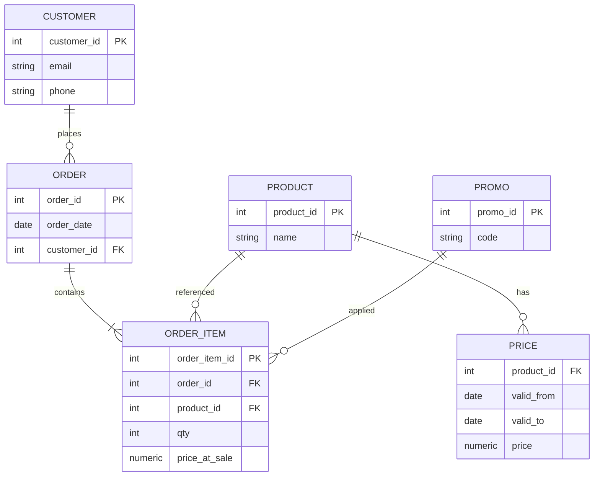
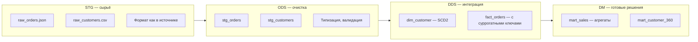
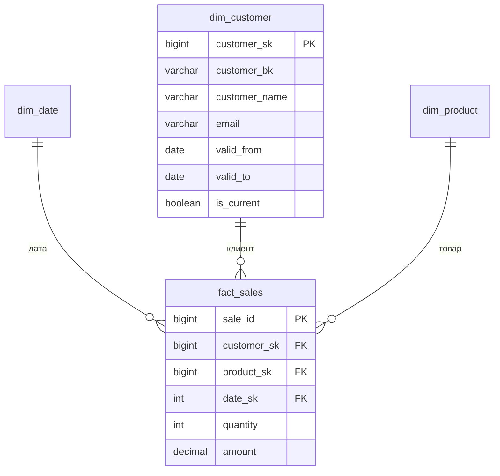
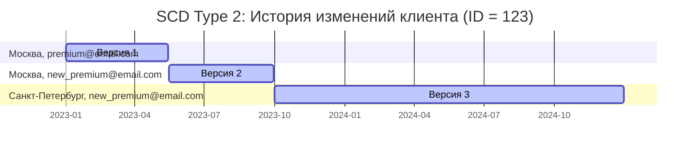
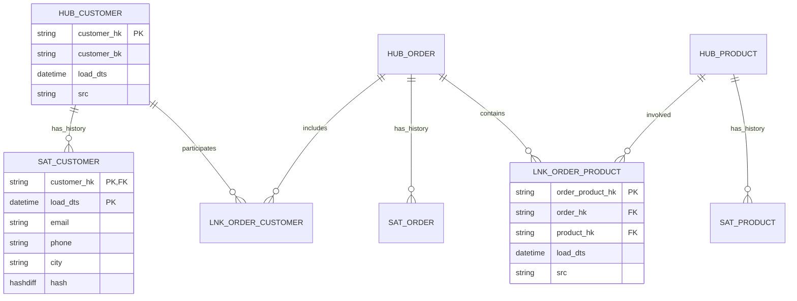
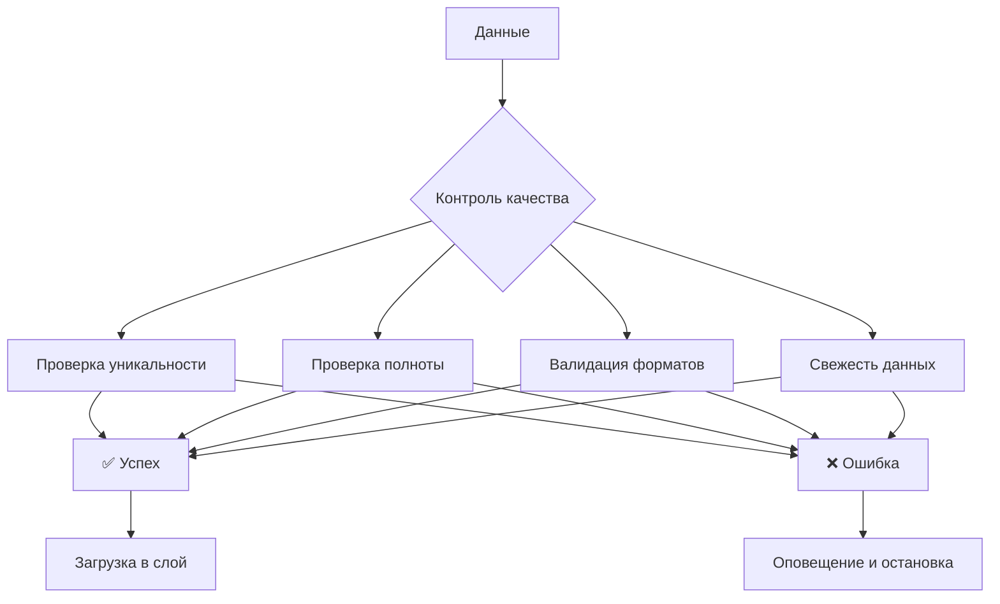

# Модели данных и слои DWH (для менти)

**Цель и аудитория:** эта статья для начинающих аналитиков/инженеров данных, которые уже умеют базовый SQL (SELECT/JOIN/GROUP BY/WHERE) и переходят к моделированию данных и архитектуре хранилища (Data Warehouse, DWH). Здесь даём общее представление: **зачем слои**, **что такое модели**, **чем они отличаются**, где обычно живут **факты/измерения/SCD**. **Выбор модели** в продакшен за вас делать не будем — на этом этапе важно понять, *зачем разные модели существуют* и *какие задачи они решают*.

---

## ЧАСТЬ A. Исходный черновик статьи (переделан в чистовик с лёгкой правкой опечаток)

Ниже — аккуратно отредактированная версия вашего плана с диаграммами Mermaid. Сохранили исходную структуру и формулировки, поправили опечатки и выровняли стиль именования.

---

# **Структура статьи про хранилище данных**

1. Введение. Проблема аналитики в OLTP
2. Учебный пример. Интернет-магазин
3. Архитектура. Зачем слои?
4. Путешествие данных. STG → ODS → DDS → DM
5. Базовые понятия. Факты, Измерения, SCD
6. Модели данных. 3NF, Data Vault, Звезда
7. Практикум. Собираем витрину
8. Зачем разные модели (демо-«дерево решений»)
9. Эксплуатация. Качество и эволюция
10. Заключение

> Примечание про Mermaid: диаграммы `mindmap` и `quadrantChart` поддерживаются не всеми рендерами. Если планируете публикацию на площадке со строгим Markdown (например, Habr), оставьте текстовую альтернативу.

---

## **1. Введение: аналитика — это не оперативный учёт**

**OLTP (оперативный учёт)**: CRM, заказы, склад.
**DWH (аналитическое хранилище)**: единая модель для анализа.

Проблема: в OLTP для исторической аналитики — сложные JOIN, тяжёлые агрегации, нестабильная производительность.

**Особенности DWH**:

* Слоистая архитектура
* Оптимизированные под аналитику модели

**Ключевые тезисы**:

* OLTP vs OLAP: транзакции против анализа
* Почему «одна большая таблица» не работает на истории
* 3 преимущества слоёв: управляемость, производительность, прозрачность

---

## **2. Учебный пример: интернет-магазин**

ER-диаграмма сущностей источника (упрощённо):



---

## **3. Архитектура хранилища: зачем делить на слои?**

```mermaid
flowchart TD
    subgraph Sources[Источники OLTP]
        A[CRM]
        B[Заказы]
        C[Склад]
    end

    A --> STG
    B --> STG
    C --> STG

    subgraph STG[STG (Bronze) — сырые данные]
        D[Таблицы-клоны \n неизменяемые/переигрузка]
    end

    STG --> ODS

    subgraph ODS[ODS (Silver) — очищенные]
        E[Типизация, валидация, \n стандартизация кодов]
    end

    ODS --> DDS

    subgraph DDS[DDS — интегрированная модель]
        F[Бизнес-сущности, SK/BK, SCD]
    end

    DDS --> DM

    subgraph DM[DM (Gold) — витрины]
        G[Звезда/Снежинка, агрегаты]
    end

    DM --> BI[BI/Отчёты]
```

---

## **4. Путешествие данных по слоям**



### 4.1 STG (Staging/Bronze)

Коротко: «как пришло». Идемпотентность, дедупликация, неизменяемость/переигрузка.

### 4.2 ODS (Operational Data Store/Silver)

Коротко: чистка и выравнивание типов, базовая унификация кодов, ещё без тяжёлой бизнес-логики.

### 4.3 DDS (Integrated/Conformed)

Коротко: интеграция источников, общие справочники, SK/BK, SCD. Здесь живут модели данных (3NF/DV/Anchor/Star).

### 4.4 DM (Data Marts/Gold)

Коротко: модели под задачи BI (звезда/снежинка). Агрегаты, материализации.

---

## **5. Базовые понятия: факты, измерения, ключи**



**SCD Type 2 — визуализация истории:**



---

## **6. Модели данных для DDS**

### 3NF (третья нормальная форма)

Классическая нормализованная модель, сильная целостность и интеграция, но SQL для аналитики сложнее.

### Снежинка (Snowflake)

Нормализованные измерения поверх звезды — компромисс между читаемостью и дублированием.

### Звезда (Star Schema)

Факт + денормализованные измерения — просто и быстро для BI/SQL.

### **Data Vault 2.0**



Коротко: хабы (BK), линки (связи), сателлиты (история атрибутов). Этот раздел обзорный.

### Anchor Modeling (анкерное моделирование)

Атомарная декомпозиция сущностей и атрибутов, гибкая эволюция схемы; высокая гранулярность усложняет чтение.

> **Сравнение (интуитивно):** Звезда — проще/быстрее для BI; 3NF — целостность и интеграция; DV/Anchor — масштабируемая интеграция из многих источников и «история по умолчанию», но сложнее читать и писать.

---

## **7. Практикум: собираем витрину**

```mermaid
flowchart TD
    A[Источники] --> STG
    STG[STG: сырые заказы, товары] --> ODS
    ODS[ODS: очищенные данные] --> DDS

    subgraph DDS[DDS: интегрированная модель]
        B[dim_customer (SCD2)]
        C[dim_product]
        D[dim_date]
        E[fact_sales]
    end

    DDS --> F{Сборка витрины}

    F --> G[mart_daily_sales]
    F --> H[mart_customer_lifetime]

    G --> I[Дашборд продаж]
    H --> J[Отчёт по клиентам]
```

**Пример SQL для витрины:**

```sql
-- Витрина ежедневных продаж (пример)
CREATE TABLE mart_daily_sales AS
SELECT
    d.date,
    p.product_name,
    c.customer_segment,
    SUM(f.quantity) AS total_quantity,
    SUM(f.amount)   AS total_amount
FROM fact_sales f
JOIN dim_date    d ON f.date_sk    = d.date_sk
JOIN dim_product p ON f.product_sk = p.product_sk  
JOIN dim_customer c ON f.customer_sk = c.customer_sk AND c.is_current = TRUE
GROUP BY d.date, p.product_name, c.customer_segment;
```

---

## **9. Эксплуатация: качество и эволюция**



---

## **10. Заключение: главное — понимать «почему»**

Ключевые идеи: разделение на слои (STG → ODS → DDS → DM), разные модели для разных задач (3NF, Star, DV, Anchor), факты/измерения/SCD, итеративная сборка витрин под конкретные вопросы бизнеса.

---

## ЧАСТЬ B. Наши предложения к статье (что усилено и что добавить)

Ниже — блоки, которые можно встроить в соответствующие разделы или вынести в отдельные боксы/врезки.

### 1) Рамочный ввод «что вы знаете / что узнаете / чего не будет»

* **Уже умеете:** SQL-основы (SELECT/JOIN/GROUP BY), простые агрегаты.
* **Узнаете:** слои (STG/ODS/DDS/DM), модели (3NF/Star/DV/Anchor), SCD и суррогатные ключи.
* **Не рассматриваем здесь:** физический дизайн, производительность, партиционирование, распределённые кластеры — это отдельная тема.

### 2) Мини-глоссарий RU/EN (по 1–2 строки)

* **Слой (Layer)** — логический уровень в DWH: STG/ODS/DDS/DM.
* **Витрина (Data Mart)** — предметно-ориентированный набор таблиц/представлений для конкретной аналитики.
* **Факт (Fact)** — таблица событий/измерений величин (кол-во, сумма).
* **Измерение (Dimension)** — справочник контекста фактов (клиенты, товары, даты).
* **Суррогатный ключ (Surrogate Key, SK)** — искусственный технический ключ (int/bigint).
* **Бизнес-ключ (Business Key, BK)** — естественный ключ из источника (например, `customer_id`).
* **SCD (Slowly Changing Dimension)** — подход к хранению истории атрибутов измерения.
* **CDC (Change Data Capture)** — техника инкрементальной загрузки изменений.
* **Conformed Dimension** — «конформное» измерение, общее для нескольких витрин.

### 3) Отображение синонимов слоёв

* **STG (Bronze)** → **ODS (Silver)** → **DDS (Conformed/Core)** → **DM (Gold)**.

### 4) «Правила слоя» — короткие чек-листы

* **STG (Bronze):** как пришло; неизменяемо/переигрузка; идемпотентность; дедуп по `(BK, load_ts)`; только тех. обогащения (например, `_ingest_id`).
* **ODS (Silver):** типизация; базовая очистка и стандартные коды; **без** тяжёлой бизнес-логики; стабильные схемы/имена.
* **DDS (Conformed/Core):** интеграция источников; единая терминология; SK/BK; SCD; здесь живут модели (3NF/Star/DV/Anchor).
* **DM (Gold):** под конкретные вопросы BI/продукта; агрегаты/материализации; доступные метрики и измерения.

### 5) Антипаттерны (короткий бокс)

* «Одна огромная историческая таблица» → медленные запросы, нет истории атрибутов.
* «Смешали STG и ODS» → потеря трассировки ошибок и инцидентов качества.
* «Факт с текстовыми атрибутами без причин» → раздутая таблица и неявные бизнес-правила.
* «SCD без BK» → история «плывёт», не привязана к бизнес-идентификатору.

### 6) SCD2: рецепт джойна «по интервалу» (шпаргалка)

```sql
-- Привязка факта к актуальной версии измерения (Type 2)
SELECT f.*, d.customer_sk
FROM fact_sales f
JOIN dim_customer d
  ON d.customer_bk = f.customer_bk              -- совпадение BK
 AND f.event_date >= d.valid_from
 AND f.event_date <  COALESCE(d.valid_to, DATE '2999-12-31');
```

### 7) Мини-практикум (сквозной, короткий)

1. Показать джойн факта к SCD2-измерению (по примеру выше).
2. Собрать `mart_daily_sales` (у вас уже есть SQL).
3. Пара проверок качества (см. ниже).

### 8) Качество данных: минимальные метрики + однострочники

* **Freshness (свежесть):** `MAX(event_time)` против «сейчас».
* **Completeness (полнота):** доля NULL по важным столбцам.
* **Consistency (согласованность):** факт без соответствия в измерении (нарушение покрытии ссылок).
* **Uniqueness (уникальность):** уникальность BK в справочнике.

```sql
-- Примеры «однострочников»
-- Freshness
SELECT NOW() - MAX(event_time) AS lag FROM ods.order;

-- Uniqueness BK
SELECT customer_bk, COUNT(*)
FROM dds.dim_customer
GROUP BY customer_bk
HAVING COUNT(*) > 1;

-- Orphan facts (без покрытия измерения)
SELECT COUNT(*)
FROM dds.fact_sales f
LEFT JOIN dds.dim_customer d ON f.customer_sk = d.customer_sk
WHERE d.customer_sk IS NULL;
```

### 9) Нейминг-гайд (пример)

* `stg.*` — как в источнике, добавочные тех. поля: `_ingest_id`, `_load_ts`.
* `ods.*` — очищенные «плоские» таблицы, стаб. схемы.
* `dds.dim_*`, `dds.fact_*` — интегрированная модель.
* `dm.mart_*` — витрины/представления.

### 10) «Зачем разные модели» (без выбора)

* **Star (звезда):** быстро писать отчёты, учим новичков на ней.
* **3NF:** лучшая консистентность/интеграция понятий, тяжелее для BI.
* **Data Vault:** масштабируемая интеграция множества источников + «история по умолчанию».
* **Anchor:** гибкая эволюция схемы, максимальная атомарность, цена — сложность.

### 11) Что почитать дальше

* **Kimball, The Data Warehouse Toolkit** — модели «звезды», SCD.
* **Inmon, Building the Data Warehouse** — корпоративный DWH и нормализация.
* **Linstedt & Olschimke, The Data Vault 2.0** — практический DV.
* **Anchor Modeling** — официальный сайт/документация по Anchor.

---

## ЧАСТЬ C. Мини-датасет (для примеров в статье)

> Опционально приложить к репозиторию/приложению статьи.

**customers.csv**

```
customer_id,email,phone,city
101,a@ex.com,700,Москва
101,b@ex.com,700,Москва
102,c@ex.com,701,СПб
```

**orders.csv**

```
order_id,order_date,customer_id
5001,2024-01-10,101
5002,2024-02-05,102
```

**order_items.csv**

```
order_item_id,order_id,product_id,qty,price_at_sale
1,5001,9001,2,100.00
2,5001,9002,1,50.00
3,5002,9001,1,100.00
```

**products.csv**

```
product_id,name
9001,Phone
9002,Case
```

**prices.csv**

```
product_id,valid_from,valid_to,price
9001,2023-12-01,2024-01-31,100
9001,2024-02-01,2999-12-31,110
```

---

## ЧАСТЬ D. DDL-скелеты (минимально)

```sql
-- DDS: измерение клиента (Type 2)
CREATE TABLE dds.dim_customer (
  customer_sk   BIGINT GENERATED ALWAYS AS IDENTITY PRIMARY KEY,
  customer_bk   VARCHAR NOT NULL,
  email         VARCHAR,
  phone         VARCHAR,
  city          VARCHAR,
  valid_from    DATE    NOT NULL,
  valid_to      DATE,
  is_current    BOOLEAN NOT NULL DEFAULT TRUE
);

-- DDS: факт продаж (гранулярность: строка заказа)
CREATE TABLE dds.fact_sales (
  sale_id      BIGINT GENERATED ALWAYS AS IDENTITY PRIMARY KEY,
  customer_sk  BIGINT NOT NULL,
  product_sk   BIGINT NOT NULL,
  date_sk      INT    NOT NULL,
  quantity     INT    NOT NULL,
  amount       DECIMAL(18,2) NOT NULL
);
```

---

## ЧАСТЬ E. Текстовые альтернативы для «капризных» диаграмм

Если `mindmap`/`quadrantChart` не поддерживаются местом публикации, используйте пункты:

* **Сводка:**

  * Архитектура: слои STG→ODS→DDS→DM, разделение ответственности, управляемость изменений.
  * Модели: 3NF (целостность), Data Vault (масштабируемость), Звезда (производительность), Anchor (гибкая эволюция).
  * Понятия: факты, измерения, SCD2, SK/BK.
  * Практика: понимать бизнес-задачу, выбирать подход под контекст, строить итеративно.

* **Интуитивное сравнение моделей (простыми словами):**
  Звезда — «быстро стартануть BI»; 3NF — «собрать единый словарь сущностей»; DV/Anchor — «надёжно интегрировать десятки источников и хранить всю историю», но читать сложнее.

---

## Итог

Статья даёт общий словарь и картинку мира: что за слои в DWH, какие модели бывают и зачем они нужны. Задача менти — почувствовать интуицию различий, научиться видеть место фактов/измерений/SCD и уверенно собрать простую витрину из DDS. Дальше — углубляться по нужной модели в отдельном материале (звезда/DV/Anchor/3NF).
